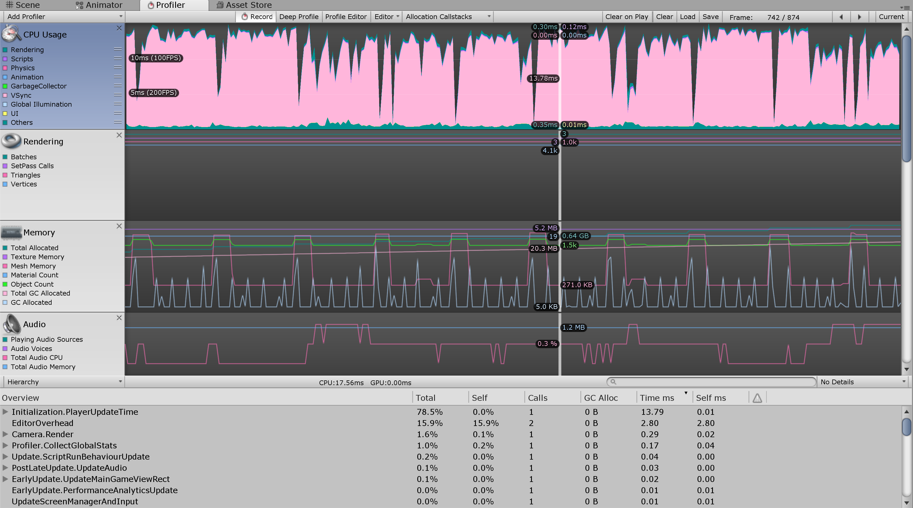
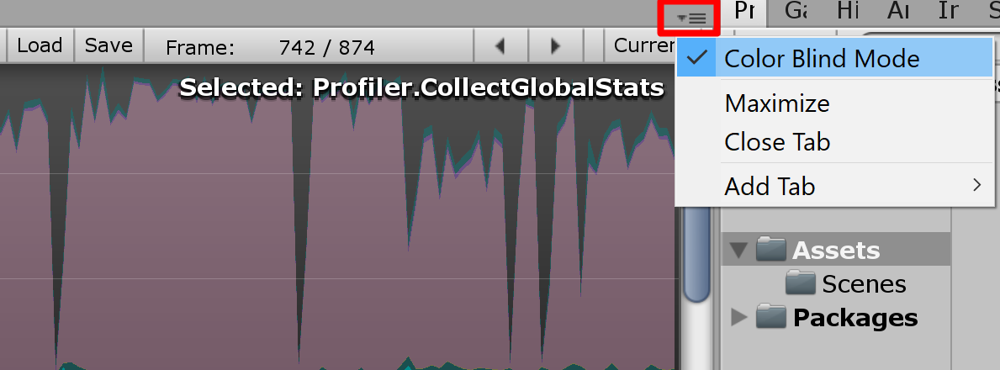
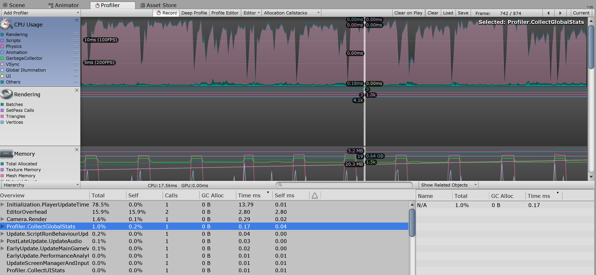

#Profiler window

Access the Profiler window in the Unity Editor via the toolbar: __Window__ &gt; __Profiler__.

See [Profiler overview](Profiler) for a summary of how the Profiler works.

 


##Profiler Controls


 

The Profiler controls are in the toolbar at the top of the window. Use these to turn profiling on and off, and navigate through profiled frames. The transport controls are at the far right end of the toolbar. Note that when the game is running and the profiler is collecting data, clicking on any of these transport controls pauses the game. The controls go to the first recorded frame, step one frame back, step one frame forward and go to the last frame respectively. 

The Profiler does not keep all recorded frames, so the notion of the _first_ frame should really be though of as the oldest frame that is still kept in memory. The "current" transport button causes the profile statistics window to display data collected in real-time. The Active Profiler popup menu allows you to select whether profiling should be done in the editor or a separate player (for example, a game running on an attached iOS device). Save button lets you write the recorded frames to a file. Correspondingly, Load button reads data saved earlier. You can also load a binary profile data written out by the player (when generating log, set [Profiler.enableBinaryLog](ScriptRef:Profiling.Profiler-enableBinaryLog.html) to enable binary format). If "Load" is clicked while the shift button is pressed, file contents is appended to the current profile frames in memory.


###Deep Profiling

When you turn on __Deep Profile__, _all_ your script code is profiled - that is, all function calls are recorded. This is useful to know where exactly time is spent in your game code.

Note that Deep Profiling incurs a **very large overhead** and uses a lot of memory, and as a result your game will run significantly slower while profiling. If you are using complex script code, Deep Profiling might not be possible at all. Deep profiling should work fast enough for small games with simple scripting. If you find that Deep Profiling for your entire game causes the frame rate to drop so much that the game barely runs, you should consider not using this approach, and instead use the approach described below. You may find deep profiling more helpful as you are designing your game and deciding how to best implement key features. Note that for large games deep profiling may cause Unity to run out of memory and so for this reason deep profiling may not be possible.

Manually profiling blocks of your script code will have a smaller overhead than using Deep Profiling. Use [Profiler.BeginSample](ScriptRef:Profiling.Profiler.BeginSample.html) and [Profiler.EndSample](ScriptRef:Profiling.Profiler.EndSample.html) scripting functions to enable and disable profiling around sections of code.

###Color Blind Mode

The Profiler window features a **Color Blind Mode**, which uses higher contrast colors in the graphs to enhance visibility for users with  red-green color blindness (such as deuteranopia, protanopia, or tritanopia). To enable it, click the context menu in the upper-right corner of the Profiler window, and click **Color Blind Mode**.


###View SyncTime

When running at a fixed framerate or running in sync with the vertical blank, Unity records the waiting time in "Wait For Target FPS". By default this amount of time is not shown in the profiler. To view how much time is spent waiting, you can toggle "View SyncTime". This is also a measure of how much headroom you have before losing frames.

##Profiler Timeline


 

The upper part of the Profiler window displays performance data over time. When you run a game, data is recorded each frame, and the history of the last several hundred frames is displayed. Clicking on a particular frame will display its details in the lower part of the window. Different details are displayed depending on which timeline area is currently selected.

The vertical scale of the timeline is managed automatically and will attempt to fill the vertical space of the window. Note that to get more detail in say the CPU Usage area you can remove the Memory and Rendering areas. Also, the splitter between the timeline and the statistics area can be selected and dragged downward to increase the screen area used for the timeline chart.

The timeline consists of several areas: CPU Usage, Rendering and Memory. These areas can be removed by clicking the close button in the panel, and re-added again using the _Add Area_ drop down in the Profile Controls bar.

Note that the coloured squares in the label area can control whether the associated timeline is displayed or not. To remove a sample from the display click on the colour key. The key will dim and the data will be removed from the graph. This can be useful to identify the cause of spikes in the CPU graph, for example.


##WebGL

You can use the Unity profiler on WebGL, just like on any other platform. One important distinction is that you cannot attach to running players in WebGL, though, as WebGL uses WebSockets for communication, which will not allow incoming connections on the browser side. Instead, you need to use the "Autoconnect profiler" checkbox in the build settings. Note also that draw calls cannot currently be profiled for WebGL.

##Remote Profiling


To profile your game running on another device or a Unity player running on another computer, you can connect the Unity Editor to that other device or computer. The dropdown __Active Profiler__  shows all Unity players running on the local network. These players are identified by player type and the host name running the player "iPhonePlayer (Toms iPhone)".

To be able to connect to a Unity player, you must launch that Unity player as a __Development build__ (menu: __File__ &gt; __Build Settings...__). 

Check the __Development Build__ option in the dialog box. From here you can also check __Autoconnect Profiler__ to make the Editor and Player Autoconnect at startup. 

###iOS


Enable remote  profiling on iOS devices by following these steps:

1. Connect your iOS device to your WiFi network. (The Profiler uses a local WiFi network to send profiling data from your device to the Unity Editor.)
1. In the Unity Editor's  __Build Settings__ dialog box (menu: __File__ &gt; __Build Settings...__), check the __Autoconnect Profiler__ checkbox.
1. Attach your device to your Mac via cable. In the Unity Editor's  __Build Settings__ dialog box (menu: __File__ &gt; __Build Settings...__), check the __Autoconnect Profiler__ checkboxcheck and select __Build & Run__. 
1. When the app launches on the device, open the Profiler window in the Unity Editor (__Window__ &gt; __Analysis__ &gt; __Profiler__).

If you are using a firewall, you need to make sure that ports 54998 to 55511 are open in the firewall's outbound rules - these are the ports used by Unity for remote profiling.

**Note:** Sometimes the Unity Editor might not autoconnect to the device. In such cases you can initiate the Profiler connection  from Profiler window __Active Profiler__ drop down menu by select appropriate device.

###Android

There are two methods to enable remote profiling on Android devices: WiFi or [ADB](http://developer.android.com/guide/developing/tools/adb.html).

For WiFi profiling, follow these steps:

1. Make sure to disable Mobile Data on your Android device.
1. Connect your Android device to your WiFi network.(The Profiler uses a local WiFi network to send profiling data from your device to the Unity Editor.)
1. Attach your device to your Mac or PC via cable. Check the __Development Build__ and __Autoconnect Profiler__ checkboxes in Unity’s Build Settings dialog box, and click on __Build & Run__ in the Unity Editor.
1. When the app launches on the device, open the Profiler window in the Unity Editor (Menu: __Window__ &gt; __Analysis__ &gt; __Profiler__).
1. If the Unity Editor fails to autoconnect to the device, select the appropriate device from the Profiler window __Active Profiler__ drop down menu.


**Note:** The Android device and host computer (running the Unity Editor) must both be on the same [subnet](http://en.wikipedia.org/wiki/Subnetwork) for the device detection to work.

For ADB profiling, follow these steps:

* Attach your device to your Mac or PC via cable and make sure ADB recognizes the device (i.e. it shows in _adb devices_ list).
* In the Unity Editor's  __Build Settings__ dialog box (menu: __File__ &gt; __Build Settings__), check the __Development Build__ checkboxcheck and select __Build & Run__. 
* When the app launches on the device, open the Profiler window in the Unity Editor (Menu: __Window__ &gt; __Analysis__ &gt; __Profiler__).
* Select the _AndroidProfiler(ADB@127.0.0.1:34999)_ from the Profiler Window __Active Profiler__ drop down menu.
**Note:** The Unity Editor  automatically creates an adb tunnel for your application when you click on __Build & Run__.
If you want to profile another application or you restart the adb server you have to setup this tunnel manually. To do this, open a Terminal window / CMD prompt and enter:

````
adb forward tcp:34999 localabstract:Unity-{insert bundle identifier here}
````

**Note:** The entry in the drop down menu is only visible when the selected target is Android.

If you are using a firewall, you need to make sure that ports 54998 to 55511 are open in the firewall's outbound rules - these are the ports used by Unity for remote profiling.


---

<span class="page-edit">• 2017-05-16  <!-- include IncludeTextAmendPageNoEdit --></span><br/>


