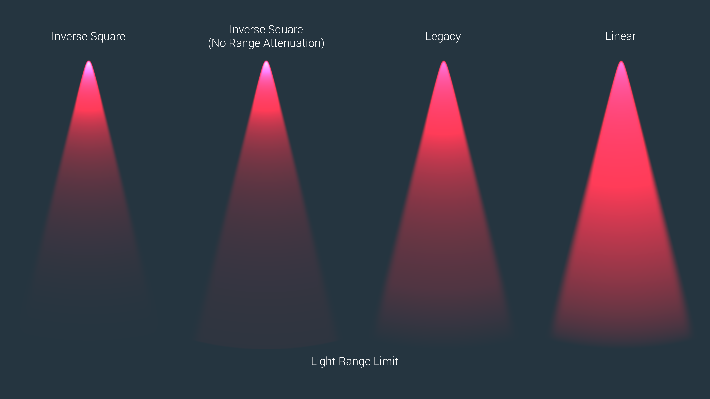

# Custom fall-off

In the real world, light fades over distance, and dim lights have a lower range than bright lights. The term "fall-off" refers to the rate at which light fades. Alongside Unity’s default fall-off lighting behaviour, you can also use custom fall-off settings.

Progressive Lightmapper provides custom fall-off presets, which you can implement via script. See the image below the table for a visual representation of how these work, and the code sample below the image for an example of how to use this functionality.

| **Property** | **Function** |
|:---|:---|
|`InverseSquared`|Apply an inverse-squared distance fall-off model. This means the light intensity decreases inversely proportional to the square of location’s distance to the light source. For more information , see Wikipedia: Inverse-square law. This option is the most physically accurate.|
|`InverseSquaredNoRangeAttenuation`|Apply an inverse-squared distance fall-off model with no smooth range attenuation. This works in the same way as `InverseSquared`, but the lighting system does not take into account the attenuation for the range parameter of punctual lights (that is, point lights and spotlights).|
|`Legacy`|Apply a quadratic fall-off model. This model bases the light attenuation on the range of the light source. The intensity diminishes as the light gets further away from the source, but there is a very sharp and unnatural drop in the attenuation, and the visual effect is not realistic.|
|`Linear`|Apply a linear fall-off model. In this model, attenuation is inversely proportional to the distance from the light, and the fall-off diminishes at a fixed rate from its source.|




```
using System.Collections;
using System.Collections.Generic;
using UnityEngine;
using UnityEngine.Experimental.GlobalIllumination;
using UnityEngine.SceneManagement;

[ExecuteInEditMode]
public class ExtractFalloff : MonoBehaviour
{
    public void OnEnable()
    {
        Lightmapping.RequestLightsDelegate testDel = (Light[] requests, Unity.Collections.NativeArray<LightDataGI> lightsOutput) =>
        {
            DirectionalLight dLight = new DirectionalLight();
            PointLight point = new PointLight();
            SpotLight spot = new SpotLight();
            RectangleLight rect = new RectangleLight();
            LightDataGI ld = new LightDataGI();

            for (int i = 0; i < requests.Length; i++)
            {
                Light l = requests[i];
                switch (l.type)
                {
                    case UnityEngine.LightType.Directional: LightmapperUtils.Extract(l, ref dLight); ld.Init(ref dLight); break;
                    case UnityEngine.LightType.Point: LightmapperUtils.Extract(l, ref point); ld.Init(ref point); break;
                    case UnityEngine.LightType.Spot: LightmapperUtils.Extract(l, ref spot); ld.Init(ref spot); break;
                    case UnityEngine.LightType.Area: LightmapperUtils.Extract(l, ref rect); ld.Init(ref rect); break;
                    default: ld.InitNoBake(l.GetInstanceID()); break;
                }

	      ld.falloff = FalloffType.InverseSquared;
                lightsOutput[i] = ld;
            }
        };

        Lightmapping.SetDelegate(testDel);
    }

    void OnDisable()
    {
        Lightmapping.ResetDelegate();
    }
}
```

---

<span class="page-history">Progressive Lightmapper added in [2018.1](https://docs.unity3d.com/2018.1/Documentation/Manual/30_search.html?q=newin20181) <span class="search-words">NewIn20181</span></span>

<span class="page-edit"> 2018-03-28  <!-- include IncludeTextNewPageSomeEdit --></span>