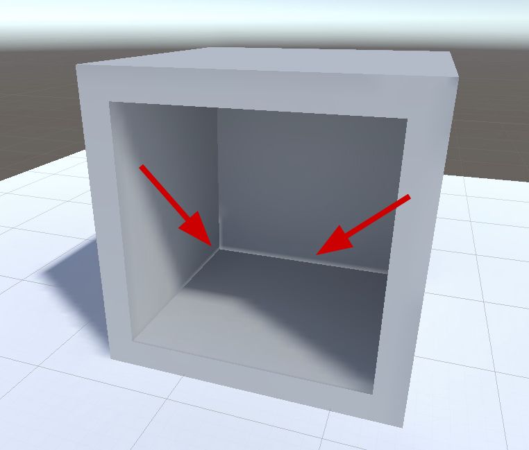
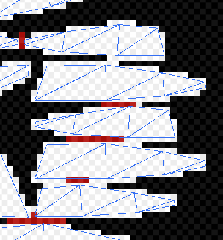
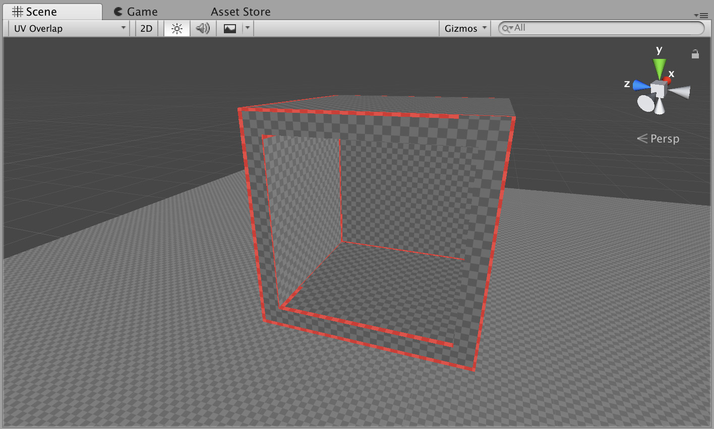
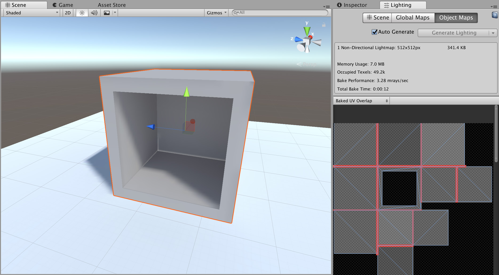
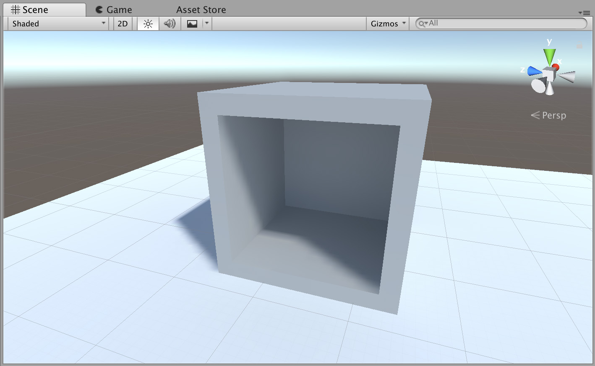

# UV overlap feedback 

Each lightmap contains a number of __charts__. At run time, Unity maps these charts onto mesh faces, and uses the charts’ lighting data to calculate the final appearance. Because of the way GPU sampling works, data from one chart can bleed onto another if they are too close to each other. This usually leads to unintended aliasing, pixelation, and other graphical results (these are called artifacts).

To avoid light bleeding, there must be a sufficient amount of space between charts. When a GPU samples a lightmap, the lighting system calculates the final sample value from the four texels closest to the sampled point (assuming bilinear filtering is used). These four texels are called the bilinear "neighborhood" of the sampled point. Charts are too close together if they overlap - that is, if the neighbourhood of any point inside a chart overlaps with the neighborhood of any point in another chart. In the image below, the white pixels indicate chart neighbourhoods, and red pixels indicate overlapping neighbourhoods.

Determining optimal chart placements and spacing can be difficult, because it depends on several parameters (such as lightmap resolution, mesh UVs, and Importer settings). For this reason, Unity provides the ability to identify these issues easily, as outlined in the following section.

## Identification

There are three ways to identity overlaps: 

* Keep an eye on Unity’s console. If Unity detects overlapping UVs, it prints a warning message with a list of affected GameObjects. 

* Use the __UV Overlap__ draw mode in the Scene View (see [GI visualizations in the Scene View](GIVis) for more information). When you have this mode enabled, Unity adds a red highlight to chart texels that are too close to texels of other charts. This is especially useful if you discover an artefact in the Scene view, and want to quickly examine whether UV overlap is causing it.

* Use Object Maps in the Lighting tab. Select an object and go to the Lighting tab and then choose Object Maps. Make sure to select Baked UV Overlap in the dropdown. Problematic texels are colored red in this view.

## Solutions

There is no one single solution for UV overlap, because there are so many things that can cause it. Here are the most common solutions to consider:

* If Unity is automatically creating the lightmap UVs, you can increase the __Pack Margin__. To do this, navigate to the [Model tab](FBXImporter-Model) of the Mesh’s import settings. Make sure __Generate Lightmap UVs__ is enabled, then fold out __Advanced__ and use the __Pack Margin__ slider to increase the value. This creates more spacing between charts, which reduces likelihood of overlap. However, this also increase the total space requirement for the lightmap, so try to apply enough spacing to avoid artifacts, but no more. For more information on lightmap UVs that Unity creates automatically, see documentation on [Generating lightmapping UVs](LightingGiUvs-GeneratingLightmappingUVs).

* If you provide lightmap UVs yourself, you can try adding margins using your modelling package.

* Increase the resolution of the entire lightmap. This will increase the numbers of pixels between the charts, and therefore reduce the likelihood of bleeding. The downside is that your lightmap may become too large. You can do this in the __Lighting__ tab under __Lightmapper Settings__.

* Increase the resolution of a single GameObject. This allows you to increase lightmap resolution only for GameObjects that have overlapping UVs. Though less likely, this can also increase your lightmap size. You can change a GameObject’s lightmap resolution inside its Mesh Renderer under __Lightmap Settings__.

---

Progressive Lightmapper added in [2018.1](https://docs.unity3d.com/2018.1/Documentation/Manual/30_search.html?q=newin20181) NewIn20181

 2018-03-28  <!-- include IncludeTextNewPageSomeEdit -->
