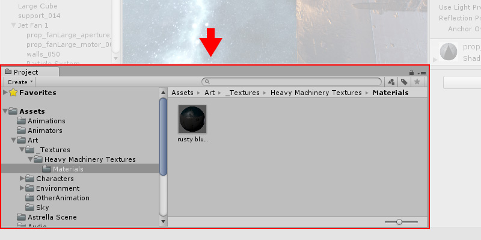
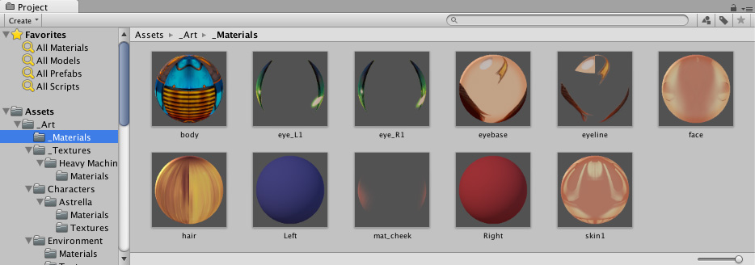
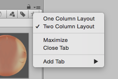
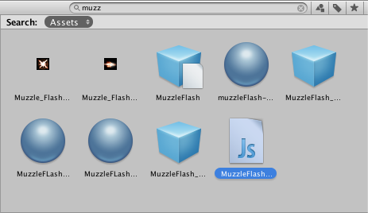
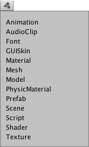
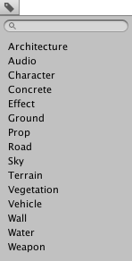
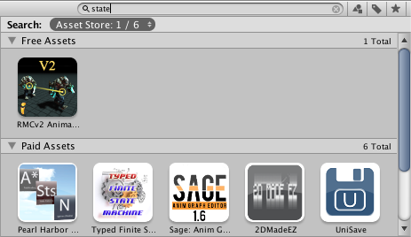

#The Project Window

 

In this view, you can access and manage the assets that belong to your project.

 

The left panel of the browser shows the folder structure of the project as a hierarchical list. When a folder is selected from the list by clicking, its contents will be shown in the panel to the right. You can click the small triangle to expand or collapse the folder, displaying any nested folders it contains. Hold down Alt while you click to expand or collapse any nested folders recursively.

The individual assets are shown in the right hand panel as icons that indicate their type (script, material, sub-folder, etc). The icons can be resized using the slider at the bottom of the panel; they will be replaced by a hierarchical list view if the slider is moved to the extreme left. The space to the left of the slider shows the currently selected item, including a full path to the item if a search is being performed. 

Above the project structure list is a **Favorites** section where you can keep frequently-used items for easy access. You can drag items from the project structure list to the Favourites and also save search queries there (see **Searching** below).

Just above the panel is a "breadcrumb trail" that shows the path to the folder currently being viewed. The separate elements of the trail can be clicked for easy navigation around the folder hierarchy. When searching, this bar changes to show the area being searched (the root Assets folder, the selected folder or the Asset Store) along with a count of free and paid assets available in the store, separated by a slash. There is an option in the _General_ section of Unity's Preferences window to disable the display of Asset Store hit counts if they are not required.

 

Along the top edge of the window is the browser's toolbar.

 

Located at the left side of the toolbar, the __Create__ menu lets you add new assets and sub-folders to the current folder. To its right are a set of tools to allow you to search the assets in your project.

The Window menu provides the option of switching to a one-column version of the project view, essentially just the hierarchical structure list without the icon view. The lock icon next to the menu enables you to "freeze" the current contents of the view (ie, stop them being changed by events elsewhere) in a similar manner to the inspector lock.

 

##Searching

The browser has a powerful search facility that is especially useful for locating assets in large or unfamiliar projects. The basic search will filter assets according to the text typed in the search box

 

If you type more than one search term then the search is narrowed, so if you type _coastal scene_ it will only find assets with both "coastal" and "scene" in the name (ie, terms are ANDed together).

To the right of the search bar are three buttons. The first allows you to further filter the assets found by the search according to their type.

 

Continuing to the right, the next button filters assets according to their Label (labels can be set for an asset in the [Inspector](UsingTheInspector)). Since the number of labels can potentially be very large, the label menu has its own mini-search filter box.

 

Note that the filters work by adding an extra term in the search text. A term beginning with "t:" filters by the specified asset type, while "l:" filters by label. You can type these terms directly into the search box rather than use the menu if you know what you are looking for. You can search for more than one type or label at once. Adding several types will expand the search to include all specified types (ie, types will be ORed together). Adding multiple labels will narrow the search to items that have all the specified labels (ie, labels are ANDed).

 

The rightmost button saves the search by adding an item to the Favourites section of the asset list.

###Searching the Asset Store

The Project Browser's search can also be applied to assets available from the Unity __Asset Store__. If you choose __Asset Store__ from the menu in the breadcrumb bar, all free and paid items from the store that match your query will be displayed. Searching by type and label works the same as for a Unity project. The search query words will be checked against the asset name first and then the package name, package label and package description in that order (so an item whose name contains the search terms will be ranked higher than one with the same terms in its package description).

 

If you select an item from the list, its details will be displayed in the inspector along with the option to purchase and/or download it. Some asset types have previews available in this section so you can, for example, rotate a 3D model before buying. The inspector also gives the option of viewing the asset in the usual Asset Store window to see additional details.

##Shortcuts

The following keyboard shortcuts are available when the browser view has focus. Note that some of them only work when the view is using the two-column layout (you can switch between the one- and two-column layouts using the panel menu in the very top right corner).

| | |
|:---|:---|
|**F** |Frame selected (ie, show the selected asset in its containing folder) |
|**Tab** |Shift focus between first column and second column (Two columns)|
|**Ctrl/Cmd + F** |Focus search field|
|**Ctrl/Cmd + A** |Select all visible items in list|
|**Ctrl/Cmd + D** |Duplicate selected assets|
|**Delete** |Delete with dialog (Win)|
|**Delete + Shift** |Delete without dialog (Win)|
|**Delete + Cmd** |Delete without dialog (OSX)|
|**Enter** |Begin rename selected (OSX)|
|**Cmd + down arrow** |Open selected assets (OSX)|
|**Cmd + up arrow** |Jump to parent folder (OSX, Two columns)|
|**F2** |Begin rename selected (Win)|
|**Enter** |Open selected assets (Win)|
|**Backspace** |Jump to parent folder (Win, Two columns)|
|**Right arrow** |Expand selected item (tree views and search results). If the item is already expanded, this will select its first child item. |
|**Left arrow** |Collapse selected item (tree views and search results). If the item is already collapsed, this will select its parent item. |
|**Alt + right arrow** |Expand item when showing assets as previews |
|**Alt + left arrow** |Collapse item when showing assets as previews |
