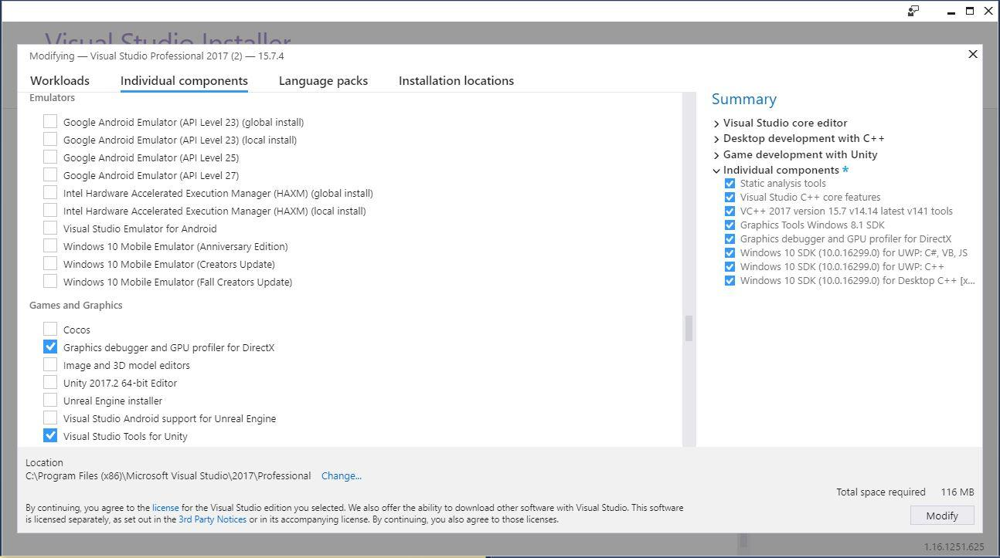
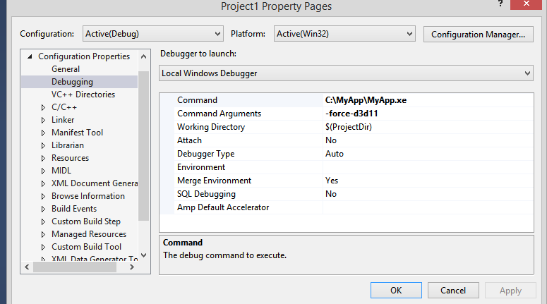
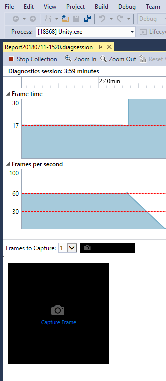
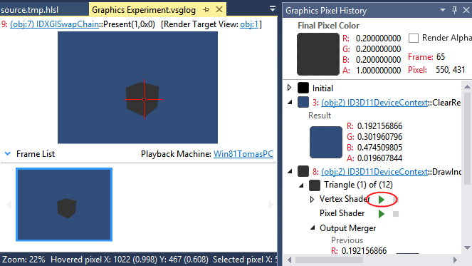
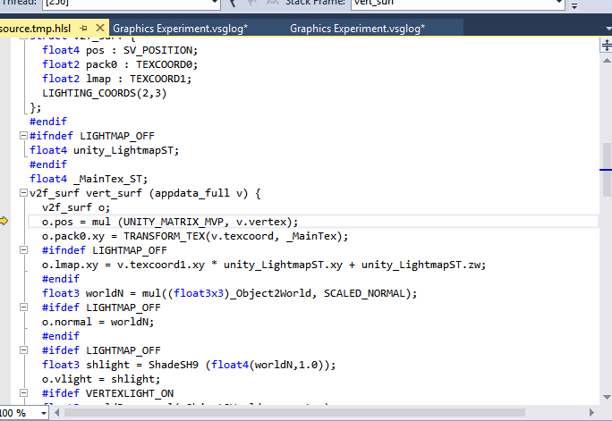

#Debugging DirectX 11/12 shaders with Visual Studio


Use the Graphics Debugger in Microsoft Visual Studio (2012 version or later) to capture individual frames of applications for debugging purposes, from platforms like Unity Editor, Windows Standalone or Universal Windows Platform.

To install the Graphics Debugger in Visual Studio:

1. Go to __Tools __&gt; __Get Tools and Features__
    

2. On the __Individual components__ tab, scroll to __Games and Graphics__ and check the box for __Graphics debugger and GPU profiler for DirectX__

3. Click __Modify__

4. Wait for installation, then follow the instructions to restart your computer


## Capture DirectX shaders with Visual Studio

You should use a built version of your Unity application to capture frames, rather than a version running in the Unity Editor. This is because the Editor might have multiple child windows open at once, and the Graphics Debugger might capture a frame from an unintended window.

### Steps to capture a frame from Unity Editor or Windows Standalone

To use the Graphics Debugger on either of these two platforms, you need to create a dummy Visual Studio Project:

1. Launch Visual Studio 2017

2. Go to __File__ &gt; __New__ &gt; __Project__ &gt; __Visual C++__ &gt; __Empty Project__

3. Go to __Project__ &gt; __Properties__ &gt; __Configuration Properties__ &gt; __Debugging__

4. In the __Command__ field, replace $(TargetPath) with the path to the Unity Editor or Windows Standalone (for example, *C:\MyApp\MyApp.exe*)

5. If you want to force Windows Standalone or Unity Editor to run under DirectX 11, select __Command Arguments__ and type __-force-d3d11__.
    

6. Go to __Debug __&gt; __Graphics__ &gt; __Start Graphics__ __Debugging__

7. If everything is configured correctly, Unity displays the following text in the top-left corner of the application:
     


8. To capture a frame, use the Print Screen key on your keyboard, or click the __Capture Frame__ box on the left side of the Visual Studio interface.
    


## Debug DirectX shaders with Visual Studio


To debug a shader, you have to compile with debug symbols. To do that, you need to insert __#pragma enable_d3d11_debug_symbols.__

Your shader should look something like this:


````
Shader "Custom/NewShader" {
	Properties {
		_MainTex ("Base (RGB)", 2D) = "white" {}
	}
	SubShader {
		Tags { "RenderType"="Opaque" }
		LOD 200
		
		CGPROGRAM
		#pragma surface surf Lambert
		#pragma enable_d3d11_debug_symbols
		sampler2D _MainTex;

		struct Input {
			float2 uv_MainTex;
		};

		void surf (Input IN, inout SurfaceOutput o) {
			half4 c = tex2D (_MainTex, IN.uv_MainTex);
			o.Albedo = c.rgb;
			o.Alpha = c.a;
		}
		ENDCG
	} 
	FallBack "Diffuse"
}

````

## Example workflow
Let’s create a basic example to show the entire process:

1. Create a new Unity project (see documentation on [Getting Started](#GettingStarted)).

2. In the top menu, go to __Assets__ &gt; __Create__ &gt; __Shader__ &gt; __Standard Surface Shader__. This creates a new shader file in your __Project__ folder.

3. Select the shader file, and in the Inspector window, click __Open__. This opens the shader file in your scripting editor. Insert `#pragma enable_d3d11_debug_symbols` into the shader code, underneath the other `#pragma` lines.

4. Create a new Material (menu: __Assets__ &gt; __Create__ &gt; __Material__).

5. In the Material’s Inspector window, select the __Shader__ dropdown, go to __Custom__, and select the shader you just created. 

6. Create a 3D cube GameObject (menu: __GameObject__ &gt; __3D Object__ &gt; __Cube__).

7. Assign your new Material to your new GameObject. To do this, drag the Material from the __Project__ window to the 3D cube.

8. Build the project for Windows Standalone. Note that real projects might be so large that building them every time you want to debug a shader becomes inefficient; in that case, debug in the Editor, but make sure your capture has profiled the correct window.

9. Capture a frame, using the steps described above in the section __Capture DirectX shaders with Visual Studio__.

10. Your captured frame appears in Visual Studio. Right-click it, and select __Pixel.__

    

11. Click the play button next to the Vertex Shader (highlighted in the screenshot above). This opens the vertex shader file:
    


There is a known issues while working with DirectX 12, in which the play buttons are not available, and the following error appears: This draw call uses system-value semantics that interfere with pixel history computation. If you experience this, use [PIX](#DebuggingShadersWithPIX) to debug your shaders instead.


### Universal Windows Platform

When you debug for Universal Windows Platform, you don’t need to create a dummy Visual Studio project, because Unity creates it for you. 

Steps to capture a frame and begin shader debugging are the same as they are for the Unity Editor or Windows Standalone.


## Alternative shader debugging techniques

You can also use [RenderDoc](#RenderDocIntegration) to debug shaders. In RenderDoc, you capture the __Scene__ from within the Editor, then use the standalone tool for debugging.

[PIX](#DebuggingShadersWithPIX) works in a similar way to Visual Studio’s Graphics Debugger. Use PIX instead of the Graphics Debugger to debug DirectX 12 projects.

---
* <span class="page-edit">2018-09-14 <!-- include IncludeTextNewPageYesEdit --></span>


