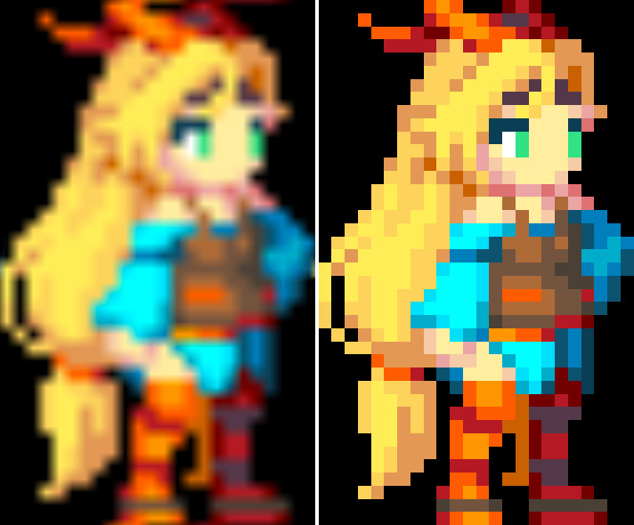

# Using sampler states


## Coupled textures and samplers

Most of the time when sampling textures in shaders, the texture sampling state should come form [texture settings](class-TextureImporter) -- essentially, textures and samplers are coupled together. This is default behavior when using DX9-style shader syntax:

```
sampler2D _MainTex;
// ...
half4 color = tex2D(_MainTex, uv);
```

Using sampler2D, sampler3D, samplerCUBE HLSL keywords declares both texture and sampler.

Most of the time this is what you want, and is the only supported option on older graphics APIs (OpenGL ES).

## Separate textures and samplers

Many graphics APIs and GPUs allow using fewer samplers than textures, and coupled texture+sampler syntax might not allow more complex shaders to be written. For example Direct3D 11 allows using up to 128 textures in a single shader, but only up to 16 samplers.

Unity allows declaring textures and samplers using DX11-style HLSL syntax, with a special naming convention to match them up: samplers that have names in the form of "sampler"+TextureName will take sampling states from that texture.

The shader snippet from section above could be rewritten in DX11-style HLSL syntax, and it would do the same thing:

```
Texture2D _MainTex;
SamplerState sampler_MainTex; // "sampler" + “_MainTex”
// ...
half4 color = _MainTex.Sample(sampler_MainTex, uv);
```

However, this way a shader could be written to "reuse" samplers from other textures, while sampling more than one texture. In the example below, three textures are sampled, but only one sampler is used for all of them:

```
Texture2D _MainTex;
Texture2D _SecondTex;
Texture2D _ThirdTex;
SamplerState sampler_MainTex; // "sampler" + “_MainTex”
// ...
half4 color = _MainTex.Sample(sampler_MainTex, uv);
color += _SecondTex.Sample(sampler_MainTex, uv);
color += _ThirdTex.Sample(sampler_MainTex, uv);
```

Note however that DX11-style HLSL syntax does not work on some older platforms (e.g. OpenGL ES 2.0), see [shading language](SL-ShadingLanguage) for details. You might want to specify `#pragma target 3.5` (see [shader compilation targets](SL-ShaderCompileTargets) to skip older platforms from using the shader.

Unity provides several shader macros to help with declaring and sampling textures using this "separate samplers" approach, see [built-in macros](SL-BuiltinMacros). The example above could be rewritten this way, using said macros:

```
UNITY_DECLARE_TEX2D(_MainTex);
UNITY_DECLARE_TEX2D_NOSAMPLER(_SecondTex);
UNITY_DECLARE_TEX2D_NOSAMPLER(_ThirdTex);
// ...
half4 color = UNITY_SAMPLE_TEX2D(_MainTex, uv);
color += UNITY_SAMPLE_TEX2D_SAMPLER(_SecondTex, _MainTex, uv);
color += UNITY_SAMPLE_TEX2D_SAMPLER(_ThirdTex, _MainTex, uv);
```

The above would compile on all platforms supported by Unity, but would fallback to using three samplers on older platforms like DX9.

## Inline sampler states

In addition to recognizing HLSL SamplerState objects named as "sampler"+TextureName, Unity also recognizes some other patterns in sampler names. This is useful for declaring simple hardcoded sampling states directly in the shaders. An example:

```
Texture2D _MainTex;
SamplerState my_point_clamp_sampler;
// ...
half4 color = _MainTex.Sample(my_point_clamp_sampler, uv);
```

The name "my_point_clamp_sampler" will be recognized as a sampler that should use Point (nearest) texture filtering, and Clamp texture wrapping mode.

Sampler names recognized as "inline" sampler states (all case insensitive):

* "Point", “Linear” or “Trilinear” (required) set up texture filtering mode.

* "Clamp", “Repeat”, “Mirror” or “MirrorOnce” (required) set up texture wrap mode.

    * Wrap modes can be specified per-axis (UVW), e.g. "ClampU_RepeatV".

* "Compare" (optional) set up sampler for depth comparison; use with HLSL SamplerComparisonState type and SampleCmp / SampleCmpLevelZero functions.

Here’s an example of sampling texture with `sampler_linear_repeat` and `sampler_point_repeat` SamplerStates respectively, illustrating how the name controls filtering mode:



Here’s an example with `SmpClampPoint`, `SmpRepeatPoint`, `SmpMirrorPoint`, `SmpMirrorOncePoint`, `Smp_ClampU_RepeatV_Point` SamplerStates respectively, illustrating how the name controls wrapping mode. In the last example, different wrap modes are set for horizontal (U) and vertical (V) axes. In all cases texture coordinates go from -2.0 to +2.0.


Just like separate texture + sampler syntax, inline sampler states are not supported on some platforms. Currently they are implemented on Direct3D 11/12, PS4, XboxOne and Metal.

Note that "MirrorOnce" texture wrapping mode is not supported on most mobile GPUs/APIs, and will fallback to Mirror mode when support is not present.
<br/>
<br/>

---
*  <span class="page-edit">2017-06-01  <!-- include IncludeTextNewPageNoEdit --></span>

* <span class="page-history">New feature in [2017.1](https://docs.unity3d.com/2017.1/Documentation/Manual/30_search.html?q=newin20171) <span class="search-words">NewIn20171</span></span>