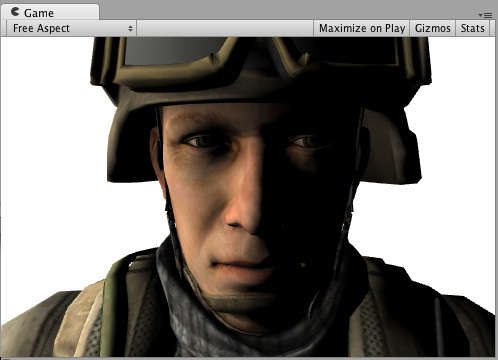
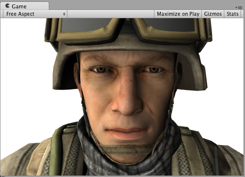
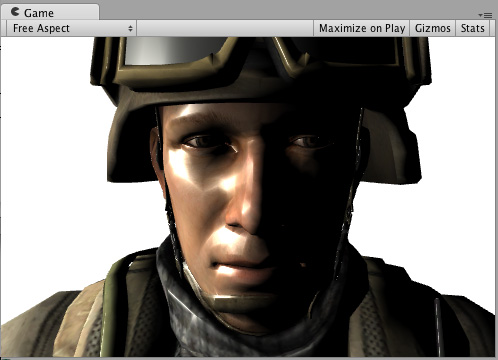
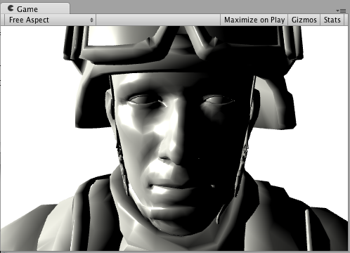

#Surface Shader lighting examples

This page provides examples of custom [Surface Shader lighting models](SL-SurfaceShaderLighting) in [Surface Shaders](SL-SurfaceShaders). For more general Surface Shader guidance, see [Surface Shader Examples](SL-SurfaceShaderExamples).

Because __Deferred Lighting__ does not play well with some custom per-material lighting models, most of the examples below make the shaders compile to __Forward Rendering__ only.

##Diffuse

The following is an example of a shader that uses the built-in Lambert lighting model:

````
  Shader "Example/Diffuse Texture" {
    Properties {
      _MainTex ("Texture", 2D) = "white" {}
    }
    SubShader {
      Tags { "RenderType" = "Opaque" }
      CGPROGRAM
      #pragma surface surf Lambert
      
      struct Input {
          float2 uv_MainTex;
      };
      
      sampler2D _MainTex;
      
      void surf (Input IN, inout SurfaceOutput o) {
          o.Albedo = tex2D (_MainTex, IN.uv_MainTex).rgb;
      }
      ENDCG
    }
    Fallback "Diffuse"
  }
````

Here's how it looks like with a Texture and without a Texture, with one directional Light in the Scene: 


 

The following example shows how to achieve the same result by writing a custom lighting model instead of using the built-in Lambert model. 

To do this, you need to use a number of Surface Shader lighting model functions. Here's a simple Lambert one. Note that only the `CGPROGRAM` section changes; the surrounding Shader code is exactly the same:

````
	Shader "Example/Diffuse Texture" {
		Properties {
			_MainTex ("Texture", 2D) = "white" {}
		}
		SubShader {
		Tags { "RenderType" = "Opaque" }
		CGPROGRAM
		  #pragma surface surf SimpleLambert
  
		  half4 LightingSimpleLambert (SurfaceOutput s, half3 lightDir, half atten) {
			  half NdotL = dot (s.Normal, lightDir);
			  half4 c;
			  c.rgb = s.Albedo * _LightColor0.rgb * (NdotL * atten);
			  c.a = s.Alpha;
			  return c;
		  }
  
		struct Input {
			float2 uv_MainTex;
		};
		
		sampler2D _MainTex;
		
		void surf (Input IN, inout SurfaceOutput o) {
			o.Albedo = tex2D (_MainTex, IN.uv_MainTex).rgb;
		}
		ENDCG
		}
		Fallback "Diffuse"
	}
````

This simple Diffuse lighting model uses the `LightingSimpleLambert` function. It computes lighting by calculating a dot product between surface normal and light direction, and then applying light attenuation and color.


##Diffuse Wrap

The following example shows __Wrapped Diffuse__, a modification of __Diffuse__ lighting where illumination "wraps around" the edges of objects. It's useful for simulating subsurface scattering effects. Only the `CGPROGRAM` section changes, so once again, the surrounding Shader code is omitted:

````
	...ShaderLab code...
	CGPROGRAM
	#pragma surface surf WrapLambert

	half4 LightingWrapLambert (SurfaceOutput s, half3 lightDir, half atten) {
		half NdotL = dot (s.Normal, lightDir);
		half diff = NdotL * 0.5 + 0.5;
		half4 c;
		c.rgb = s.Albedo * _LightColor0.rgb * (diff * atten);
		c.a = s.Alpha;
		return c;
	}

	struct Input {
		float2 uv_MainTex;
	};
	
	sampler2D _MainTex;
		void surf (Input IN, inout SurfaceOutput o) {
		o.Albedo = tex2D (_MainTex, IN.uv_MainTex).rgb;
	}
	ENDCG
	...ShaderLab code...
````

Here's how it looks like with a Texture and without a Texture, with one directional Light in the Scene: 

 
 


##Toon Ramp

The following example shows a "Ramp" lighting model that uses a Texture ramp to define how surfaces respond to the angles between the light and the normal. This can be used for a variety of effects, and is especially effective when used with __Toon__ lighting.

````
  	...ShaderLab code...
	CGPROGRAM
	#pragma surface surf Ramp

	sampler2D _Ramp;

	half4 LightingRamp (SurfaceOutput s, half3 lightDir, half atten) {
		half NdotL = dot (s.Normal, lightDir);
		half diff = NdotL * 0.5 + 0.5;
		half3 ramp = tex2D (_Ramp, float2(diff)).rgb;
		half4 c;
		c.rgb = s.Albedo * _LightColor0.rgb * ramp * atten;
		c.a = s.Alpha;
		return c;
	}

	struct Input {
		float2 uv_MainTex;
	};
	
	sampler2D _MainTex;
	
	void surf (Input IN, inout SurfaceOutput o) {
		o.Albedo = tex2D (_MainTex, IN.uv_MainTex).rgb;
	}
	ENDCG
   	...ShaderLab code...
````

Here's how it looks like with a Texture and without a Texture, with one directional Light in the Scene: 

 
 


 


##Simple Specular

The following example shows a simple specular lighting model, similar to the built-in BlinnPhong lighting model.


````
  	...ShaderLab code...
	CGPROGRAM
	#pragma surface surf SimpleSpecular

	half4 LightingSimpleSpecular (SurfaceOutput s, half3 lightDir, half3 viewDir, half atten) {
		half3 h = normalize (lightDir + viewDir);

		half diff = max (0, dot (s.Normal, lightDir));

		float nh = max (0, dot (s.Normal, h));
		float spec = pow (nh, 48.0);

		half4 c;
		c.rgb = (s.Albedo * _LightColor0.rgb * diff + _LightColor0.rgb * spec) * atten;
		c.a = s.Alpha;
		return c;
	}

	struct Input {
		float2 uv_MainTex;
	};
	
	sampler2D _MainTex;
	
	void surf (Input IN, inout SurfaceOutput o) {
		o.Albedo = tex2D (_MainTex, IN.uv_MainTex).rgb;
	}
	ENDCG
   	...ShaderLab code...
````

Here's how it looks like with a Texture and without a Texture, with one directional Light in the Scene: 

 
 


##Custom GI

We'll start with a Shader that mimics Unity's built-in GI:

````
    Shader "Example/CustomGI_ToneMapped" {
    	Properties {
    		_MainTex ("Albedo (RGB)", 2D) = "white" {}
    	}
    	SubShader {
    		Tags { "RenderType"="Opaque" }
    		
    		CGPROGRAM
    		#pragma surface surf StandardDefaultGI
    
    		#include "UnityPBSLighting.cginc"
    
    		sampler2D _MainTex;
    
    		inline half4 LightingStandardDefaultGI(SurfaceOutputStandard s, half3 viewDir, UnityGI gi)
    		{
    			return LightingStandard(s, viewDir, gi);
    		}
    
    		inline void LightingStandardDefaultGI_GI(
    			SurfaceOutputStandard s,
    			UnityGIInput data,
    			inout UnityGI gi)
    		{
    			LightingStandard_GI(s, data, gi);
    		}
    
    		struct Input {
    			float2 uv_MainTex;
    		};
    
    		void surf (Input IN, inout SurfaceOutputStandard o) {
    			o.Albedo = tex2D(_MainTex, IN.uv_MainTex);
    		}
    		ENDCG
    	}
	    FallBack "Diffuse"
    }
````

Now, let's add some tone mapping on top of the GI:

````
    Shader "Example/CustomGI_ToneMapped" {
    	Properties {
    		_MainTex ("Albedo (RGB)", 2D) = "white" {}
    		_Gain("Lightmap tone-mapping Gain", Float) = 1
    		_Knee("Lightmap tone-mapping Knee", Float) = 0.5
    		_Compress("Lightmap tone-mapping Compress", Float) = 0.33
    	}
    	SubShader {
    		Tags { "RenderType"="Opaque" }
    		
    		CGPROGRAM
    		#pragma surface surf StandardToneMappedGI
    
    		#include "UnityPBSLighting.cginc"
    
    		half _Gain;
    		half _Knee;
    		half _Compress;
    		sampler2D _MainTex;
    
    		inline half3 TonemapLight(half3 i) {
    			i *= _Gain;
    			return (i > _Knee) ? (((i - _Knee)*_Compress) + _Knee) : i;
    		}
    
    		inline half4 LightingStandardToneMappedGI(SurfaceOutputStandard s, half3 viewDir, UnityGI gi)
    		{
    			return LightingStandard(s, viewDir, gi);
    		}
    
    		inline void LightingStandardToneMappedGI_GI(
    			SurfaceOutputStandard s,
    			UnityGIInput data,
    			inout UnityGI gi)
    		{
    			LightingStandard_GI(s, data, gi);
    
    			gi.light.color = TonemapLight(gi.light.color);
    			#ifdef DIRLIGHTMAP_SEPARATE
    				#ifdef LIGHTMAP_ON
    					gi.light2.color = TonemapLight(gi.light2.color);
    				#endif
    				#ifdef DYNAMICLIGHTMAP_ON
    					gi.light3.color = TonemapLight(gi.light3.color);
    				#endif
    			#endif
    			gi.indirect.diffuse = TonemapLight(gi.indirect.diffuse);
    			gi.indirect.specular = TonemapLight(gi.indirect.specular);
    		}
    
    		struct Input {
    			float2 uv_MainTex;
    		};
    
    		void surf (Input IN, inout SurfaceOutputStandard o) {
    			o.Albedo = tex2D(_MainTex, IN.uv_MainTex);
    		}
    		ENDCG
    	}
    	FallBack "Diffuse"
    }
````
