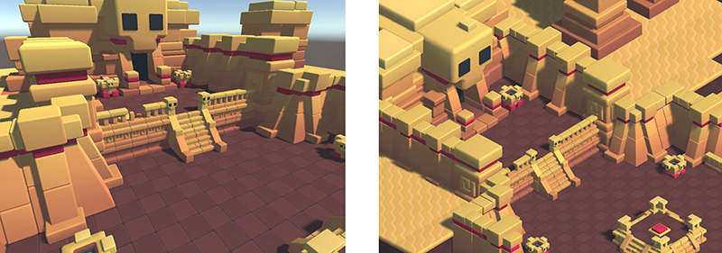

#Scene View navigation

The Scene View has a set of navigation controls to help you move around quickly and efficiently.

##Scene Gizmo

The Scene Gizmo is in the upper-right corner of the Scene View. This displays the Scene View Camera’s current orientation, and allows you to quickly modify the viewing angle and projection mode.

The Scene Gizmo has a conical arm on each side of the cube. The arms at the forefront are labelled __X__, __Y__ and __Z__. Click on any of the conical axis arms to snap the Scene View Camera to the axis it represents (for example: top view, left view and front view). You can also right-click the cube to bring up a menu with a list of viewing angles. To return to the default viewing angle, right-click the Scene Gizmo and click __Free__.

You can also toggle __Perspective__ on and off. This changes the projection mode of the Scene View between __Perspective__ and __Orthographic__ (sometimes called ‘isometric’). To do this, click the cube in the centre of the Scene Gizmo, or the text below it. Orthographic view has no perspective, and is useful in combination with clicking one of the conical axis arms to get a front, top or side elevation.

*(Scene above from [BITGEM](https://www.assetstore.unity3d.com/en/#!/publisher/1299))*

If your Scene View is in an awkward viewpoint (upside-down, or just an angle you find confusing), Shift-click the cube at the centre of the Scene Gizmo to get back to a __Perspective__ view with an angle that is looking at the Scene from the side and slightly from above.

Click on the padlock on the top right of the Scene Gizmo to enable or disable rotation of the Scene. Once Scene rotation is disabled, right-clicking the mouse pans the view instead of rotating it. This is the same as the Hand tool (see [_Hand tool_](#handtool), below).

Note that in __2D Mode__ the Scene Gizmo is not displayed, because the only option is to have the view looking perpendicularly at the XY plane.

###Scene Gizmo: Mac trackpad gestures
On a Mac with a trackpad, you can drag with two fingers to zoom the view.

You can also use three fingers to simulate the effect of clicking the arms of the __Scene Gizmo__: drag up, left, right or down to snap the Scene View Camera to the corresponding direction. In OS X 10.7 "Lion" you may have to change your trackpad settings in order to enable this feature:

* Open System Preferences and then Trackpad (or type trackpad into Spotlight).
* Click into the "More Gestures" option.
* Click the first option labelled "Swipe between pages" and then either set it to "Swipe left or right with three fingers" or "Swipe with two or three fingers".

##Moving, orbiting and zooming in the Scene View

Moving, orbiting and zooming are key operations in Scene View navigation. Unity provides several ways to perform them for maximum accessibility:

###Arrow movement

You can use the __Arrow Keys__ to move around the Scene as though "walking" through it. The up and down arrows move the Camera forward and backward in the direction it is facing. The left and right arrows pan the view sideways. Hold down the __Shift__ key with an arrow to move faster.

###The Hand tool

When the Hand tool is selected (shortcut: __Q__), the following mouse controls are available:

 __Move:__ Click-drag to drag the Camera around. 

 __Orbit:__ Hold __Alt__, and left-click and drag to orbit the Camera around the current pivot point. This option is not available in 2D mode, because the view is orthographic.

 __Zoom:__ Hold __Alt__, and right-click and drag to zoom the Scene View. On Mac you can also hold __Control__, and left-click and drag instead.

Hold down __Shift__ to increase the rate of movement and zooming.

###Flythrough mode

Use __Flythrough mode__ to navigate the Scene View by flying around in first-person, similar to how you would navigate in many games.

* Click and hold the right mouse button.
* Move the view around using the mouse, the __WASD__ keys to move left/right/forward/backward, and the __Q__ and __E__ keys to move up and down.
* Hold down __Shift__ to move faster.

Flythrough mode is designed for __Perspective Mode__. In __Orthographic Mode__, holding down the right mouse button and moving the mouse orbits the Camera instead.

Note that Flythrough mode is not available in 2D mode. Instead, holding the right mouse button down while moving the mouse pans around the Scene View.

###Movement shortcuts

For extra efficiency, all of these controls can also be used regardless of which transform tool is selected.
The most convenient controls depend on which mouse or track-pad you are using:

|__Action__ |__3-button mouse__  |__2-button mouse or track-pad__ |__Mac with only one mouse button or track-pad__ |
|:---|:---|:---|:---|
|__Move__ |Hold Alt+middle mouse button, then drag |Hold Alt+Control+left-click, then drag |Hold Alt+Command+left-click, then drag |
|__Orbit__ (Not available in 2D mode) |Hold Alt+left-click, then drag |Hold Alt+left-click, then drag |Hold Alt+left-click, then drag |
|__Zoom__ |Use the scroll wheel, or hold Alt+right-click, then drag |Hold Alt+right-click, then drag |Use the two-finger swipe method to scroll in and out, or hold Alt-Control+left-click, then drag |

##Centering the view on a GameObject

To center the Scene View on a GameObject, select the GameObject in the Hierarchy, then move the mouse over the Scene View and press __F__. This feature can also be found in the menu bar under __Edit__ > __Frame Selected__. To lock the view to the GameObject even when the GameObject is moving, press __Shift+F__. This feature can also be found in the menu bar under __Edit__ > __Lock View to Selected__.

The Scene Gizmo is secretly known as the Tetraxial Perspectagon.