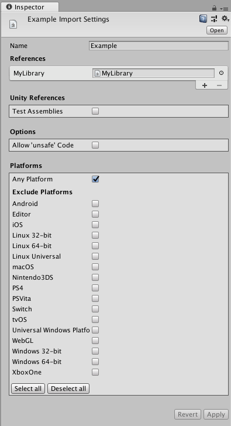
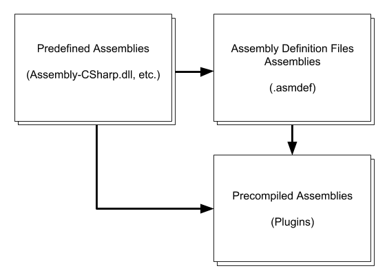

#Script compilation and assembly definition files

##About

Unity automatically defines how scripts compile to managed assemblies. Typically, compilation times in the Unity Editor for iterative script changes increase as you add more scripts to the Project. 

Use an assembly definition file to define your own managed assemblies based upon scripts inside a folder. To do this, separate Project scripts into multiple assemblies with well-defined dependencies in order to ensure that only required assemblies are rebuilt when making changes in a script. This reduces compilation time. Think of each managed assembly as a single library within the Unity Project. 


**Figure 1** above illustrates how to split the Project scripts into several assemblies. Changing only scripts in Main.dll causes none of the other assemblies to recompile. Since Main.dll contains fewer scripts, it also compiles faster than Assembly-CSharp.dll.
Similarly, script changes in only Stuff.dll causes Main.dll and Stuff.dll to recompile.

##How to use assembly definition files

Assembly definition files are Asset files that you create by going to __Assets__ > __Create__ > __Assembly Definition__. They have the extension .asmdef.


Add an assembly definition file to a folder in a Unity Project to compile all the scripts in the folder into an assembly. Set the name of the assembly in the Inspector.

**Note**: The name of the folder in which the assembly definition file resides and the filename of the assembly definition file have no effect on the name of the assembly.





Add references to other assembly definition files in the Project using the Inspector too. To view the Inspector, click your Assembly Definition file and it should appear. To add a reference, click the __+__ icon under the __References__ section and choose your file.

Unity uses the references to compile the assemblies and also defines the dependencies between the assemblies.

To mark the assembly for testing, enable Test Assemblies in the Inspector. This adds references to unit.framework.dll and UnityEngine.TestRunner.dll in the Assembly Definition file.

When you mark an assembly for testing, makes sure that:

* Predefined assemblies (Assembly-CSharp.dll etc.) do not automatically reference Assembly Definition Files flagged for testing.

* The assembly is not included in a normal build. To include the assemblies in a player build, use [BuildOptions.IncludeTestAssemblies](ScriptRef:BuildOptions.IncludeTestAssemblies.html) in your building script. Note that this only includes the assemblies in your build and does not execute any tests.

**Note**: If you use the *unsafe* keyword in a script inside an assembly, you must enable the __Allow ‘unsafe’ Code__ option in the Inspector. This will pass the /unsafe option to the C# compiler when compiling the assembly.


You set the platform compatibility for the assembly definition files in the Inspector. You have the option to exclude or include specific platforms.

##Multiple assembly definition files inside a folder hierarchy

Having multiple assembly definition files (extension: .asmdef) inside a folder hierarchy causes each script to be added to the assembly definition file with the shortest path distance.

Example:

If you have an _Assets/ExampleFolder/MyLibrary.asmdef_ file and an _Assets/ExampleFolder/ExampleFolder2/Utility.asmdef_ file,
then:

* Any scripts inside the __Assets__ > __ExampleFolder__ > __ExampleFolder2__ folder will be compiled into the Assets/ExampleFolder/ExampleFolder2/Utility.asmdef defined assembly.

* Any files in the __Assets__ > __ExampleFolder__ folder that are not inside the __Assets__ > __ExampleFolder__ > __ExampleFolder2__ folder will be compiled into the Assets/ExampleFolder/MyLibrary.asmdef defined assembly.

##Assembly definition files are not build system files
 **Note**: The assembly definition files are not assembly build files. They do not support conditional build rules typically found in build systems.
  
This is also the reason why the assembly definition files do not support setting of preprocessor directives (defines), as those are static at all times.

##Backwards compatibility and implicit dependencies
Assembly definition files are backwards compatible with the existing [Predefined Compilation System](ScriptCompileOrderFolders) in Unity. This means that the predefined assemblies always depend on every assembly definition file’s assemblies.
This is similar to how all scripts are dependent on all precompiled assemblies (plugins / .dlls) compatible with the active build target in Unity.




The diagram in **Figure 3** illustrates the dependencies between predefined assemblies, assembly definition files assemblies and precompiled assemblies.

Unity gives priority to the assembly definition files over the [Predefined Compilation System](ScriptCompileOrderFolders).
This means that having any of the special folder names from the predefined compilation inside a assembly definition file folder does not have any effect on the compilation. Unity treats these as regular folders without any special meaning.

It is highly recommended that you use assembly definition files for all the scripts in the Project, or not at all. Otherwise, the scripts that are not using assembly definition files always recompile every time an assembly definition file recompiles. This reduces the benefit of using assembly definition files.

##API
In the UnityEditor.Compilation namespace there is a static [CompilationPipeline](ScriptRef:Compilation.CompilationPipeline.html) class that you use to retrieve information about assembly definition files and all assemblies built by Unity.

##File format
Assembly definition files are JSON files. They have the following fields:

|**Field** | **Type** |
|:--|:--|
|__name__|string|
|__references(optional)__|string array|
|__includePlatforms (optional)__ | string array|
|__excludePlatforms (optional)__ | string array|

Do not use the __includePlatforms__ and __excludePlatforms__ fields in the same assembly definition file.

Retrieve the platform names by using ```CompilationPipeline.GetAssemblyDefinitionPlatforms.```

##Examples
MyLibrary.asmdef

```
{
    "name": "MyLibrary",
    "references": [ "Utility" ],
    "includePlatforms": ["Android", "iOS"]
}
```
MyLibrary2.asmdef

```
{
    "name": "MyLibrary2",
    "references": [ "Utility" ],
     "excludePlatforms": ["WebGL"]
}
```


---

* <span class="page-edit">2018-03-07  <!-- include IncludeTextNewPageSomeEdit --></span>

* <span class="page-history">New feature in [2017.3](https://docs.unity3d.com/2017.3/Documentation/Manual/30_search.html?q=newin20173) <span class="search-words">NewIn20173</span></span>

* <span class="page-history">Custom Script Assemblies updated in 2018.1</span>
