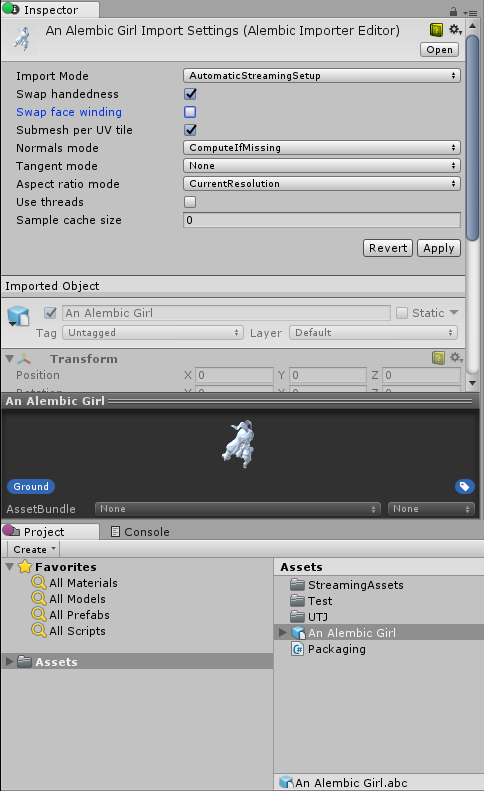

## Scripted Importers

Scripted Importers are part of the [Unity Scripting API](ScriptingSection). Use Scripted Importers to write custom Asset importers in C# for file formats not natively supported by Unity.

Create a custom importer by specializing the abstract class [ScriptedImporter](ScriptRef:Experimental.AssetImporters.ScriptedImporter.html) and applying the [ScriptedImporter](ScriptRef:Experimental.AssetImporters.ScriptedImporterAttribute.html) attribute. This registers your custom importer to handle one or more file extensions. When a file matching the registered file extensions is detected by the Asset pipeline as being new or changed, Unity invokes the method `OnImportAsset` of your custom importer.

Note: Scripted Importers cannot handle a file extension that is already natively handled by Unity.

**Note: Limitation**

This is an experimental release of the Scripted Importer feature and as such is limited to assets that can be created using the Unity Scripting API. This is not a limitation of the implementation or design of the this feature, but does impose limits on its real-world use.


### Example

Below is a simple example as Scripted Importer: It imports asset files with the extension "cube" into a Unity Prefab with a cube primitive as the main Asset and a default material with a color fetched from the Asset file:

```
using UnityEngine;
using UnityEditor.Experimental.AssetImporters;
using System.IO;

[ScriptedImporter(1, "cube")]
public class CubeImporter : ScriptedImporter
{
    public float m_Scale = 1;

    public override void OnImportAsset(AssetImportContext ctx)
    {
        var cube = GameObject.CreatePrimitive(PrimitiveType.Cube);
        var position = JsonUtility.FromJson<Vector3>(File.ReadAllText(ctx.assetPath));

        cube.transform.position = position;
        cube.transform.localScale = new Vector3(m_Scale, m_Scale, m_Scale);

        // 'cube' is a a GameObject and will be automatically converted into a prefab
        // (Only the 'Main Asset' is elligible to become a Prefab.)
        ctx.AddObjectToAsset("main obj", cube);
        ctx.SetMainObject(cube);

        var material = new Material(Shader.Find("Standard"));
        material.color = Color.red;

        // Assets must be assigned a unique identifier string consistent across imports
        ctx.AddObjectToAsset("my Material", material);

        // Assets that are not passed into the context as import outputs must be destroyed
        var tempMesh = new Mesh();
        DestroyImmediate(tempMesh);
    }
}
```

**Note**: 

* The importer is registered with Unity's Asset pipeline by placing the the `ScriptedImporter` attribute on the CubeImporter class.
* The CubeImporter class implements the abstract `ScriptedImporter` base class.
* `OnImportAsset`’s ctx argument contains both input and output data for the import event.
* Each import event must generate one (and only one) call to `SetMainAsset`.
* Each import event may generate as many calls to `AddSubAsset` as necessary.
* Please refer to the [Scripting API documentation](ScrptRef:Experimental.AssetImporters.ScriptedImporter.html) for more details.

You may also implement a custom Import Settings Editor by specializing [ScriptedImporterEditor](ScriptRef:Experimental.AssetImporters.ScriptedImporterEditor) class and decorating it with the class attribute `CustomEditor` to tell it what type of importer it is used for.

For example:


```
using UnityEditor;
using UnityEditor.Experimental.AssetImporters;
using UnityEditor.SceneManagement;
using UnityEngine;

[CustomEditor(typeof(CubeImporter))]
public class CubeImporterEditor: ScriptedImporterEditor
{
    public override void OnInspectorGUI()
    {
        var colorShift = new GUIContent("Color Shift");
        var prop = serializedObject.FindProperty("m_ColorShift");
        EditorGUILayout.PropertyField(prop, colorShift);
        base.ApplyRevertGUI();
    }
}
```

### Using a Scripted Importer

Once you have added a scripted importer class to a project, you may use it just like any other native file type supported by Unity:

* Drop a supported file in the Asset directory hierarchy to import.
* Restarting the Unity Editor reimports any files that have changed since last update.
* Editing the Asset file on disk and returning to the Unity Editor triggers a reimport.
* Import a new asset using __Asset__ > __Import New Asset...__.
* Explicitly trigger a re-import via the menu: __Asset__ > __Reimport__.
* Click on the Asset to see its settings in the [Inspector window](UsingTheInspector). To modify its settings, edit them in the Inspector window and click __Apply__ .
<br/><br/>





### Real-world use of Scripted Importers

* __Alembic__: The Alembic importer plug-in has been updated to use a Scripted Importer. For more information, visit [Unity github: AlembicImporter](https://github.com/unity3d-jp/AlembicImporter).

* __USD__: The USD importer plug-in has been updated to use a Scripted Importer.
For more information, please visit [Unity github:: USDForUnity](https://github.com/unity3d-jp/USDForUnity).

<br/>
<br/>

---

* <span class="page-history">New feature in [2017.1](https://docs.unity3d.com/2017.1/Documentation/Manual/30_search.html?q=newin20171) <span class="search-words">NewIn20171</span></span>

* <span class="page-edit">2017-07-27  <!-- include IncludeTextAmendPageNoEdit --></span>


