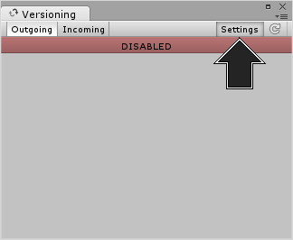
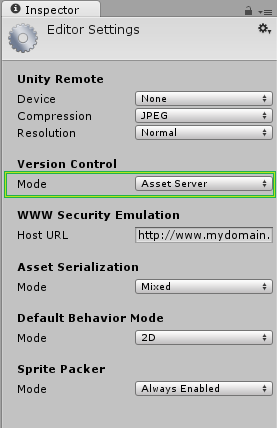
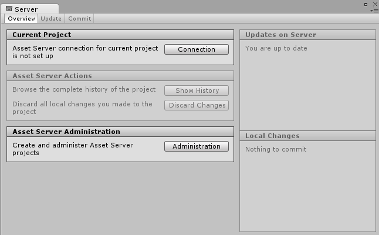
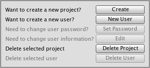
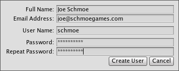

Setting up the Asset Server
===========================

|**WARNING: LEGACY DOCUMENTATION** |
|:---|
|Note that that from 2017.1 the Asset Server is a deprecated product. We recommend using Plastic SCM or Perforce for version control in your Unity project. 2017-06-30|

Server-side Installation
------------------------


The Asset Server is designed to be a simple one-time installation on a server machine. Interacting with the Asset Server is done through Unity. Unity can be installed on the server machine, but it does not need to be. It must be administrated from a Client machine, where Projects and Users can be added. Each additional client must be configured to synchronize with a Project, using a specific User credential.

You can install the Asset Server on Mac OS X 10.4 or later, Windows Vista and various Linux distributions including CentOS, Ubuntu and Suse Linux.
[Download Unity Asset Server](http://www.unity3d.com/asset-server) from here.

The installer will install all necessary files, setup a database and launch the Asset Server. At the end of the process you will be asked to create an __Admin password__. This password is required to administer the Asset Server from within Unity. You must connect to the Asset Server as the administrator before you can create any projects or users.


Administrating the Asset Server
-------------------------------

The Asset Server allows any number of __Users__ to connect to a __Project__. The Administrator must first connect to the Server with Unity as a client and create new Projects and Users.

This guide will show you how to get your server up and running and ready for use.

Please be aware that the __Asset Server__ is now a legacy product. We recommend using __Plastic SCM__ or __Perforce__ for version control in your Unity project.

[PlasticSCM](plasticSCMIntegration)
[PerForce](perForceIntegration)


**1.**
Launch __Unity__ and open up a blank project. Select __Window__ &gt; __Asset Management__ &gt; __Version Control__, then click the __Settings__ button.

 

You will then see the __Version Control__ settings in the __Inspector__, now select __Asset Server__ from the __Mode__ drop down menu.

 

**2.** Now we are going to run the asset server. Find and run the following file:

**Windows:** C:\Program Files (x86)\Unity\AssetServer\bin\AssetServerControl.exe

**Macintosh:** /Library/UnityAssetServer

*Note: Yosemite 10.10.3 users will need to search via the hard drive's liabry directory, not the user's liabry directory.*

**3.** You can now select __Window__ &gt; __Asset Management__ &gt; __Version Control__. This will open the asset server's management tab.

Click the Administration button.

 

**4.** In the __Server Address__ field, enter either the __ip address__ or __host name__ of the computer running the Asset Server that you want to administer. If the Asset Server is installed on your local machine, you can use "localhost" as the __Server Address__. Next, provide the administrator name and password. The administrator name is always "admin", and the password is what was entered when installing the Asset Server. Finally, hit the __Connect__ button. You're now connected to the Asset Server, and can perform the initial setup.

 

###Managing Projects and Users

Each Server can contain several Projects, and each User can have permission to one or more Projects. Projects are generally orthogonal, and unique in asset collections. It is best to think "one Project equals one game".

New Projects can be created by clicking on the __Create__ button in the __Server Administration__ tab. 


 

New users can be created by first selecting an existing project and then clicking on the __New User__ button. 


 

After a user has been created in one Project, the user can be added to another project by enabling the checkbox on the left of the user name in the users list.

You can enable or disable user access for individual projects. 
To completely remove a project or user from the server use the __Delete Project__ and __Delete User__ buttons.

###Firewall settings

The Unity Asset Server uses TCP port __10733__. You might need to enable connections to this port in your firewall and/or router.


Advanced
--------


The Asset Server is built using a modified version of PostgreSQL. Accessing the SQL database directly requires a bit of technical knowledge about SQL and Unix/Linux command lines. User discretion is advised.

###Backing up

We have provided a command line tool to back up an asset server. The tool should be run from an administrator account on the machine running the asset server. Replace BACKUP_LOCATION with the path name you want the backup tool to place the backups:

Mac OS X 
`sudo /Library/UnityAssetServer/bin/as_backup ` BACKUP_LOCATION

Linux 
`sudo /opt/unity_asset_server/bin/as_backup ` BACKUP_LOCATION

Windows 
`"%ProgramFiles%\Unity\AssetServer\bin\as_backup.cmd" ` BACKUP_LOCATION

as_backup will create a directory at BACKUP_LOCATION containing one or more files per project plus files containing information about each project and a backup of all users and their passwords.

###Restoring a Backup

To restore an Asset Server backup produced with as_backup, first perform a clean installation of the Asset Server without any projects created. (The restore procedure will refuse to overwrite already existing projects with the same name.) 

Then run the provided backup restoration tool, `as_restore` pointing it to the location of a backup created with as_backup:

Mac OS X 
`sudo /Library/UnityAssetServer/bin/as_restore ` BACKUP_LOCATION

Linux 
`sudo /opt/unity_asset_server/bin/as_restore ` BACKUP_LOCATION

Windows 
`"%ProgramFiles%\Unity\AssetServer\bin\as_restore.cmd" ` BACKUP_LOCATION

Note that you can also use as_backup and as_restore to move an asset server installation from one machine to another by performing the backup on the source machine, moving the backup directory to the destination machine (or mount it through a network file share,) and then running as_restore to insert the data into the newly installed Asset Server instance. This will even work when the source and destination Asset Servers have different versions or are running on different operating systems.

###Locating the database name of an Asset Server Project

To view the tables in a Project database, first you need to figure out the name of the actual database. Run this command line command on the machine hosting the Asset Server:

Mac OS X 
`/Library/UnityAssetServer/bin/psql -U admin -h localhost -d postgres -c 'select * from all_databases**view'`

Linux 
`/opt/unity_asset_server/bin/psql -U admin -h localhost -d postgres -c 'select * from all_databases**view'`

Windows 
`"%ProgramFiles%\Unity\AssetServer\bin\psql.exe" -U admin -h localhost -d postgres -c "select * from all_databases**view"`

This and other commands will prompt you for a password. Every time this happens, enter the admin password for the database, which was set during the installation. The result will be a table that follows this basic layout:


````
    databasename | projectname | description | version 
--------------------+--------------------+--------------------------+---------
 sandbox | Sandbox | Created with Unity 2.0.0 | 1.0
 game | Game | Created with Unity 2.0.0 | 1.0
 my_game_project | My Game Project | Created with Unity 2.0.0 | 1.0
(3 rows)


````

Now you need to identify the "databasename" of the Project you want to back up. When creating a database, the default "databasename" is same as the "projectname" as shown inside Unity, but in lowercase and spaces replaced with underscores.

Note that if your server hosts multiple PostgreSQL databases on different ports you nay need to explicitly provide the port used to connect to the Asset Server database. In this case add -p 10733 to the commands given (assuming you have used the default port of 10733 for your instance.) For example:

Linux 
`/opt/unity_asset_server/bin/psql -U admin -h localhost -d postgres -c 'select * from all_databases**view' -p 10733`

###Additional SQL Functions

These and all other commands use tools from the PostgreSQL distribution. You can read more about these tools here: http://www.postgresql.org/docs/8.3/interactive/reference-client.html

------

*  <span class="page-edit">2017-06-30  <!-- include IncludeTextAmendPageNoEdit --></span>

*  <span class="page-history">Asset Server deprecated in [2017.1](https://docs.unity3d.com/2017.1/Documentation/Manual/30_search.html?q=newin20171) </span>

* <span class="page-history">Windows XP support in Standalone Player removed in 2018.1</span>

