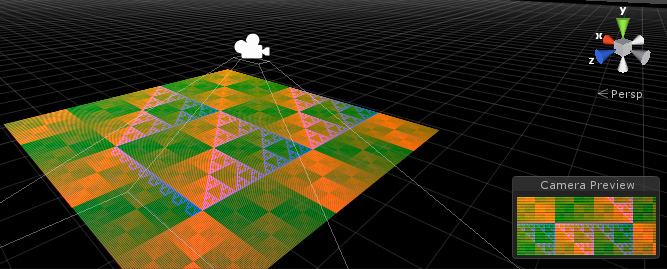

#Sparse Textures

__Sparse textures__ (also known as "tiled textures" or "mega-textures") are textures that are too large to fit in graphic memory in their entirety. To handle them, Unity breaks the main texture down into smaller rectangular sections known as "tiles". Individual tiles can then be loaded as necessary. For example, if the camera can only see a small area of a sparse texture, then only the tiles that are currently visible need to be in memory.

Aside from the tiling, a sparse texture behaves like any other texture in usage. Shaders can use them without special modification and they can have mipmaps, use all texture filtering modes, etc. If a particular tile cannot be loaded for some reason then the result is undefined; some GPUs show a black area where the missing tile should be but this behaviour is not standardised.

Not all hardware and platforms support sparse textures. For example, on DirectX systems they require [DX11.2](http://msdn.microsoft.com/en-us/library/windows/desktop/dn312084.aspx) (Windows 8.1) and a fairly recent GPU. On OpenGL they require [ARB_sparse_texture](http://www.opengl.org/registry/specs/ARB/sparse_texture.txt) extension support. Sparse textures only support non-compressed texture formats.

See the [SparseTexture](ScriptRef:SparseTexture.html) script reference page for further details about handling sparse textures from scripts.

##Example Project

A minimal example project for sparse textures is available [here](../uploads/Examples/SparseTextureExample.zip).

 
The example shows a simple procedural texture pattern and lets you move the camera to view different parts of it. Note that the project requires a recent GPU and a DirectX 11.2 (Windows 8.1) system, or using OpenGL with _ARB\_sparse\_texture_ support.
