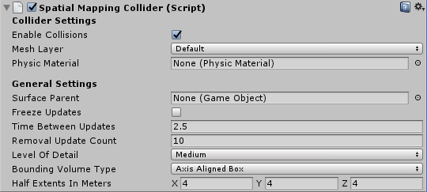
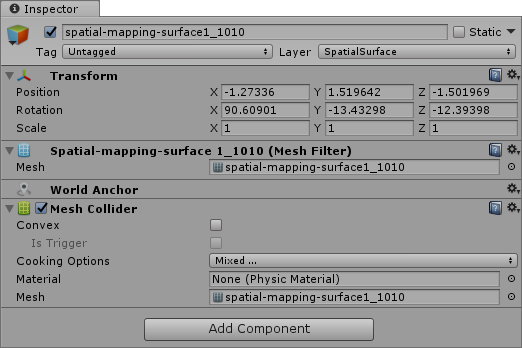

# Spatial Mapping Collider

The __Spatial Mapping Collider__ component allows holographic content to interact with real-world physical Surfaces. This component handles creating, updating, and destroying the Surface GameObject Colliders in the Scene.

The component periodically queries the system for Surface changes in the physical world. When the system reports Surface changes, the __Spatial Mapping Collider__ component prioritizes when each reported Surface is baked by Unity. Every time a Surface is baked by the system, a new GameObject is then generated by Unity, containing a [Mesh Filter](class-MeshFilter) and [Mesh Collider](class-MeshCollider) component. A Surface with a Mesh Collider allows raycasts to collide with it as with any other mesh in Unity. See [Camera Raycast](CameraRays) documentation for more information.

__Note:__ This component only updates the Mesh Collider components of Surface GameObjects, and not the Mesh Renderers.

__Note: Spatial Mapping Colliders__ update with less latency than __Spatial Mapping Mesh Renderers__. This means that Colliders update faster than Renderers.



## Collider Settings

| __Setting__|__Description__|
|:---|:---| 
|__Enable Collisions__| Check this box to enable Surface [Mesh Colliders](class-MeshCollider). This means that holographic content can collide with Surfaces.|
|__Mesh Layer__| Set the [Layer](Layers) property on all the Surface Mesh Colliders. Note that you need to set Layers for raycasts. When performing a raycast, you must indicate which Layers you want the ray intersection to test against. See [Camera Raycast](CameraRays) documentation for more information, and see [Example script: SpatialSurface raycast](#ExampleScript), below. <br/><br/>By default, Unity assigns all GameObjects to the __Default__ Layer. However, it is good practice to assign your GameObjects to a specific Layer. We recommend that you create a new layer specifically for Spatial Mapping Surfaces and assign this Layer to the Mesh Layer property.|
|__Physic Material__| Specify which __Physic Material__ to assign to each Surface GameObject’s Mesh Collider. The default is __None (Physic Material)__. <br/><br/>A __Physic Material__ specifies how other Rigidbody components should interact with it. For example, you might want to create a Surface that simulates ice, and therefore applies less friction to a GameObject moving on it. <br/><br/>The Spatial Mapping Collider component applies its __Physic Material__ to all of the Mesh Colliders on its Surface GameObjects. See documentation on [Physic Material](class-PhysicMaterial) for more information|

## General Settings

<!-- include SpatialMappingComponentsGeneralSettings -->

## Using the Spatial Mapping Collider

### Surface GameObjects

When you add a __Spatial Mapping Collider__ component to a GameObject in your Scene, it generates its own separate set of Surface GameObjects during runtime. These appear in your Scene parented to a Surface Parent GameObject.

The Surface GameObjects generated by the __Spatial Mapping Collider__ contain the following components:

* [Mesh Filter](class-MeshFilter)

* [World Anchor](wmr_input_types)

* [Mesh Collider](class-MeshCollider)



If you add multiple __Spatial Mapping Collider__ components to your Scene, each individual component generates its own set of Surface GameObjects. For example, if two GameObjects in your Scene contain a __Spatial Mapping Collider__ then your Scene contains two sets of Surface GameObjects; one generated by each component at runtime. This is important to keep in mind for optimization purposes.
s
__Note:__ When first generated by the Spatial Mapping system, all __Surface GameObjects__ are assigned to the __Default Layer__. However, it is good practice to assign your GameObjects to a specific Layer, because raycasting is an expensive calculation to perform. By using Layers, you can filter which GameObjects you are doing your raycast calculations against, and so optimise performance. If you don’t have a lot of complicated Meshes on your __Default__ Layer, then doing a raycast test for collision won’t have a large performance cost. However, it is best to organize your GameObjects into Layers to reduce the complexity of raycast tests when doing collisions. You can change the layer assigned to all Surface GameObjects generated by a specific __Spatial Mapping Collider__ component by changing the __Collider Settings__ > __Mesh Layer__ property.

<a name="ExampleScript"></a>

### Example script: SpatialSurface raycast on a tap gesture event

The following example demonstrates how to raycast against GameObjects on the __SpatialSurface__ Layer and use a GestureRecognizer to initiate this raycast upon detection of a tap gesture event.

```

using UnityEngine;
using System.Collections; 

//Required for Gesture Recognizer
using UnityEngine.XR.WSA.Input;


public class CustomLayerCollision : MonoBehaviour
{

    //use this to capture gesture events

    private GestureRecognizer GR_recognizer;

    void Start()
    {
        //Initialise the GestureRecognizer

	    GR_recognizer = new GestureRecognizer();

        //Initiate gesture capture

        GR_recognizer.StartCapturingGestures();

        //Tell the GestureRecognizer which events to listen for

        GR_recognizer.SetRecognizableGestures(GestureSettings.Tap);

        //Subscribe the Tapped event to the DetectCollisions method

        //This makes this method be called any time the GestureRecognizer detects a tap event

        GR_recognizer.Tapped += DetectCollisions;

        //When the user initiates a tap gesture, the DetectCollisions   

        //method is called by the Tapped event delegate to do a collision test using Raycasting

        //See [GestureRecognizer API reference](ScriptRef:XR.WSA.Input.GestureRecognizer.html) for more details
    }
    //Method to fire a raycast on a Tap event
    public void DetectCollisions(TappedEventArgs tapEvent)
    {
        // Raycast against all GameObjects that are on either the
        // spatial Surface or UI layers.

        int layerMask = 1 << LayerMask.NameToLayer("SpatialSurface");

        //construct a Ray using the position and forward direction of the User’s head
        Ray GazeRay = new Ray(tapEvent.headPose.position, tapEvent.headPose.forward);

        //Raycast using constructed Ray from Gaze and store collisions in array hits

        RaycastHit[] hits = Physics.RaycastAll(GazeRay, float.MaxValue, layerMask);

        if (hits.Length > 0)
        {
            foreach (RaycastHit hit in hits)
            {
                Debug.Log(string.Format("Hit Object **\"**{0}**\"** at position **\"**{1}**\"**", hit.collider.gameObject, hit.point));
            }
        }
        else
        {
            Debug.Log("Nothing was hit.");
        }
    }
}

```

See documentation on [Layers](Layers) and [Raycasting from Camera](CameraRays) for more information.

--

* <span class="page-edit">2018-05-01 <!-- include IncludeTextNewPageYesEdit --></span>

* <span class="page-history">Spatial Mapping for Hololens documentation updated in 2017.3</span>
