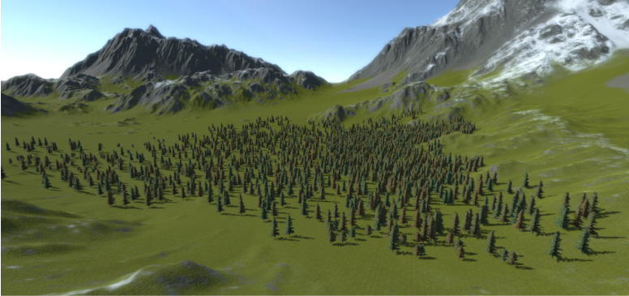
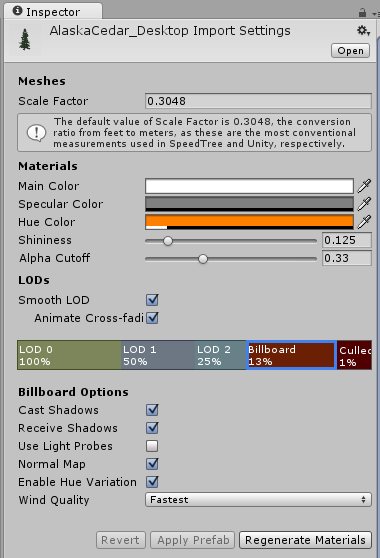
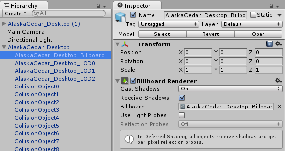

#SpeedTree

SpeedTree Assets (.spm files saved by Unity version of SpeedTree Modeler) are recognized and imported by Unity just like other Assets. Ensure Textures are reachable in the Project folder, and Materials for each [LOD](LevelOfDetail) are generated automatically. There are import settings when you select .spm Assets for you to tweak the generated GameObject and attached Materials. Materials are not generated again on reimporting, unless you hit the __Generate Materials__, or __Apply & Generate Materials__ button. Therefore any customisations to the Materials can be preserved.

The SpeedTree importer in the end generates a Prefab with [LODGroup component](class-LODGroup) configured. The Prefab can both be instantiated in a Scene as a common Prefab instance, or be selected as a tree prototype on the terrain and be "painted" across it. Additionally, terrain accepts any GameObject with an LODGroup component as a tree prototype, and put no limitation on the mesh size or number of Materials being used (in contrast to the [Tree Creator](class-Tree) trees). But, be aware that SpeedTree trees usually use 3–4 different Materials, which results in a number of draw-calls being issued every frame, so you should try to avoid heavy use of LOD trees on platforms that are sensitive to draw-call numbers.

##Casting and receiving real-time shadows

To make billboards cast shadows correctly, during the shadow caster pass, billboards are rotated to face the light direction (or light position in the case of point light) instead of facing the camera.

To enable these options, select the __Billboard LOD__ level in the Inspector of an .spm Asset, tick __Cast Shadows__ or __Receive Shadows__ in __Billboard Options__, and click __Apply Prefab__.

To change billboard shadow options of instantiated SpeedTree GameObjects, select the billboard GameObject in the Hierarchy window, and tweak these options in the Inspector of the Billboard Renderer, just as you would with a normal Mesh Renderer.

Trees painted on the terrain inherit billboard shadow options from the Prefab. 

You can use `BillboardRenderer.shadowCastingMode` and `BillboardRenderer.receiveShadows` to alter these options at runtime. 

**Known Issues:** As with any other renderer, the __Receive Shadows__ option has no effect while using deferred rendering. Billboards always receive shadows in deferred path.

