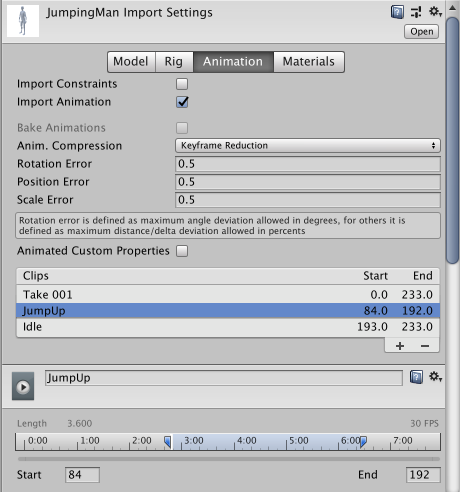
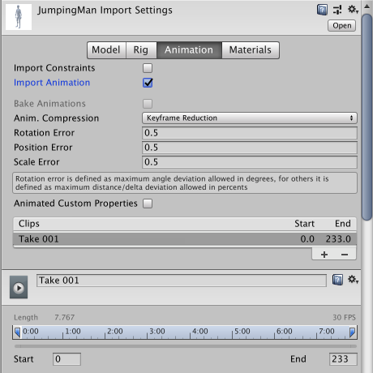
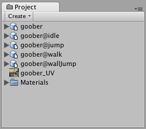

# Extracting animation clips

An animated character typically has a number of different movements that are activated in the game in different circumstances, called [Animation Clips](class-AnimationClip). For example, we might have separate animation clips for walking, running, jumping, throwing, and dying. Depending on how the artist set up the animation in the 3D modeling application, these separate movements might be imported as distinct animation clips or as one single clip where each movement simply follows on from the previous one. In cases where there is only one long clip, you can extract component animation clips inside Unity, which adds a few extra steps to your workflow.

If your model has multiple animations that you already defined as individual clips, the [Animations tab](class-AnimationClip) looks like this:

 

You can preview any of the clips that appear in the list. If you need to, you can edit the time ranges of the clips. 

If your model has multiple animations supplied as one continuous take, the __Animation__ tab looks like this:

 

In this case, you can define the time ranges (frames or seconds) that correspond to each of the separate animation sequences (walking, jumping, running, and idling). You can create a new animation clip by following these steps:

1. Click the add (`+`) button. 
2. Select the range of frames or seconds that it includes.
3. You can also change the name of the clip.

For example, you could define the following:

* idle animation during frames 0 - 83
* jump animation during frames 84 - 192
* slightly swinging arms animation during frames 193 - 233

For further information, see the [Animation tab](class-AnimationClip).

## Importing animations using multiple model files

Another way to import animations is to follow a naming scheme that Unity allows for the animation files. You can create separate model files and name them with the convention `modelName@animationName.fbx`. For example, for a model called `goober`, you could import separate idle, walk, jump and walljump animations using files named `goober@idle.fbx`, `goober@walk.fbx`, `goober@jump.fbx` and `goober@walljump.fbx`. When exporting animation like this, it is unnecessary to include the Mesh in these files, but in that case you should enable the [Preserve Hierarchy Model import option](FBXImporter-Model).

 

Unity automatically imports all four files and collects all animations to the file without the @ sign in. In the example above, Unity imports the `goober.mb` file with references to the `idle`, `jump`, `walk` and `wallJump` animations automatically.

For FBX files, you can export the Mesh in a Model file without its animation. Then export the four clips as `goober@_animname_.fbx` by exporting the desired keyframes for each (enable animation in the FBX dialog).

---

*  2018-04-25  <!-- include IncludeTextAmendPageSomeEdit -->
