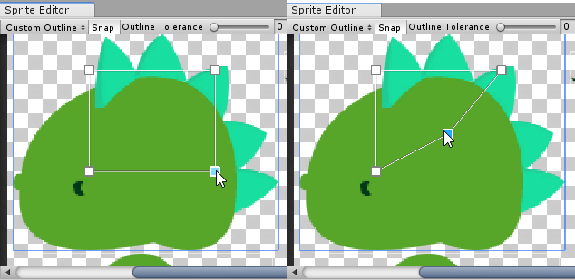
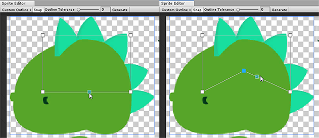

# Sprite Editor: Custom Outline

Use the [Sprite Editor’s](SpriteEditor) __Custom Outline__ option to edit the shape of the [Mesh](class-Mesh) that Unity renders the [Sprite](Sprites) texture on. The Custom Outline editor allows you to use control points to create and define the shape of the Sprite's Mesh outline. 

By default, Unity renders each Sprite on a rectangle Mesh. This Mesh might include transparent areas outside the Texture's border, and rendering these transparent areas can negatively affect performance. When you use the Custom Outline editor to define a Mesh outline that matches the outline of the Sprite Texture, you reduce the size of the transparent areas, which improves performance.
 
To access the Custom Outline editor, select a Sprite, then select [Sprite Editor](SpriteEditor) in its Inspector window. Click the __Sprite Editor__ drop-down at the top left of the Sprite Editor window, and select __Custom Outline__. 

## Automatically generating a Mesh outline

Unity can automatically generate a Mesh outline for you. Custom Outline mode has settings to adjust how Unity does this.

### Properties

|**Property**|**Function**|
|:---|:---|
|__Snap__|Snap control points to the nearest pixel. Enable this to use Outline Tolerance effectively.|
|__Outline Tolerance__|Use the slider to control the complexity and accuracy of the generated Mesh outline. At the minimum value (0), the Sprite Editor generates a basic Mesh outline around the Sprite with the minimal number of control points. At the maximum value (1), the Sprite Editor generates a Mesh outline with many control points and a tight Mesh that follows the pixel outline of the Sprite as closely as possible.|
|__Generate__|Click to automatically create a Mesh outline.|

To automatically generate a Mesh outline:

1. Select a Sprite, navigate to the __Sprite Editor__ &gt; __Custom Outline__ window, and select __Generate__. The Editor automatically generates a Mesh outline that follows the transparent border of the Sprite. 
2. Enable __Snap__ to make sure the generated Mesh outline follows the shape of the Sprite Texture.
2. Use the __Outline Tolerance__ slider to adjust how tightly the generated Mesh outline attempts to follow the outline of the Sprite Texture. This affects the overall complexity of the Mesh outline, and the number of control points generated.
3. Select __Generate__ to refresh the Mesh outline after each change.

## Creating a custom Mesh outline

You can create your own custom Mesh outline. This is useful if you want the Mesh to be smaller, larger, or a different shape to your Sprite Texture. Follow this workflow to create a custom Mesh outline.

**Create a Mesh outline**: Click and drag over a Sprite to create a rectangle Mesh outline with four control points. Repeat this step to create multiple Mesh outlines within the Sprite. Unity only renders the areas enclosed within the Mesh outlines.

**Change the shape of a Mesh outline**: To adjust the shape of the Mesh outline, click and drag the control points. When you hover over a control point, it turns blue to indicate that you can select it. Click and drag the control point to different positions to adjust the shape of the Mesh outline.

**Add a control point to a Mesh outline**: To add a control point, hover over a section of the Mesh outline. A preview of the control point appears along the Mesh outline's edge. Click to add a new control point at that location.

**Move a section of Mesh outline between control points**: To move a section between two control points, hold __Ctrl__ while hovering over the Mesh outline section. This section of the Mesh outline turns yellow. While holding __Ctrl__, click and drag the section to move it to a different position.

---

*  2018-10-19  <!-- include IncludeTextAmendPageYesEdit -->

* __Edit Outline__ renamed to __Custom Outline__ in Unity version 2017.3.