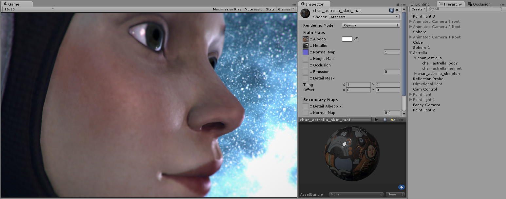
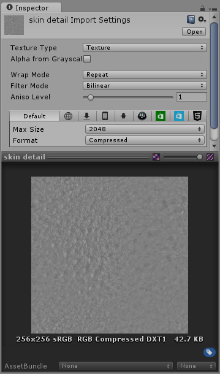
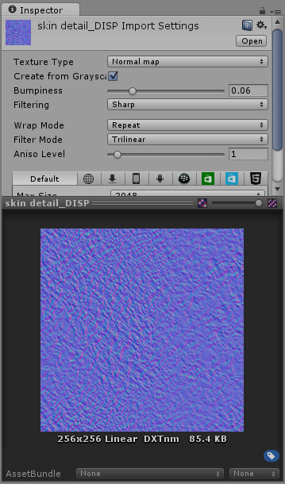
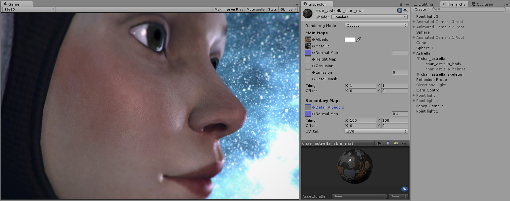
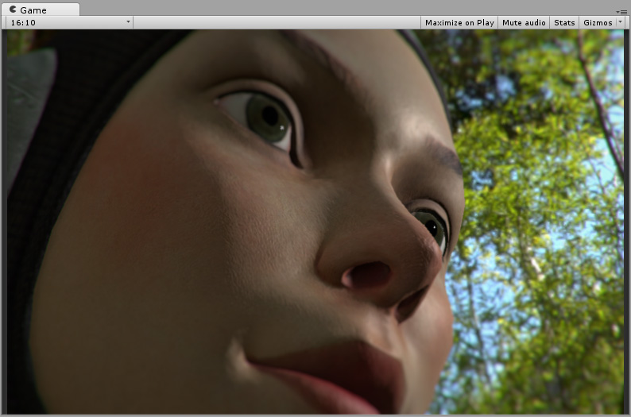

#Secondary Maps (Detail Maps) & Detail Mask

Secondary Maps (or Detail maps) allow you to overlay a second set of textures on top of the main textures listed above. You can apply a second Albedo colour map, and a second Normal map. Typically, these would be mapped on a much smaller scale repeated many times across the object's surface, compared with the main Albedo and Detail maps.

The reason for this is to allow the material to have sharp detail when viewed up close, while also having a normal level of detail when viewed from further away, without having to use a single extremely high texture map to achieve both goals.

Typical uses for detail textures would be:
- Adding skin detail, such as pores and hairs, to a character's skin
- Adding tiny cracks and lichen growth to a brick wall
- adding small scratches and scuffs to a large metal container

If you use a single normal map do ALWAYS plug it into the primary channel. The Secondary normal map channel is more expensive than the primary one but has the exact same effect.

### Detail Mask
The detail mask texture allows you to mask off certain areas of your model to have the detail texture applied. This means you can show the detail texture in certain areas, and hide it in others. In the example of the skin pores above, you might want to create a mask so the pores are not shown on the lips or eyebrows.