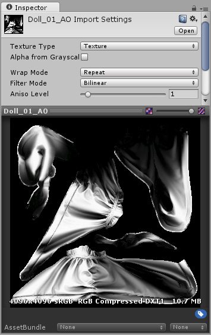

#Occlusion Map

The occlusion map is used to provide information about which areas of the model should receive high or low indirect lighting. Indirect lighting comes from ambient lighting and reflections, and so steep concave parts of your model such as a crack or fold would not realistically receive much indirect light.

Occlusion texture maps are normally calculated by 3D applications directly from the 3D model using the modeller or third party software.

An occlusion map is a greyscale image, with white indicating areas that should receive full indirect lighting, and black indicating no indirect lighting. Sometimes this is as simple as a greyscale heightmap, for simple surfaces (such as the knobbly stone wall texture shown in the heightmap example above).

At other times, generating the correct occlusion texture is slightly more complex. For example, if a character in your scene is wearing a hood, the inside edges of the hood should be set to very low indirect lighting, or none at all. In these situations, occlusion maps will be often be produced by artists, using 3D applications to automatically generate an occlusion map based on the model.

