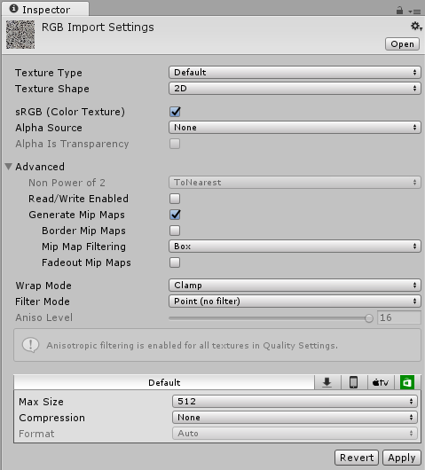
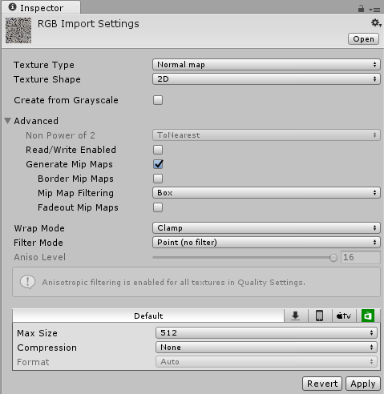
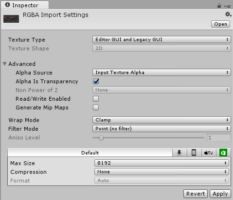
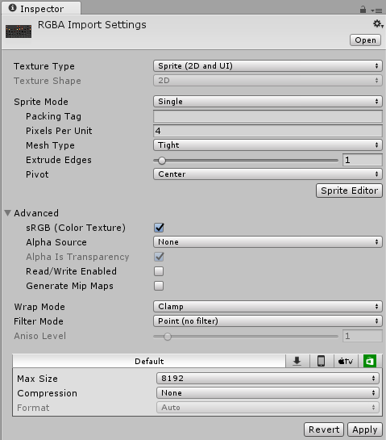
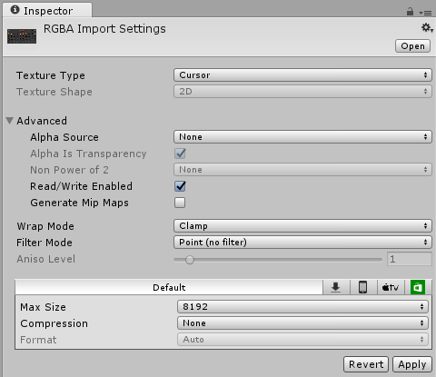
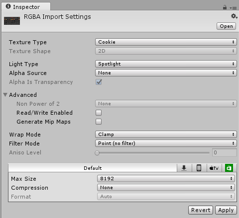
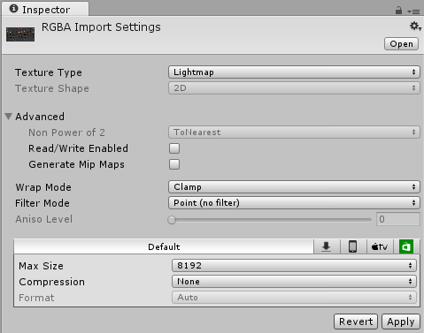
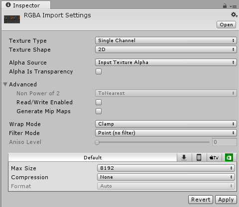

#Texture Types

You can import different [Texture](Textures) types into the Unity Editor via the [Texture Importer](class-TextureImporter).

Below are the properties available to configure the various Texture types in Unity in the Texture Inspector window. Scroll down or select from the list below to find details of the Texture type you wish to learn about.

* [Default](#Default)
* [Normal Map](#NormalMap)
* [Editor GUI and Legacy](#Editor)
* [Sprite (2D and UI)](#Sprite)
* [Cursor](#Cursor)
* [Cookie](#Cookie)
* [Lightmap](#Lightmap)
* [Single Channel](#SingleChannel)

## Texture type: Default

| **Property:**| **Function:** |
|:---|:---| 
| __Texture Type__| __Default__ is the most common setting used for all Textures. It provides access to most of the properties for Texture importing. |
| __Texture Shape__| Use this to define the shape of the Texture. See documentation on the [Texture Importer](class-TextureImporter) for information on all Texture shapes.  |
| __sRGB (Color Texture)__| Check this box to specify that the Texture is stored in gamma space. This should always be checked for non-HDR color Textures (such as Albedo and Specular Color). If the Texture stores information that has a specific meaning, and you need the exact values in the Shader (for example, the smoothness or the metalness), uncheck this box. This box is checked by default. |
| __Alpha Source__| Use this to specify how the alpha channel of the Texture is generated. This is set to __None__ by default. |
|&nbsp;&nbsp;&nbsp;&nbsp;None| The imported Texture does not have an alpha channel, whether or not the input Texture has one. |
|&nbsp;&nbsp;&nbsp;&nbsp;Input Texture Alpha| This uses the alpha from the input Texture if a Texture is provided. |
|&nbsp;&nbsp;&nbsp;&nbsp;From Gray Scale| This generates the alpha from the mean (average) of the input Texture RGB values. |
| __Alpha is Transparency__| If the alpha channel you specify is Transparency, enable __Alpha is Transparency__ to dilate the color and avoid filtering artifacts on the edges. |
| __Advanced__||
| __Non Power of 2__| If the Texture has a non-power of two (NPOT) dimension size, this defines a scaling behavior at import time. See documentation on [Importing Textures](ImportingTextures) for more information on non-power of two sizes. This is set to __None__ by default. |
|&nbsp;&nbsp;&nbsp;&nbsp;None| Texture dimension size stays the same. |
|&nbsp;&nbsp;&nbsp;&nbsp;To nearest| The Texture is scaled to the nearest power-of-two dimension size at import time. For example, a 257x511 px Texture is scaled to 256x512 px. Note that PVRTC formats require Textures to be square (that is width equal to height), so the final dimension size is upscaled to 512x512 px. |
|&nbsp;&nbsp;&nbsp;&nbsp;To larger| The Texture is scaled to the power-of-two dimension size of the largest dimension size value at import time. For example, a 257x511 px Texture is scaled to 512x512 px. |
|&nbsp;&nbsp;&nbsp;&nbsp;To smaller| The Texture is scaled to the power-of-two dimension size of the smallest dimension size value at import time. For example, a 257x511 px Texture is scaled to 256x256 px. |
| __Read/Write Enabled__| Check this box to enable access to the Texture data from script functions (such as [Texture2D.SetPixels](ScriptRef:Texture2D.SetPixels.html), [Texture2D.GetPixels](ScriptRef:Texture2D.GetPixels.html) and other [Texture2D](ScriptRef:Texture2D.html) functions). Note that a copy of the Texture data is made, doubling the amount of memory required for Texture Assets, so only use this property if absolutely necessary. This is only valid for uncompressed and DXT compressed Textures; other types of compressed textures cannot be read from. This property is disabled by default. |
| __Generate Mip Maps__| Check this box to enable mipmap generation. Mipmaps are smaller versions of the Texture that get used when the Texture is very small on screen. See documentation on [Importing Textures](ImportingTextures) for more information on mipmaps. |
|&nbsp;&nbsp;&nbsp;&nbsp;Border Mip Maps| Check this box to avoid colors bleeding out to the edge of the lower MIP levels. Used for light cookies (see below). This box is unchecked by default. |
|&nbsp;&nbsp;&nbsp;&nbsp;Mip Map Filtering| There are two ways of mipmap filtering available for optimizing image quality. The default option is __Box__. |
|&nbsp;&nbsp;&nbsp;&nbsp;&nbsp;&nbsp;&nbsp;&nbsp;_Box_| This is the simplest way to fade out mipmaps. The MIP levels become smoother as they go down in dimension size. |
|&nbsp;&nbsp;&nbsp;&nbsp;&nbsp;&nbsp;&nbsp;&nbsp;_Kaiser_| A sharpening algorithm runs on the mipmaps as they go down in dimension size. Try this option if your Textures are too blurry in the distance. (The algorothm is of a Kaiser Window type - see [Wikipedia]( https://en.wikipedia.org/wiki/Kaiser_window) for further information.) |
|&nbsp;&nbsp;&nbsp;&nbsp;Fadeout Mip Maps| Enable this to make the mipmaps fade to gray as the MIP levels progress. This is used for detail maps. The left-most scroll is the first MIP level to begin fading out. The right-most scroll defines the MIP level where the Texture is completely grayed out. |
| __Wrap Mode__| Select how the Texture behaves when tiled. The default option is __Clamp__. |
|&nbsp;&nbsp;&nbsp;&nbsp;Repeat| The Texture repeats itself in tiles. |
|&nbsp;&nbsp;&nbsp;&nbsp;Clamp| The Texture’s edges are stretched.  |
| __Filter Mode__| Select how the Texture is filtered when it gets stretched by 3D transformations. The default option is __Point (no filter)__. |
|&nbsp;&nbsp;&nbsp;&nbsp;Point (no filter)| The Texture appears blocky up close. |
|&nbsp;&nbsp;&nbsp;&nbsp;Bilinear| The Texture appears blurry up close. |
|&nbsp;&nbsp;&nbsp;&nbsp;Trilinear| Like Bilinear, but the Texture also blurs between the different MIP levels. |
| __Aniso Level__| Increases Texture quality when viewing the Texture at a steep angle. Good for floor and ground Textures. See documentation on [Importing Textures](ImportingTextures) for more information on Anisotropic filtering. |

## Texture type: Normal Map 

| **Property:**| **Function:** |
|:---|:---| 
| __Texture Type__| Select __Normal map__ to turn the color channels into a format suitable for real-time normal mapping. |
| __Texture Shape__| Use this to define the shape of the Texture. See documentation on the [Texture Importer](class-TextureImporter) for information on all Texture shapes.  |
| __Create from Greyscale__| This creates the Normal Map from a greyscale heightmap. Check this to enable it and enabled it and see the __Bumpiness__ and __Filtering__. This option is unchecked by default. |
|&nbsp;&nbsp;&nbsp;&nbsp;Bumpiness| Control the amount of bumpiness. A low bumpiness value means that even sharp contrast in the heightmap is translated to gentle angles and bumps. A high value creates exaggerated bumps and very high-contrast lighting responses to the bumps. This option is only visible if Create from Greyscale is checked.  |
|&nbsp;&nbsp;&nbsp;&nbsp;Filtering| Determine how the bumpiness is calculated: |
|&nbsp;&nbsp;&nbsp;&nbsp;&nbsp;&nbsp;&nbsp;&nbsp;_Smooth_| This generates Normal Maps with standard (forward differences) algorithms. |
|&nbsp;&nbsp;&nbsp;&nbsp;&nbsp;&nbsp;&nbsp;&nbsp;_Sharp_| Also known as a Sobel filter, this generates Normal Maps that are sharper than Standard. |
| __Advanced__||
| __Non Power of 2__| If the Texture has a non-power of two (NPOT) dimension size, this defines a scaling behavior at import time. See documentation on [Importing Textures](ImportingTextures) for more information on non-power of two dimension sizes. This is set to __None__ by default. |
|&nbsp;&nbsp;&nbsp;&nbsp;None| Texture dimension size stays the same. |
|&nbsp;&nbsp;&nbsp;&nbsp;To nearest| The Texture is scaled to the nearest power-of-two dimension size at import time. For example, a 257x511 px Texture is scaled to 256x512 px. Note that PVRTC formats require Textures to be square (width equal to height), so the final dimension size is upscaled to 512x512 px. |
|&nbsp;&nbsp;&nbsp;&nbsp;To larger| The Texture is scaled to the power-of-two dimension size of the largest dimension size value at import time. For example, a 257x511 px Texture is scaled to 512x512 px. |
|&nbsp;&nbsp;&nbsp;&nbsp;To smaller| The Texture is scaled to the power-of-two dimension size of the smallest dimension size value at import time. For example, a 257x511 px Texture is scaled to 256x256 px. |
| __Read/Write Enabled__| Check this box to enable access to the Texture data from script functions (such as [Texture2D.SetPixels](ScriptRef:Texture2D.SetPixels.html), [Texture2D.GetPixels](ScriptRef:Texture2D.GetPixels.html) and other [Texture2D](ScriptRef:Texture2D.html) functions). Note that a copy of the Texture data is made, doubling the amount of memory required for Texture Assets, so only use this property if absolutely necessary. This is only valid for uncompressed and DXT compressed Textures; other types of compressed textures cannot be read from. This property is disabled by default. |
| __Generate Mip Maps__| Check this box to enable mipmap generation. Mipmaps are smaller versions of the Texture that get used when the Texture is very small on screen. See documentation on [Importing Textures](ImportingTextures) for more information on mipmaps. |
|&nbsp;&nbsp;&nbsp;&nbsp;Border Mip Maps| Check this box to avoid colors bleeding out to the edge of the lower MIP levels. Used for light cookies (see below). This box is unchecked by default. |
|&nbsp;&nbsp;&nbsp;&nbsp;Mip Map Filtering| There are two ways of mipmap filtering available for optimizing image quality. The default option is __Box__. |
|&nbsp;&nbsp;&nbsp;&nbsp;&nbsp;&nbsp;&nbsp;&nbsp;_Box_| This is the simplest way to fade out mipmaps. The MIP levels become smoother as they go down in dimension size. |
|&nbsp;&nbsp;&nbsp;&nbsp;&nbsp;&nbsp;&nbsp;&nbsp;_Kaiser_| A sharpening algorithm runs on the mipmaps as they go down in dimension size. Try this option if your Textures are too blurry in the distance. (The algorothm is of a Kaiser Window type - see [Wikipedia]( https://en.wikipedia.org/wiki/Kaiser_window) for further information.) |
|&nbsp;&nbsp;&nbsp;&nbsp;Fadeout Mip Maps| Enable this to make the mipmaps fade to gray as the MIP levels progress. This is used for detail maps. The left-most scroll is the first MIP level to begin fading out. The right-most scroll defines the MIP level where the Texture is completely grayed out. |
| __Wrap Mode__| Select how the Texture behaves when tiled. The default option is __Clamp__. |
|&nbsp;&nbsp;&nbsp;&nbsp;Repeat| The Texture repeats itself in tiles. |
|&nbsp;&nbsp;&nbsp;&nbsp;Clamp| The Texture’s edges are stretched.  |
| __Filter Mode__| Select how the Texture is filtered when it gets stretched by 3D transformations. The default option is __Point (no filter)__. |
|&nbsp;&nbsp;&nbsp;&nbsp;Point (no filter)| The Texture appears blocky up close. |
|&nbsp;&nbsp;&nbsp;&nbsp;Bilinear| The Texture appears blurry up close. |
|&nbsp;&nbsp;&nbsp;&nbsp;Trilinear| Like Bilinear, but the Texture also blurs between the different MIP levels. |
| __Aniso Level__| Increases Texture quality when viewing the Texture at a steep angle. Good for floor and ground Textures. See documentation on [Importing Textures](ImportingTextures) for more information on Anisotropic filtering. |

## Texture type: Editor GUI and Legacy GUI

| Property:| Function: |
|:---|:---| 
| __Texture Type__| Select __Editor GUI and Legacy GUI__ if you are using the Texture on any HUD or GUI controls. |
| __Texture Shape__| Use this to define the shape of the Texture. See documentation on the [Texture Importer](class-TextureImporter) for information on all Texture shapes.  |
| __Advanced__||
| __Alpha Source__| Use this to specify how the alpha channel of the Texture is generated. This is set to None by default. |
|&nbsp;&nbsp;&nbsp;&nbsp;None| The imported Texture does not have an alpha channel, whether or not the input Texture has one. |
|&nbsp;&nbsp;&nbsp;&nbsp;Input Texture Alpha| This uses the alpha from the input Texture if a Texture is provided. |
|&nbsp;&nbsp;&nbsp;&nbsp;From Gray Scale| This generates the alpha from the mean (average) of the input Texture RGB values. |
| __Alpha is Transparency__| If the alpha channel you specify is Transparency, enable __Alpha is Transparency__ to dilate the color and avoid filtering artifacts on the edges. |
| __Non Power of 2__| If the Texture has a non-power of two (NPOT) dimension size, this defines a scaling behavior at import time. See documentation on [Importing Textures](ImportingTextures) for more information on non-power of two sizes. This is set to __None__ by default. |
|&nbsp;&nbsp;&nbsp;&nbsp;None| Texture dimension size stays the same. |
|&nbsp;&nbsp;&nbsp;&nbsp;To nearest| The Texture is scaled to the nearest power-of-two dimension size at import time. For example, a 257x511 px Texture is scaled to 256x512 px. Note that PVRTC formats require Textures to be square (width equal to height), so the final dimension size is upscaled to 512x512 px. |
|&nbsp;&nbsp;&nbsp;&nbsp;To larger| The Texture is scaled to the power-of-two dimension size of the largest dimension size value at import time. For example, a 257x511 px Texture is scaled to 512x512 px. |
|&nbsp;&nbsp;&nbsp;&nbsp;To smaller| The Texture is scaled to the power-of-two dimension size of the smallest dimension size value at import time. For example, a 257x511px Texture is scaled to 256x256. |
| __Read/Write Enabled__| Check this box to enable access to the Texture data from script functions (such as [Texture2D.SetPixels](ScriptRef:Texture2D.SetPixels.html), [Texture2D.GetPixels](ScriptRef:Texture2D.GetPixels.html) and other [Texture2D](ScriptRef:Texture2D.html) functions). Note that a copy of the Texture data is made, doubling the amount of memory required for Texture Assets, so only use this property if absolutely necessary. This is only valid for uncompressed and DXT compressed Textures; other types of compressed textures cannot be read from. This property is disabled by default. |
| __Generate Mip Maps__| Check this box to enable mipmap generation. Mipmaps are smaller versions of the Texture that get used when the Texture is very small on screen. See documentation on [Importing Textures](ImportingTextures) for more information on mipmaps. |
|&nbsp;&nbsp;&nbsp;&nbsp;Border Mip Maps| Check this box to avoid colors bleeding out to the edge of the lower MIP levels. Used for light cookies (see below). This box is unchecked by default. |
|&nbsp;&nbsp;&nbsp;&nbsp;Mip Map Filtering| There are two ways of mipmap filtering available for optimizing image quality. The default option is __Box__. |
|&nbsp;&nbsp;&nbsp;&nbsp;&nbsp;&nbsp;&nbsp;&nbsp;_Box_| This is the simplest way to fade out mipmaps. The MIP levels become smoother as they go down in dimension size. |
|&nbsp;&nbsp;&nbsp;&nbsp;&nbsp;&nbsp;&nbsp;&nbsp;_Kaiser_| A sharpening algorithm runs on the mipmaps as they go down in dimension size. Try this option if your Textures are too blurry in the distance. (The algorothm is of a Kaiser Window type - see [Wikipedia]( https://en.wikipedia.org/wiki/Kaiser_window) for further information.) |
|&nbsp;&nbsp;&nbsp;&nbsp;Fadeout Mip Maps| Enable this to make the mipmaps fade to gray as the MIP levels progress. This is used for detail maps. The left-most scroll is the first MIP level to begin fading out. The right-most scroll defines the MIP level where the Texture is completely grayed out. |
| __Wrap Mode__| Select how the Texture behaves when tiled. The default option is __Clamp__. |
|&nbsp;&nbsp;&nbsp;&nbsp;Repeat| The Texture repeats itself in tiles. |
|&nbsp;&nbsp;&nbsp;&nbsp;Clamp| The Texture’s edges are stretched.  |
| __Filter Mode__| Select how the Texture is filtered when it gets stretched by 3D transformations. The default option is __Point (no filter)__. |
|&nbsp;&nbsp;&nbsp;&nbsp;Point (no filter)| The Texture appears blocky up close. |
|&nbsp;&nbsp;&nbsp;&nbsp;Bilinear| The Texture appears blurry up close. |
|&nbsp;&nbsp;&nbsp;&nbsp;Trilinear| Like Bilinear, but the Texture also blurs between the different MIP levels. |
| __Aniso Level__| Increases Texture quality when viewing the Texture at a steep angle. Good for floor and ground Textures. See documentation on [Importing Textures](ImportingTextures) for more information on Anisotropic filtering. |

## Texture type: Sprite (2D and UI)

| Property:| Function: |
|:---|:---| 
| __Texture Type__| Select __Sprite (2D and UI)__ if you are using the Texture in a 2D game as a [Sprite](Sprites). |
| __Texture Shape__| Use this to define the shape of the Texture. See documentation on the [Texture Importer](class-TextureImporter) for information on all Texture shapes.  |
| __Sprite mode__| Use this setting to specify how the the Sprite graphic is extracted from the image. The default for this option is __Single__. |
|&nbsp;&nbsp;&nbsp;&nbsp;Single| Use the Sprite image in isolation. |
|&nbsp;&nbsp;&nbsp;&nbsp;Multiple| Keep multiple related Sprites together in the same image (for example, animation frames or separate Sprite elements that belong to a single game character). |
| __Packing Tag__| Specify by name a Sprite atlas which you want to pack this Texture into. |
| __Pixels Per Unit__| The number of pixels of width/height in the Sprite image that correspond to one distance unit in world space. |
| __Mesh Type__| This defines the Mesh type that is generated for the Sprite. The default for this option is __Tight__.|
|&nbsp;&nbsp;&nbsp;&nbsp;Full Rect| This creates a quad to map the Sprite onto it. |
|&nbsp;&nbsp;&nbsp;&nbsp;Tight| This generates a Mesh based on pixel alpha value. The Mesh generated generally follows the shape of the Sprite.  **Note:** Any Sprite that is smaller than 32x32 uses __Full Rect__, even when __Tight__ is specified. |
| __Extrude Edges__| Use the slider to determine how much area to leave around the Sprite in the generated Mesh. |
| __Pivot__| The location in the image where the Sprite’s local coordinate system originates. Choose one of the pre-set options, or select __Custom__ to set your own Pivot location. |
|&nbsp;&nbsp;&nbsp;&nbsp;Custom| Define the X and Y to set a custom Pivot location in the image. |
|**Advanced**||
| __sRGB (Color Texture)__| Use this to specify whether or not the Texture is stored in gamma space. This should be the case for all non-HDR color Textures (such as Albedo and Specular Color). If the Texture stores information that has a specific meaning, and you need the exact values in the Shader (for example, the smoothness or the metalness), uncheck this box. |
| __Alpha Source__| Use this to specify how the alpha channel of the Texture is generated. |
|&nbsp;&nbsp;&nbsp;&nbsp;None| The imported Texture does not have an alpha channel, whether or not the input Texture has one. |
|&nbsp;&nbsp;&nbsp;&nbsp;Input Texture Alpha| This uses the alpha from the input Texture. This option does not appear in the menu if there is no alpha in the imported Texture. |
|&nbsp;&nbsp;&nbsp;&nbsp;From Gray Scale| This generates the alpha from the mean (average) of the input Texture RGB values. |
| __Alpha is Transparency__| If the provided alpha channel is Transparency, enable Alpha is Transparency to dilate the color and avoid filtering artifacts on the edges. |
| __Read/Write Enabled__| Check this box to enable access to the Texture data from script functions (such as [Texture2D.SetPixels](ScriptRef:Texture2D.SetPixels.html), [Texture2D.GetPixels](ScriptRef:Texture2D.GetPixels.html) and other [Texture2D](ScriptRef:Texture2D.html) functions). Note however that a copy of the Texture data will be made, doubling the amount of memory required for Texture Asset, so only use this property if absolutely necessary. This is only valid for uncompressed and DXT compressed Textures; other types of compressed textures cannot be read from. This property is disabled by default. | 
| __Generate Mip Maps__| Check this box to enable mipmap generation. Mipmaps are smaller versions of the Texture that get used when the Texture is very small on screen. See the Details section at the end of the page. |
|&nbsp;&nbsp;&nbsp;&nbsp;Border Mip Maps| Select this to avoid colors bleeding out to the edge of the lower MIP levels. Used for Light Cookies (see below). |
|&nbsp;&nbsp;&nbsp;&nbsp;Mip Map Filtering| There are two ways of mipmap filtering available for optimizing image quality: |
|&nbsp;&nbsp;&nbsp;&nbsp;&nbsp;&nbsp;&nbsp;&nbsp;_Box_| This is the simplest way to fade out mipmaps. The MIP levels become smoother as they go down in dimension size. |
|&nbsp;&nbsp;&nbsp;&nbsp;&nbsp;&nbsp;&nbsp;&nbsp;_Kaiser_| A sharpening algorithm runs on the mipmaps as they go down in dimension size. Try this option if your Textures are too blurry in the distance. (The algorothm is of a Kaiser Window type - see [Wikipedia]( https://en.wikipedia.org/wiki/Kaiser_window) for further information.) |
|&nbsp;&nbsp;&nbsp;&nbsp;Fadeout Mip Maps| Enable this to make the mipmaps fade to gray as the MIP levels progress. This is used for detail maps. The left-most scroll is the first MIP level to begin fading out. The right-most scroll defines the MIP level where the Texture is completely grayed out. |
| Wrap Mode| Select how the Texture behaves when tiled: |
|&nbsp;&nbsp;&nbsp;&nbsp;Repeat| The Texture repeats itself in tiles. |
|&nbsp;&nbsp;&nbsp;&nbsp;Clamp| The Texture’s edges are stretched. |
| __Filter Mode__| Select how the Texture is filtered when it gets stretched by 3D transformations: |
|&nbsp;&nbsp;&nbsp;&nbsp;Point| The Texture appears blocky up close. |
|&nbsp;&nbsp;&nbsp;&nbsp;Bilinear| The Texture appears blurry up close. |
|&nbsp;&nbsp;&nbsp;&nbsp;Trilinear| Like Bilinear, but the Texture also blurs between the different MIP levels. |
| __Aniso Level__| Increases Texture quality when viewing the Texture at a steep angle. Good for floor and ground Textures. See the Details section at the end of the page. |

## Texture type: Cursor

| Property:| Function: |
|:---|:---| 
| __Texture Type__| Select __Cursor__ if you are using the Texture as a custom cursor.  |
| __Texture Shape__| Use this to define the shape of the Texture. See documentation on the [Texture Importer](class-TextureImporter) for information on all Texture shapes.  |
|**Advanced**||
| __Alpha Source__| Use this to specify how the alpha channel of the Texture is generated. This is set to None by default. |
|&nbsp;&nbsp;&nbsp;&nbsp;None| The imported Texture does not have an alpha channel, whether or not the input Texture has one. |
|&nbsp;&nbsp;&nbsp;&nbsp;Input Texture Alpha| This uses the alpha from the input Texture if a Texture is provided. |
|&nbsp;&nbsp;&nbsp;&nbsp;From Gray Scale| This generates the alpha from the mean (average) of the input Texture RGB values. |
| __Alpha is Transparency__| If the alpha channel you specify is Transparency, enable __Alpha is Transparency__ to dilate the color and avoid filtering artifacts on the edges. |
| __Non Power of 2__| If the Texture has a non-power of two (NPOT) dimension size, this defines a scaling behavior at import time. See documentation on [Importing Textures](ImportingTextures) for more information on non-power of two dimension sizes. This is set to __None__ by default. |
|&nbsp;&nbsp;&nbsp;&nbsp;None| Texture dimension size stays the same. |
|&nbsp;&nbsp;&nbsp;&nbsp;To nearest| The Texture is scaled to the nearest power-of-two dimension size at import time. For example, a 257x511 px Texture is scaled to 256x512 px. Note that PVRTC formats require Textures to be square (width equal to height), so the final dimension size is upscaled to 512x512 px. |
|&nbsp;&nbsp;&nbsp;&nbsp;To larger| The Texture is scaled to the power-of-two dimension size of the largest dimension size value at import time. For example, a 257x511 px Texture is scaled to 512x512 px. |
|&nbsp;&nbsp;&nbsp;&nbsp;To smaller| The Texture is scaled to the power-of-two dimension size of the smallest dimension size value at import time. For example, a 257x511 px Texture is scaled to 256x256. |
| __Read/Write Enabled__| Check this box to enable access to the Texture data from script functions (such as [Texture2D.SetPixels](ScriptRef:Texture2D.SetPixels.html), [Texture2D.GetPixels](ScriptRef:Texture2D.GetPixels.html) and other [Texture2D](ScriptRef:Texture2D.html) functions). Note that a copy of the Texture data is made, doubling the amount of memory required for Texture Assets, so only use this property if absolutely necessary. This is only valid for uncompressed and DXT compressed Textures; other types of compressed textures cannot be read from. This property is disabled by default. |
| __Generate Mip Maps__| Check this box to enable mipmap generation. Mipmaps are smaller versions of the Texture that get used when the Texture is very small on screen. See documentation on [Importing Textures](ImportingTextures) for more information on mipmaps. |
|&nbsp;&nbsp;&nbsp;&nbsp;Border Mip Maps| Check this box to avoid colors bleeding out to the edge of the lower MIP levels. Used for light cookies (see below). This box is unchecked by default. |
|&nbsp;&nbsp;&nbsp;&nbsp;Mip Map Filtering| There are two ways of mipmap filtering available for optimizing image quality. The default option is __Box__. |
|&nbsp;&nbsp;&nbsp;&nbsp;&nbsp;&nbsp;&nbsp;&nbsp;_Box_| This is the simplest way to fade out mipmaps. The MIP levels become smoother as they go down in dimension size. |
|&nbsp;&nbsp;&nbsp;&nbsp;&nbsp;&nbsp;&nbsp;&nbsp;_Kaiser_| A sharpening algorithm runs on the mipmaps as they go down in dimension size. Try this option if your Textures are too blurry in the distance. (The algorothm is of a Kaiser Window type - see [Wikipedia]( https://en.wikipedia.org/wiki/Kaiser_window) for further information.) |
|&nbsp;&nbsp;&nbsp;&nbsp;Fadeout Mip Maps| Enable this to make the mipmaps fade to gray as the MIP levels progress. This is used for detail maps. The left-most scroll is the first MIP level to begin fading out. The right-most scroll defines the MIP level where the Texture is completely grayed out. |
| __Wrap Mode__| Select how the Texture behaves when tiled. The default option is __Clamp__. |
|&nbsp;&nbsp;&nbsp;&nbsp;Repeat| The Texture repeats itself in tiles. |
|&nbsp;&nbsp;&nbsp;&nbsp;Clamp| The Texture’s edges are stretched.  |
| __Filter Mode__| Select how the Texture is filtered when it gets stretched by 3D transformations. The default option is __Point (no filter)__. |
|&nbsp;&nbsp;&nbsp;&nbsp;Point (no filter)| The Texture appears blocky up close. |
|&nbsp;&nbsp;&nbsp;&nbsp;Bilinear| The Texture appears blurry up close. |
|&nbsp;&nbsp;&nbsp;&nbsp;Trilinear| Like Bilinear, but the Texture also blurs between the different MIP levels. |
| __Aniso Level__| Increases Texture quality when viewing the Texture at a steep angle. Good for floor and ground Textures. See documentation on [Importing Textures](ImportingTextures) for more information on Anisotropic filtering. |

## Texture type: Cookie

| Property:| Function: |
|:---|:---| 
| __Texture Type__| Select __Cookie__ to set your Texture up with the basic parameters used for the [Cookies](Cookies) of your Scene’s [Lights](class-Light). |
| __Texture Shape__| Use this to define the shape of the Texture. See documentation on the [Texture Importer](class-TextureImporter) for information on all Texture shapes.  |
| Light Type| Define the type of Light that the Texture is applied to. Directional and Spotlight cookies must be 2D Textures, and Point Light Cookies must be cubemaps. The system automatically enforces the right shape depending on the Light type.  For Directional Lights this Texture tiles, so in the Texture inspector set the __Edge Mode__ to __Repeat__.  For Spotlights, keep the edges of your Cookie Texture solid black to get the proper effect. In the Texture Inspector, set the __Edge Mode__ to __Clamp__.|
| __Alpha is Transparency__| If the alpha channel you specify is Transparency, enable __Alpha is Transparency__ to dilate the color and avoid filtering artifacts on the edges. |
| __Advanced__||
| __Non Power of 2__| If the Texture has a non-power of two (NPOT) dimension size, this defines a scaling behavior at import time. See documentation on [Importing Textures](ImportingTextures) for more information on non-power of two sizes. This is set to __None__ by default. |
|&nbsp;&nbsp;&nbsp;&nbsp;None| Texture dimension size stays the same. |
|&nbsp;&nbsp;&nbsp;&nbsp;To nearest| The Texture is scaled to the nearest power-of-two dimension size at import time. For example, a 257x511 px Texture is scaled to 256x512 px. Note that PVRTC formats require Textures to be square (width equal to height), so the final dimension size is upscaled to 512x512 px. |
|&nbsp;&nbsp;&nbsp;&nbsp;To larger| The Texture is scaled to the power-of-two dimension size of the largest dimension size value at import time. For example, a 257x511 px Texture is scaled to 512x512 px. |
|&nbsp;&nbsp;&nbsp;&nbsp;To smaller| The Texture is scaled to the power-of-two dimension size of the smallest dimension size value at import time. For example, a 257x511 px Texture is scaled to 256x256. |
| __Read/Write Enabled__| Check this box to enable access to the Texture data from script functions (such as [Texture2D.SetPixels](ScriptRef:Texture2D.SetPixels.html), [Texture2D.GetPixels](ScriptRef:Texture2D.GetPixels.html) and other [Texture2D](ScriptRef:Texture2D.html) functions). Note that a copy of the Texture data is made, doubling the amount of memory required for Texture Assets, so only use this property if absolutely necessary. This is only valid for uncompressed and DXT compressed Textures; other types of compressed textures cannot be read from. This property is disabled by default. |
| __Generate Mip Maps__| Check this box to enable mipmap generation. Mipmaps are smaller versions of the Texture that get used when the Texture is very small on screen. See documentation on [Importing Textures](ImportingTextures) for more information on mipmaps. |
|&nbsp;&nbsp;&nbsp;&nbsp;Border Mip Maps| Check this box to avoid colors bleeding out to the edge of the lower MIP levels. Used for light cookies (see below). This box is unchecked by default. |
|&nbsp;&nbsp;&nbsp;&nbsp;Mip Map Filtering| There are two ways of mipmap filtering available for optimizing image quality. The default option is __Box__. |
|&nbsp;&nbsp;&nbsp;&nbsp;&nbsp;&nbsp;&nbsp;&nbsp;_Box_| This is the simplest way to fade out mipmaps. The MIP levels become smoother as they go down in dimension size. |
|&nbsp;&nbsp;&nbsp;&nbsp;&nbsp;&nbsp;&nbsp;&nbsp;_Kaiser_| A sharpening algorithm runs on the mipmaps as they go down in dimension size. Try this option if your Textures are too blurry in the distance. (The algorothm is of a Kaiser Window type - see [Wikipedia]( https://en.wikipedia.org/wiki/Kaiser_window) for further information.) |
|&nbsp;&nbsp;&nbsp;&nbsp;Fadeout Mip Maps| Enable this to make the mipmaps fade to gray as the MIP levels progress. This is used for detail maps. The left-most scroll is the first MIP level to begin fading out. The right-most scroll defines the MIP level where the Texture is completely grayed out. |
| __Wrap Mode__| Select how the Texture behaves when tiled. The default option is __Clamp__. |
|&nbsp;&nbsp;&nbsp;&nbsp;Repeat| The Texture repeats itself in tiles. |
|&nbsp;&nbsp;&nbsp;&nbsp;Clamp| The Texture’s edges are stretched.  |
| __Filter Mode__| Select how the Texture is filtered when it gets stretched by 3D transformations. The default option is __Point (no filter)__. |
|&nbsp;&nbsp;&nbsp;&nbsp;Point (no filter)| The Texture appears blocky up close. |
|&nbsp;&nbsp;&nbsp;&nbsp;Bilinear| The Texture appears blurry up close. |
|&nbsp;&nbsp;&nbsp;&nbsp;Trilinear| Like Bilinear, but the Texture also blurs between the different MIP levels. |
| __Aniso Level__| Increases Texture quality when viewing the Texture at a steep angle. Good for floor and ground Textures. See documentation on [Importing Textures](ImportingTextures) for more information on Anisotropic filtering. |

## Texture type: Lightmap

| Property:| Function: |
|:---|:---| 
| __Texture Type__| Select __Lightmap__ if you are using the Texture as a [Lightmap](class-LightmapParameters). This option enables encoding into a specific format (RGBM or dLDR, depending on the platform) and a post-processing step on Texture data (a push-pull dilation pass).|
| __Texture Shape__| Use this to define the shape of the Texture. See documentation on the [Texture Importer](class-TextureImporter) for information on all Texture shapes.  |
|**Advanced**||
| __Non Power of 2__| If the Texture has a non-power of two (NPOT) dimension size, this defines a scaling behavior at import time. See documentation on [Importing Textures](ImportingTextures) for more information on non-power of two  dimension sizes. This is set to __None__ by default. |
|&nbsp;&nbsp;&nbsp;&nbsp;None| Texture size stays the same. |
|&nbsp;&nbsp;&nbsp;&nbsp;To nearest| The Texture is scaled to the nearest power-of-two dimension size at import time. For example, a 257x511 px Texture is scaled to 256x512 px. Note that PVRTC formats require Textures to be square (width equal to height), so the final dimension size is upscaled to 512x512 px. |
|&nbsp;&nbsp;&nbsp;&nbsp;To larger| The Texture is scaled to the power-of-two dimension size of the largest size value at import time. For example, a 257x511 px Texture is scaled to 512x512 px. |
|&nbsp;&nbsp;&nbsp;&nbsp;To smaller| The Texture is scaled to the power-of-two dimension size of the smallest dimension size value at import time. For example, a 257x511 px Texture is scaled to 256x256 px. |
| __Read/Write Enabled__| Check this box to enable access to the Texture data from script functions (such as [Texture2D.SetPixels](ScriptRef:Texture2D.SetPixels.html), [Texture2D.GetPixels](ScriptRef:Texture2D.GetPixels.html) and other [Texture2D](ScriptRef:Texture2D.html) functions). Note that a copy of the Texture data is made, doubling the amount of memory required for Texture Assets, so only use this property if absolutely necessary. This is only valid for uncompressed and DXT compressed Textures; other types of compressed textures cannot be read from. This property is disabled by default. |
| __Generate Mip Maps__| Check this box to enable mipmap generation. Mipmaps are smaller versions of the Texture that get used when the Texture is very small on screen. See documentation on [Importing Textures](ImportingTextures) for more information on mipmaps. |
|&nbsp;&nbsp;&nbsp;&nbsp;Border Mip Maps| Check this box to avoid colors bleeding out to the edge of the lower MIP levels. Used for light cookies (see below). This box is unchecked by default. |
|&nbsp;&nbsp;&nbsp;&nbsp;Mip Map Filtering| There are two ways of mipmap filtering available for optimizing image quality. The default option is __Box__. |
|&nbsp;&nbsp;&nbsp;&nbsp;&nbsp;&nbsp;&nbsp;&nbsp;_Box_| This is the simplest way to fade out mipmaps. The MIP levels become smoother as they go down in dimension size. |
|&nbsp;&nbsp;&nbsp;&nbsp;&nbsp;&nbsp;&nbsp;&nbsp;_Kaiser_| A sharpening algorithm runs on the mipmaps as they go down in dimension size. Try this option if your Textures are too blurry in the distance. (The algorothm is of a Kaiser Window type - see [Wikipedia]( https://en.wikipedia.org/wiki/Kaiser_window) for further information.) |
|&nbsp;&nbsp;&nbsp;&nbsp;Fadeout Mip Maps| Enable this to make the mipmaps fade to gray as the MIP levels progress. This is used for detail maps. The left-most scroll is the first MIP level to begin fading out. The right-most scroll defines the MIP level where the Texture is completely grayed out. |
| __Wrap Mode__| Select how the Texture behaves when tiled. The default option is __Clamp__. |
|&nbsp;&nbsp;&nbsp;&nbsp;Repeat| The Texture repeats itself in tiles. |
|&nbsp;&nbsp;&nbsp;&nbsp;Clamp| The Texture’s edges are stretched.  |
| __Filter Mode__| Select how the Texture is filtered when it gets stretched by 3D transformations. The default option is __Point (no filter)__. |
|&nbsp;&nbsp;&nbsp;&nbsp;Point (no filter)| The Texture appears blocky up close. |
|&nbsp;&nbsp;&nbsp;&nbsp;Bilinear| The Texture appears blurry up close. |
|&nbsp;&nbsp;&nbsp;&nbsp;Trilinear| Like Bilinear, but the Texture also blurs between the different MIP levels. |
| __Aniso Level__| Increases Texture quality when viewing the Texture at a steep angle. Good for floor and ground Textures. See documentation on [Importing Textures](ImportingTextures) for more information on Anisotropic filtering. |

## Texture type: Single Channel

| Property:| Function: |
|:---|:---| 
| __Texture Type__| Select __Single Channel__ if you only need one channel in the Texture. |
| __Texture Shape__| Use this to define the shape of the Texture. See documentation on the [Texture Importer](class-TextureImporter) for information on all Texture shapes.  |
| __Alpha Source__| Use this to specify how the alpha channel of the Texture is generated. This is set to None by default. |
|&nbsp;&nbsp;&nbsp;&nbsp;None| The imported Texture does not have an alpha channel, whether or not the input Texture has one. |
|&nbsp;&nbsp;&nbsp;&nbsp;Input Texture Alpha| This uses the alpha from the input Texture if a Texture is provided. |
|&nbsp;&nbsp;&nbsp;&nbsp;From Gray Scale| This generates the alpha from the mean (average) of the input Texture RGB values. |
| __Alpha is Transparency__| If the alpha channel you specify is Transparency, enable __Alpha is Transparency__ to dilate the color and avoid filtering artifacts on the edges. |
| __Advanced__||
| __Non Power of 2__| If the Texture has a non-power of two (NPOT) dimension size, this defines a scaling behavior at import time. See documentation on [Importing Textures](ImportingTextures) for more information on non-power of two sizes. This is set to __None__ by default. |
|&nbsp;&nbsp;&nbsp;&nbsp;None| Texture dimension size stays the same. |
|&nbsp;&nbsp;&nbsp;&nbsp;To nearest| The Texture is scaled to the nearest power-of-two dimension size at import time. For example, a 257x511 px Texture is scaled to 256x512 px. Note that PVRTC formats require Textures to be square (width equal to height), so the final dimension size is upscaled to 512x512 px. |
|&nbsp;&nbsp;&nbsp;&nbsp;To larger| The Texture is scaled to the power-of-two dimension size of the largest dimension size value at import time. For example, a 257x511 px Texture is scaled to 512x512 px. |
|&nbsp;&nbsp;&nbsp;&nbsp;To smaller| The Texture is scaled to the power-of-two dimension size of the smallest size value at import time. For example, a 257x511 px Texture is scaled to 256x256. |
| __Read/Write Enabled__| Check this box to enable access to the Texture data from script functions (such as [Texture2D.SetPixels](ScriptRef:Texture2D.SetPixels.html), [Texture2D.GetPixels](ScriptRef:Texture2D.GetPixels.html) and other [Texture2D](ScriptRef:Texture2D.html) functions). Note that a copy of the Texture data is made, doubling the amount of memory required for Texture Assets, so only use this property if absolutely necessary. This is only valid for uncompressed and DXT compressed Textures; other types of compressed textures cannot be read from. This property is disabled by default. |
| __Generate Mip Maps__| Check this box to enable mipmap generation. Mipmaps are smaller versions of the Texture that get used when the Texture is very small on screen. See documentation on [Importing Textures](ImportingTextures) for more information on mipmaps. |
|&nbsp;&nbsp;&nbsp;&nbsp;Border Mip Maps| Check this box to avoid colors bleeding out to the edge of the lower MIP levels. Used for light cookies (see below). This box is unchecked by default. |
|&nbsp;&nbsp;&nbsp;&nbsp;Mip Map Filtering| There are two ways of mipmap filtering available for optimizing image quality. The default option is __Box__. |
|&nbsp;&nbsp;&nbsp;&nbsp;&nbsp;&nbsp;&nbsp;&nbsp;_Box_| This is the simplest way to fade out mipmaps. The MIP levels become smoother as they go down in dimension size. |
|&nbsp;&nbsp;&nbsp;&nbsp;&nbsp;&nbsp;&nbsp;&nbsp;_Kaiser_| A sharpening algorithm runs on the mipmaps as they go down in dimension size. Try this option if your Textures are too blurry in the distance. (The algorothm is of a Kaiser Window type - see [Wikipedia]( https://en.wikipedia.org/wiki/Kaiser_window) for further information.) |
|&nbsp;&nbsp;&nbsp;&nbsp;Fadeout Mip Maps| Enable this to make the mipmaps fade to gray as the MIP levels progress. This is used for detail maps. The left-most scroll is the first MIP level to begin fading out. The right-most scroll defines the MIP level where the Texture is completely grayed out. |
| __Wrap Mode__| Select how the Texture behaves when tiled. The default option is __Clamp__. |
|&nbsp;&nbsp;&nbsp;&nbsp;Repeat| The Texture repeats itself in tiles. |
|&nbsp;&nbsp;&nbsp;&nbsp;Clamp| The Texture’s edges are stretched.  |
| __Filter Mode__| Select how the Texture is filtered when it gets stretched by 3D transformations. The default option is __Point (no filter)__. |
|&nbsp;&nbsp;&nbsp;&nbsp;Point (no filter)| The Texture appears blocky up close. |
|&nbsp;&nbsp;&nbsp;&nbsp;Bilinear| The Texture appears blurry up close. |
|&nbsp;&nbsp;&nbsp;&nbsp;Trilinear| Like Bilinear, but the Texture also blurs between the different MIP levels. |
| __Aniso Level__| Increases Texture quality when viewing the Texture at a steep angle. Good for floor and ground Textures. See documentation on [Importing Textures](ImportingTextures) for more information on Anisotropic filtering. |

