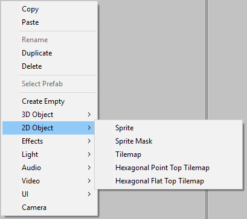
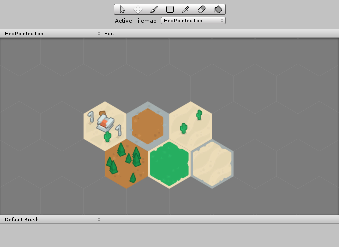
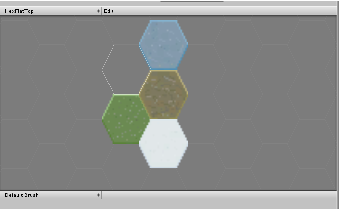
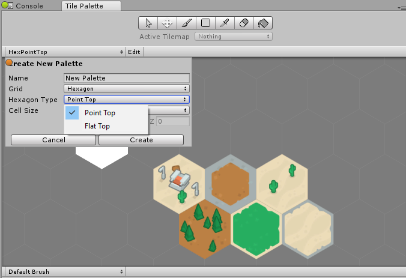

# Hexagonal Tilemaps

In addition to regular [Tilemaps](Tilemap), Unity provides both __Hexagonal Point Top__ and __Hexagonal Flat Top__ Tilemaps. Hexagonal tiles are often used in strategic tabletop games, because they have consistent distance between their centres and any point on their edge, and neighboring tiles always share edges. This makes them ideal for constructing almost any kind of large play area and allows players to make tactical decisions regarding movement and positioning.

To create a __Hexagonal Tilemap__, follow the same steps to [create a regular Tilemap](Tilemap-CreatingTilemaps) (menu: __GameObject &gt; 2D Object__) but choose one of the __Hexagonal__ options in the __2D Object__ menu.

Select the __Hexagonal Tilemap__ option that matches the orientation of the hexagonal Tiles you are using. The following are examples of a __Hexagonal Point Top Tilemap__ and a __Hexagonal Flat Top Tilemap__.

When creating the __Tile Palette__ for a Hexagonal Tilemap, set the __Grid__ setting of the __Tile Palette__ to __Hexagon__ and select the __Hexagon Type__ that matches the Tilemap and Tiles you are using, as shown below.

---
* 2018-07-17 <!-- include IncludeTextNewPageYesEdit -->

* Hexagonal Tilemaps added in [2018.2](https://docs.unity3d.com/2018.2/Documentation/Manual/30_search.html?q=newin20182) NewIn20182