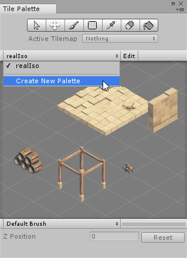
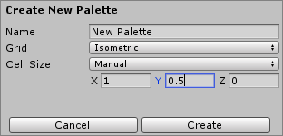
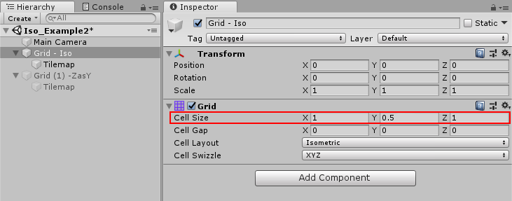
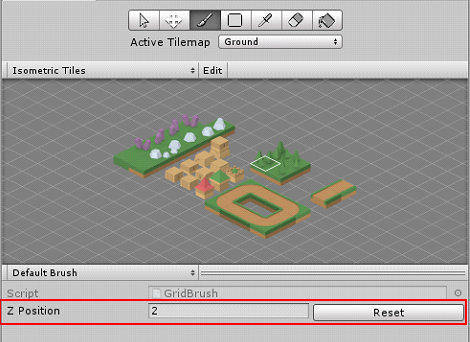
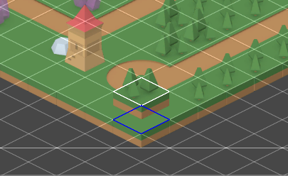

# Creating a Tile Palette for an Isometric Tilemap

To create a __Tile Palette__ for painting an Isometric Tilemap:

1. Open the Tile Palette window (menu: __Window &gt; 2D &gt; Tile Palette__): 
     

2. Select the __Create New Palette__ to open its drop-down menu.
3. Set the __Grid type__ to __Isometric__ or __Isometric Z As Y__, to match the same settings as the Tilemap you want to paint with the palette.
4. Check that __Cell Size__ is set to __Manual__. Leave X and Z at their default values. If your isometric project is based on dimetric projection then set Y to ‘0.5’. If your project is based on isometric projection instead, then set Y to ‘0.57735’.
 The above Cell Size settings allow the Grid to simulate the projected angles for each of the respective projection types. For further information about the two forms of projection, please refer to this [article](https://en.wikipedia.org/wiki/Isometric_computer_graphics) for further details.

5. Select __Create__ to finalize your settings and create the new **Tile Palette** **Asset**.
6. Check that the __Cell Size__ settings of the Grid containing the Tilemap matches the Cell Size of your Tile Palette.

     
7. To make any changes to the Tile Palette, double-click the Asset in the Asset Folder to open it as a [Prefab](Prefabs) and make your changes there.

## Adjusting the Tile height in the Palette

When painting Tiles on an Isometric Z as Y Tilemap, define the Z position of the __Grid__ you are painting on by setting the __Z Position__ value. For this type of Tilemap, the Z position value translates into an offset along the Y-axis, and Tiles painted with different Z positions appear to have different heights on the Tilemap.

The __Z Position__ editor is at the bottom of the Tilemap Palette: 

Adjust the Z Position by entering the desired value (only whole numbers). Tiles are painted on a Grid with the set Z position until the value is changed or reset. To change the value back to the default of 0, select __Reset__ .

In the Scene view, the brush preview displays both the Tile at the Cell’s original position with a Z value of 0 as a blue outline, and its painted position with the Z-as-Y offset applied is displayed with a white outline.

With the Tile brush selected, use the following shortcut keys to quickly switch to different Z positions.

|__Shortcut key:__ |__Command:__ |
|:---|:---|
|-|Increase Z position by 1|
|=|Decrease Z position by 1|

To remove Tiles, set the __Erase Brush__ to the same Z position as the target Tile to be removed. The Erase Brush does not erase Tiles painted on at a different Z position to it.

---

* Isometric Tilemaps added in [2018.3](https://docs.unity3d.com/2018.3/Documentation/Manual/30_search.html?q=newin20183) NewIn20183
