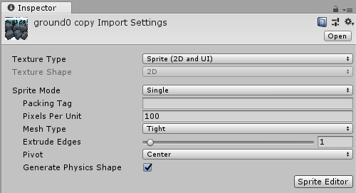
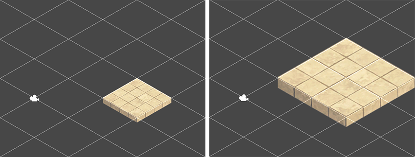

# Importing and preparing Sprites

[Import](Sprites) the individual tiles or tilesheet images for your Isometric Tilemap into your Unity Project by placing the textures into the Assets folder. Select the imported images to view their [Texture Importer](class-TextureImporter) settings in the Inspector window.

When importing Sprites for use in an Isometric Tilemap, use the he following recommended settings. For further information about each setting, refer to the documentation on [Texture Type: Sprite (2D and UI)](TextureTypes.html#Sprite).

1. __Texture Type__ - Set this to __Sprite (2D and UI)__. Other texture types are not supported for Tilemaps.
2. __Sprite Mode__ - Set this to __Single__ if the texture contains only a single Sprite. Set to __Multiple__ if it contains multiple Sprite textures, for example a sprite sheet with multiple Tiles textures.
3. __Pixels Per Unit (PPU)__ - This value is the number of pixels that make up one Unity unit for the selected Sprite. This determines the size of the Sprite when it is rendered on the Tilemap. This is also affected by the __Cell Size__ setting of the Grid that contains the Tilemap, which determines how many Unity units make up a single Cell. 

In the example below, the imported Sprite is a 256x128 image, and the Isometric Tilemap has a __Cell Size__ of (XYZ: 1, 0.5, 1) Unity units. To make the Sprite fit exactly on a single Cell of the Tilemap, set its PPU value to 256. Its entire width then corresponds to one Unity unit, which is equal to the width (X value: 1) of a single Cell.

If the Sprite is set to a PPU value of 128, then it becomes 2 (256px /128) Unity units in width. This causes the Sprite to visually appear to cover 2 Cells in width when painted on the Tilemap. However, the Tile the Sprite is rendered on remains as a single Cell position.

1. __Mesh Type__ - Set to __Tight__ to ensure the Tile Meshes follow the outline of the imported Sprites, and the Tiles are drawn flush together on the Tilemap. Due to the general diamond shape of most Isometric Tiles, setting this to __Full Rect__ may result in the wasted drawing of the transparent spaces in the corners of an Isometric Tile, and is not recommended.
2. __Generate Physics Shape__ - If the Tiles do not need to interact with [Physics2D](https://docs.unity3d.com/Manual/Physics2DReference.html), then clear this option. Leave this option enabled to generate a Physics Shape based on the shape of the Tile Sprite, for use with the [Tilemap Collider](https://docs.unity3d.com/Manual/Tilemap-Physics2D.html) component. To make the generated Physics Shape  match the cell of the Tilemap instead, select the Tile Asset and set its [Collider Type](https://docs.unity3d.com/Manual/Tilemap-TileAsset.html) property to __Grid__.

After the Sprites are imported, refine the outlines of the Sprites by opening the Sprite Editor for each of them and [editing ](https://docs.unity3d.com/Manual/SpriteOutlineEditor.html)[their outlines](https://docs.unity3d.com/Manual/SpriteOutlineEditor.html). For Sprites in an Isometric Tilemap, you should set the __Pivot__ of the Sprite so that the ‘ground’ is relative to the Sprite.

If the Texture is imported with __Sprite Mode__ set to __Multiple__ and contains multiple Sprites, then edit the outline of each Sprite in the Sprite Editor.

---

* Isometric Tilemaps added in [2018.3](https://docs.unity3d.com/2018.3/Documentation/Manual/30_search.html?q=newin20183) NewIn20183
