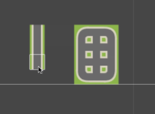

# Scriptable Tile example



The `RoadTile` example provide the ability to easily layout linear segments onto the Tilemap, such as roads or pipes, with a minimal set of sprites. The following is a script used to create the Tile. 

```
using UnityEngine;
using System.Collections;
#if UNITY_EDITOR
using UnityEditor;
#endif

public class RoadTile : Tile 
{
	public Sprite[] m_Sprites;
	public Sprite m_Preview;
	// This refreshes itself and other RoadTiles that are orthogonally and diagonally adjacent
	public override void RefreshTile(Vector3Int location, ITilemap tilemap)
	{
		for (int yd = -1; yd <= 1; yd++)
			for (int xd = -1; xd <= 1; xd++)
			{
				Vector3Int position = new Vector3Int(location.x + xd, location.y + yd, location.z);
				if (HasRoadTile(tilemap, position))
					tilemap.RefreshTile(position);
			}
	}
	// This determines which sprite is used based on the RoadTiles that are adjacent to it and rotates it to fit the other tiles.
	// As the rotation is determined by the RoadTile, the TileFlags.OverrideTransform is set for the tile.
	public override void GetTileData(Vector3Int location, ITilemap tilemap, ref TileData tileData)
	{
		int mask = HasRoadTile(tilemap, location + new Vector3Int(0, 1, 0)) ? 1 : 0;
		mask += HasRoadTile(tilemap, location + new Vector3Int(1, 0, 0)) ? 2 : 0;
		mask += HasRoadTile(tilemap, location + new Vector3Int(0, -1, 0)) ? 4 : 0;
		mask += HasRoadTile(tilemap, location + new Vector3Int(-1, 0, 0)) ? 8 : 0;
		int index = GetIndex((byte)mask);
		if (index >= 0 && index < m_Sprites.Length)
		{
			tileData.sprite = m_Sprites[index];
			tileData.color = Color.white;
			var m = tileData.transform;
			m.SetTRS(Vector3.zero, GetRotation((byte) mask), Vector3.one);
			tileData.transform = m;
			tileData.flags = TileFlags.LockTransform;
			tileData.colliderType = ColliderType.None;
		}
		else
		{
		Debug.LogWarning("Not enough sprites in RoadTile instance");
}
	}
	// This determines if the Tile at the position is the same RoadTile.
	private bool HasRoadTile(ITilemap tilemap, Vector3Int position)
	{
		return tilemap.GetTile(position) == this;
	}
	// The following determines which sprite to use based on the number of adjacent RoadTiles
	private int GetIndex(byte mask)
	{
		switch (mask)
		{
			case 0: return 0;
			case 3:
			case 6:
			case 9:
			case 12: return 1;
			case 1:
			case 2:
			case 4:
			case 5:
			case 10:
			case 8: return 2;
			case 7:
			case 11:
			case 13:
			case 14: return 3;
			case 15: return 4;
		}
		return -1;
	}
// The following determines which rotation to use based on the positions of adjacent RoadTiles
	private Quaternion GetRotation(byte mask)
	{
		switch (mask)
		{
			case 9:
			case 10:
			case 7:
			case 2:
			case 8:
				return Quaternion.Euler(0f, 0f, -90f);
			case 3:
			case 14:
				return Quaternion.Euler(0f, 0f, -180f);
			case 6:
			case 13:
				return Quaternion.Euler(0f, 0f, -270f);
		}
		return Quaternion.Euler(0f, 0f, 0f);
	}
#if UNITY_EDITOR
// The following is a helper that adds a menu item to create a RoadTile Asset
	[MenuItem("Assets/Create/RoadTile")]
	public static void CreateRoadTile()
	{
		string path = EditorUtility.SaveFilePanelInProject("Save Road Tile", "New Road Tile", "Asset", "Save Road Tile", "Assets");
		if (path == "")
			return;
	AssetDatabase.CreateAsset(ScriptableObject.CreateInstance<RoadTile>(), path);
	}
#endif
}
```

---

* <span class="page-edit">2017-09-06 <!-- include IncludeTextNewPageSomeEdit --></span>