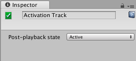

# Activation Track properties

Use the Inspector window to change the name of an Activation track and to set the state of its bound GameObject when the Timeline Asset finishes playing.

|**Property:** |**Function:** |
|:---|:---|
|__Display Name__| The name of the Activation track shown in the Timeline Editor window and in the Playable Director component. The Display Name applies to the Timeline Asset and all of its Timeline instances. You can only modify the Display Name by selecting the Activation track while editing a Timeline instance. |
|__Post-playback state__ | Use the Post-playback state to set the activation state for the bound GameObject when the Timeline Asset stops playing. The Post-playback state applies to the Timeline Asset and all of its Timeline instances. |
|&#160;&#160;&#160;&#160;_Active_ | Select to activate the bound GameObject when the Timeline Asset finishes playing. |
|&#160;&#160;&#160;&#160;_Inactive_ | Select to deactivate the bound GameObject when the Timeline Asset finishes playing. |
|&#160;&#160;&#160;&#160;_Revert_ | Select to revert the bound GameObject to its activation state before the Timeline Asset began playing. For example, if the Timeline Asset ends with the GameObject set to inactive, and the GameObject was active before the Timeline Asset began playing, then the GameObject reverts to active. |
|&#160;&#160;&#160;&#160;_Leave As Is_ | Select to set the activation state of the bound GameObject to same state at the end of the Timeline Asset. For example, if the Timeline Asset ends with the GameObject set to inactive, the GameObject remains inactive. |

---
* 2017-12-07  <!-- include IncludeTextNewPageSomeEdit -->