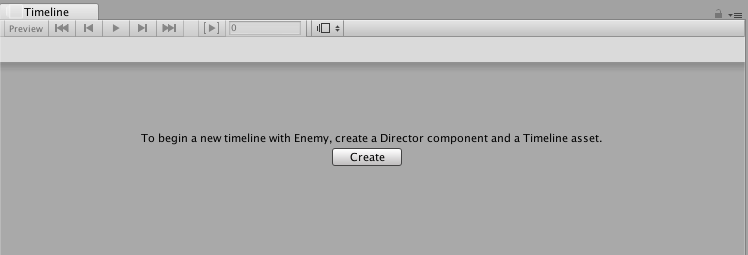

## Creating a Timeline Asset and Timeline instance

To use a Timeline Asset in your scene, associate the Timeline Asset to a GameObject using a Playable Director component. Associating a Timeline Asset with a Playable Director component creates a Timeline instance and allows you to specify which objects in the scene are animated by the Timeline Asset. The GameObject must also have an Animator component.

The Timeline Editor window provides an automated method of creating a Timeline instance while creating a new Timeline Asset. The Timeline Editor window also creates all the necessary components.

To create a new Timeline Asset and Timeline instance, follow these steps:

1. In your scene, select the GameObject that you want to use as the focus of your cinematic or other gameplay-based sequence.

2. Open the Timeline Editor window (menu: __Window__ &gt; __Sequencing__ &gt; __Timeline__). If the GameObject does not yet have a Playable Director component attached to a Timeline Asset, a message in the Timeline Editor window prompts you to click the __Create__ button.

1. Click __Create__. A dialog box prompts you for the name and location of the Timeline Asset being created. You can also specify tags to identify the Timeline Asset.

2. Click __Save__.

Unity does the following: 

* Saves a new Timeline Asset to the Project. If you did not change the name and location of the Timeline Asset being created, the name of the Timeline Asset is based on the selected GameObject with the "Timeline" suffix. For example, selecting the GameObject named "Enemy", by default, names the asset "EnemyTimeline" and saves it to the Assets directory in your project.

* Adds an empty Animation track to the Timeline Asset.

* Adds a [Playable Director component](class-PlayableDirector) to the selected GameObject and sets the __Playable__ property to the Timeline Asset. This creates a Timeline instance.

* In the Playable Director component, the binding for the Animation track is set to the selected GameObject. The Animation track does not have any clips, so the selected GameObject is not animated.

* Adds an Animator component to the selected GameObject. The Animator component animates the GameObject through the Timeline instance. The GameObject cannot be animated without an Animator component.

---
* 2017-08-10  <!-- include IncludeTextNewPageSomeEdit -->