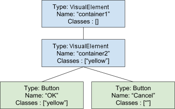

# USS selectors

To demonstrate selectors, this topic uses the following visual tree example:



## Simple selectors

A simple selector can be a wildcard or any combination of types, names, or class names. Based on the example visual tree above, here are some examples of valid simple selectors:

- `#container1`
- `VisualElement`
- `VisualElement#container1`
- `VisualElement.yellow`
- `Button#OK.yellow:hover`

### Type

```css
TypeName { ... }
```

Use the Type selector to match an element based on its C# type. For example, `Button` matches the two buttons.

When using the Type selector, specify only the concrete object type. Do not include the namespace in the type name.

### Name

```css
#name { ... }
```

Use the Name selector to match an element based on the value of its `VisualElement.name` property.
For example, `#Cancel` matches the second button based on its name.

Element names should be unique inside a panel. This recommendation is not inforced but using non-unique names could lead to unexpected matches. 

Don't include `#` when assigning the name to an element.

### Class

```css
.class { ... }
```

Use the Class selector to match an element assigned to a specific class. 

To match an element, the selector does not have to specify all the classes assigned to the element. Specifying a single class name matches the elements assigned the same class. For example, `.yellow` matches the element named *container2* and the button element named *OK*.

If you specify multiple classes in a selector, for an element to match, it must be assigned the same class names.  

Don't include `.` when you assign the class name to the element.

Class names cannot begin with a number.

### Wildcard

```css
* { ... }
```

Matches any element.

### Pseudo-states

```css
:pseudo-state { ... }
```

Use pseudo-states to match an element when it enters a specific state. For example, `Button:hover` matches visual elements of type `Button`, but only when the user positions the cursor over the visual element.

Supported pseudo-states:

- `hover` : the cursor is hovering over the visual element.
- `active` : the visual element is being interacted with.
- `inactive` : the visual element is no longer being interacted with.
- `focus` : the visual element has focus.
- `selected` : unused.
- `disabled` : the visual element is set to `enabled == false`.
- `enabled` : the visual element is set to `enable == true`.
- `checked` : the visual element is a  `Toggle` element and it is checked.

Pseudo-states are specified after other simple selectors. Pseudo-states cannot be extended. There is only a predefined set of supported psuedo-states.


## Complex selectors

Complex selectors are combinations of simple selectors with delimiters. Complex selectors also include selector lists that provide a abbreviated way of applying the same style to many elements.

### Delimiters

UIElements supports the following delimiters:

- The empty (or space) delimiter matches all descendants of an element.
- The "greater than" symbol (`>`) matches visual elements that are the direct descendant of an element matched by the previous selectors.

For example :

- `#container1 .yellow` : matches both the inner element and the first button
- `#container2 > .yellow` : matches only the inner element

### Selector List

Use a selector list to apply the same style definition to many elements. Each selector is separated by a comma and each selector can be a simple or complex selector.

For example :

```css
#container1, Button { padding-top:10 }
```

is the same as

```css
#container1 { padding-top: 10 } Button { padding-top: 10}
```

## Selector precedence

If multiple selectors match the same element, the selector with the highest specificity takes precedence. For simple selectors, the basic specificity rule is: 

- **Name** is more specific than,
- **Class**, which is more specific than, 
- **Type**, which is more specific than,
- wildcard `*`.

If two selectors are equal, the selector that appears last in the file takes precedence.

To determine selector specificity across different files, UIElement considers the order in which the tree is traversed for style application. Elements with higher depth and sibling index take precedence.

When default styles and user-defined styles have equal selectors, the user-defined selector is considered more specific than the default selector.

The `!important` keyword is ignored.

Values set in C# have the highest specificity.

---
* <span class="page-edit">2018-11-02  <!-- include IncludeTextAmendPageSomeEdit --></span>

