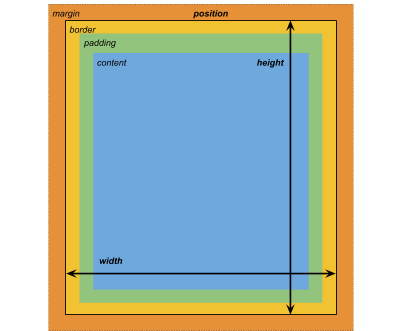

# USS supported properties

This topic lists the supported USS properties and their accepted values. 

## USS syntax

UIElements style properties use the same grammar syntax as W3C CSS documents:

- Keyword values appear as is. For example:  `auto`, `baseline`.
- Basic data types appear between angle brackets ( `<` and `>`). For example:  *&lt;length&gt;*, *&lt;color&gt;*.
- Non-terminals that share the same name as a property appear between angle brackets ( `<` and `>`). For example,  *&lt;border-width&gt;*.

If a property value has more than one component:

- Several juxtaposed words mean that all of them must occur, in the given order.
- A bar (`|`) separates two or more alternatives: exactly one must occur.
- A double bar (`||`) separates two or more options: one or more must occur, in any order.
- A double ampersand (`&&`) separates two or more components, all of which must occur, in any order.
- Square brackets (`[` `]`) denote grouping.

Every type, keyword, or angle-bracketed group may be followed by modifiers:

- an asterisk (`*`) indicates that the preceding type, word, or group occurs zero or more times.
- a plus (`+`) indicates that the preceding type, word, or group occurs one or more times.
- a question mark (`?`) indicates that the preceding type, word, or group is optional.
- a pair of numbers in curly braces (`{A,B}`) indicates that the preceding type, word, or group occurs at least `A` and at most `B` times.

## Box model

### Dimensions

- *width: &lt;number&gt;*
- *height: &lt;number&gt;*
- *min-width: &lt;number&gt;*
- *min-height: &lt;number&gt;*
- *max-width: &lt;number&gt;*
- *max-height: &lt;number&gt;*

The `width` and `height` specifies the size of the element in pixels. If `width` is not specified, the width is based on the width of the element's contents. If `height`  is not specified, the height is based on the height of the element's contents.

### Margins

- *margin-left: &lt;number&gt;*
- *margin-top: &lt;number&gt;*
- *margin-right: &lt;number&gt;*
- *margin-bottom: &lt;number&gt;*

### Borders

- *border-left-width: &lt;number&gt;*
- *border-top-width: &lt;number&gt;*
- *border-right-width: &lt;number&gt;*
- *border-bottom-width: &lt;number&gt;*

### Padding

- *padding-left: &lt;number&gt;*
- *padding-top: &lt;number&gt;*
- *padding-right: &lt;number&gt;*
- *padding-bottom: &lt;number&gt;*

## Flex layout

This section lists the properties for positioning visual elements. UIElements includes a [layout engine](UIE-LayoutEngine) that positions visual elements based on layout and styling properties. The layout engine implements a subset of *Flexbox*: a HTML/CSS layout system. 

By default, all items are vertically placed in their container. 

### Items

- *flex-grow: &lt;number&gt;*
- *flex-shrink: &lt;number&gt;*
- *flex-basis: &lt;number&gt; | auto*
- *flex: none | [ &lt;flex-grow&gt; [ &lt;flex-shrink&gt; &lt;flex-basis&gt;? ]? ]*
- *align-self: auto | flex-start | flex-end | center | baseline | stretch*

Note: Because `units` are not supported, the *&lt;flex-basis&gt;* value must always be specified last. 

### Containers

- *flex-direction: row | row-reverse | column | column-reverse*
- *flex-wrap: nowrap | wrap | wrap-reverse*
- *align-content: flex-start | flex-end | center | space-between | space-around | stretch*
- *align-items: flex-start | flex-end | center | baseline | stretch*
- *justify-content: flex-start | flex-end | center | space-between | space-around | space-evenly*

## Relative and absolute positioning

### Positioning

- *position: absolute | relative*

This property is set to `relative` by default, which positions the element based on its parent. If this property is set to `absolute`, the element leaves its parent layout and values are specified based on the parent bounds.

### Position

- *left*
- *top*
- *right*
- *bottom*

The distance in pixels from the parent edge or the original position of the element.

## Drawing properties

The drawing properties set the background, borders, and appearance of the visual element.

### Background

- *background-color: &lt;color&gt;*
- *background-image: &lt;resource&gt; | &lt;url&gt; | none*
- *-unity-background-scale-mode: stretch-to-fill | scale-and-crop | scale-to-fit*

### Borders

- *border-color: &lt;color&gt;*
- *border-left-radius: &lt;number&gt;*
- *border-top-radius: &lt;number&gt;*
- *border-right-radius: &lt;number&gt;*
- *border-bottom-radius: &lt;number&gt;*

### Appearance

- *overflow: hidden | visible*
- *opacity: &lt;number&gt;*
- *visibility: visible | hidden*

## Text properties

Text properties set the color, font, font size, and Unity specific properties for font resource, font style, alignment, word wrap, and clipping.

- *color: &lt;color&gt;*
- *-unity-font: &lt;resource&gt; | &lt;url&gt;*
- *font-size: &lt;number&gt;*
- *-unity-font-style: normal | italic | bold | bold-and-italic*
- *-unity-text-align: upper-left | middle-left | lower-left | upper-left | middle-center | lower-center | upper-right | middle-right | lower-right*
- *-unity-word-wrap: true | false*
- *-unity-clipping: clip | overflow*

## Cursor property

Use the `cursor` default texture type to import a custom texture for the cursor. The Unity editor only supports default cursor values.

*cursor: [ [ &lt;resource&gt; | &lt;url&gt; ] [ &lt;hotspotX&gt; &lt;hotspotY&gt;]? , ] [ arrow | text | resize-vertical | resize-horizontal | link | slide-arrow | resize-up-right | resize-up-left | move-arrow | rotate-arrow | scale-arrow | arrow-plus | arrow-minus | pan | orbit | zoom | fps | split-resize-up-down | split-resize-left-right ]*

## Obsolete and renamed properties

This section lists the drawing properties that were either made obsolete or renamed in UIElements. The obsolete and renamed properties are listed alphabetically.

- `background-size` has been renamed `-unity-background-scale-mode`.
- `border-left`, `border-top`, `border-right`, and `border-bottom` have been renamed `border-left-width`, `border-top-width`, `border-right-width`, and `border-bottom-width`, respectively.
- `font` has been renamed  `-unity-font`.
- `font-style` has been renamed  `-unity-font-style`.
- `position-left`, `position-top`, `position-right`, and `position-bottom` have been renamed `left`, `top`, `right`, and `bottom`, respectively.
- `position-type` has been renamed `position`.
- `text-alignment` has been renamed  `-unity-text-align`.
- `text-clipping` has been renamed  `-unity-clipping`. It is recommended that you use the standard `overflow` property instead.
- `text-color` has been renamed  `color`.
- `-word-wrap` has been renamed  `-unity-word-wrap`.

---
* 2018-11-16  <!-- include IncludeTextAmendPageSomeEdit -->
 
