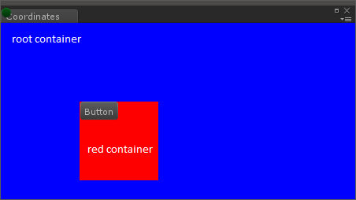

# The Visual Tree

The visual tree holds all the visual elements in a window. It is an object graph made of lightweight nodes refered to as *visual elements*. 

These nodes are allocated on the C# heap, either manually or by loading UXML assets from a UXML template file. 

Each node contains the layout information, its drawing and redrawing options, and how the node responds to events.

## VisualElement

`VisualElement` is the common base class for all nodes in the visual tree. The `VisualElement` base class contains properties for styles, layout data, local transformations, event handlers, and so on.

`VisualElement` has several subclasses that define additional behaviour and functionality, including specialized controls. `VisualElement` may have child elements.

You are not required to derive from the `VisualElement` base class to work with UIElements. You can customize the look and behavior of a `VisualElement` through stylesheets and event callbacks.

## Connectivity

The root object of the visual tree is referred to as the panel. A new element is ignored until it is connected to the panel. You can add elements to an existing element to attach your user interface to the panel. 

To verify if a `VisualElement` is connected to a panel, you can test the `panel` property of this element. When the visual element is not connected, the test returns  `null`.

**Note**: While UIElements is experimental, you must go through the extension method `GetRootVisualContainer()` in the `UnityEditor.Experimental.UIElements` namespace. This namespace is required to prevent accidental usage of this property.

## Drawing order

The elements in the visual tree are drawn in the following order:

- parents are drawn before their children
- children are drawn according to their sibling list

The only way to change their drawing order is to reorder `VisualElement`objects in their parents.

You can draw a subtree in a `RenderTexture` and re-use the pixels for future redraw events by setting
`VisualElement.clippingOptions = ClippingOptions.ClipAndCacheContents`.

## Position, transforms, and coordinate systems

The different coordinate systems are defined as follow:

- World: Coordinates are relative to the panel space. The panel is the highest element in the visual tree.
- Local: Coordinates are relative to the element itself.

The layout system computes the `VisualElement.layout` property (type `Rect`) for each element. 

The `layout.position` is expressed as pixels relative to the coordinate space of its parent. Although you can assign a value to `layout.position` directly, it is recommended that you use style sheets and the layout system to position elements.

Each `VisualElement` also has a `layout.transform` property (type`ITransform`) that positions an element relative to its parent. By default, the `transform` is the identity.

The `VisualElement.layout.position` and `VisualElement.layout.transform` properties define how to transform between the local coordinate system and the parent coordinate system.

The `VisualElementExtensions` static class provides the following extension methods that transform points and rectangles between coordinate systems:

- `WorldToLocal` transforms a `Vector2` or `Rect` from `Panel` space to the referential within the element.
- `LocalToWorld` transforms a `Vector2` or `Rect` to `Panel` space referential
- `ChangeCoordinatesTo` transforms `Vector2` or `Rect` from the local space of one element to the local space of another.

For example, in the image above, the tree is arranged as follows:

- `Panel`
    - Tab section (refered to as  `DockArea` and labelled "Coordinates")
        - Blue `VisualElement` acts as the root (refered to as "root container")
            - Red `VisualElement` acts as a parent of the button ("red container")
                - `Button`

From the point of view of the panel:

- The origin of the panel is (0, 0) regardless of the referential
- The origin of the root is (0, 22) in world space
- The origin of the red container is (100, 122) in world space. Its
  `position` property (defined in `layout` property) is set as (100, 100) because it is relative to its parent: the root container.
- The origin of the button is (100, 122) in the world space. Its `position` property (defined in `layout` property) is set as (0, 0) because it is relative to its parent: the red container.

The origin of an element is its top left corner.

Use the `worldBound` property to retrieve the window space coordinates of the `VisualElement`, taking into account the transforms and positions of its ancestry. 

---
* 2018-11-02  <!-- include IncludeTextAmendPageSomeEdit -->

