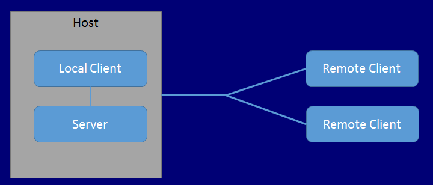

# Networking HLAPI System Concepts

## Server and Host

In Unity’s High Level API (HLAPI) system, multiplayer games include:

* A **server**: A server is an instance of the game which all other players connect to when they want to play together. A server often manages various aspects of the game, such as keeping score, and transmit that data back to the client.

* **Clients:** Clients are instances of the game that usually connect from different computers to the server. Clients can connect over a local network, or online. 

A **client** is an instance of the game that connects to the **server**, so that the person playing it can play the game with other people, who connect on their own clients.

The server might be either a "dedicated server", or a “host server”. 

* **Dedicated server**: This is an instance of the game that only runs to act as a server.

* **Host server**: When there is no dedicated server, one of the clients also plays the role of the server. This client is the "host server". The host server creates a single instance of the game (called the host), which acts as both server and client.

The diagram below represents three players in a multiplayer game. In this game, one client is also acting as host, which means the client itself is the "local client". The local client connects to the host server, and both run on the same computer. The other two players are remote clients - that is, they are on different computers, connected to the host server.

The **host** is a single instance of your game, acting as both **server** and **client** at the same time. The host uses a special kind of internal client for local client communication, while other clients are remote clients. The local client communicates with the server through direct function calls and message queues, because it is in the same process. It actually shares the Scene with the server. Remote clients communicate with the server over a regular network connection. When you use Unity’s HLAPI, this is all handled automatically for you.

One of the aims of the multiplayer system is for the code for local clients and remote clients to be the same, so that you only have to think about one type of client most of the time when developing your game. In most cases, Unity handles this difference automatically, so you should rarely need to think about the difference between your code running on a local client or a remote client.

## Instantiate and Spawn

When you make a single player game In Unity, you usually use the `GameObject.Instantiate` method to create new GameObjects at runtime. However, with a multiplayer system, the server itself must "spawn" GameObjects in order for them to be active within the networked game. When the server spawns GameObjects, it triggers the creation of GameObjects on connected clients. The spawning system manages the lifecycle of the GameObject, and synchronizes the state of the GameObject based on how you set the GameObject up.

For more details about networked instantiating and spawning, see documentation on [Spawning GameObjects](UNetSpawning).

## Players and Local Players

Unity’s multiplayer HLAPI system handles player GameObjects differently to non-player GameObjects. When a new player joins the game (when a new client connects to the server), that player’s GameObject becomes a "local player" GameObject on the client of that player, and Unity associates the player’s connection with the player’s GameObject. Unity associates one player GameObject for each person playing the game, and routes [networking commands](UNetActions.html) to that individual GameObject. A player cannot invoke a [command](UNetActions.html) on another player’s GameObject, only their own.

For more details, see documentation on [Player GameObjects](UNetPlayers).

## Authority

Servers and clients can both manage a GameObject’s behavior. The concept of "authority" refers to how and where a GameObject is managed. Unity’s HLAPI is based around “server luthority” as the default state, where the Server (the host) has authority over all GameObjects which do not represent players. Player GameObjects are a special case and treated as having “local authority”. You may want to build your game using a different system of authority - for more details, see [Network Authority](UNetAuthority).

