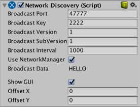

# Network Discovery

The [Network Discovery component](class-NetworkDiscovery.html) allows Unity multiplayer games to find each other on a local area network (a LAN). This means your players don't have to find out the IP address of the host to connect to a game on a LAN. Network Discovery doesn't work over the internet, only on local networks. For internet-based games, see the [MatchMaker](UnityMultiplayerSettingUp) service.

The Network Discovery component can broadcast its presence, listen for broadcasts from other Network Discovery components, and optionally join matching games using the **Network Manager**. The Network Discovery component uses the UDP broadcast feature of the network transport layer.

To use local network discovery, create an empty GameObject in the Scene, and add the Network Discovery component to it. 



Like the [Network Manager HUD](class-NetworkManagerHUD.html), this component has a default GUI that shows in the Game view for controlling it, intended for temporary developmental work, with the assumption that you will create your own replacement for it before finishing your game. Note that you also need a Network Manager component in the Scene to be able to join a game through the Network Discovery GUI. When the game starts, click the **Initialize Broadcast** button in the Network Discovery GUI (in the Game view) to send a broadcast and begin discovery of other games on the local network.

The Network Discovery component can run in server mode (activated by clicking the "Start Broadcasting" button in the GUI), or client mode (activated by clicking the 'Listen for Broadcast' button in the GUI).

When in **server mode**, the Network Discovery component sends broadcast messages over the network on the port specified in the inspector. These messages contain the **Broadcast ****Key** and **Broadcast Version** of the game. You can set these to any value you like, their purpose is to identify this particular version and release of your game to avoid conflicts - such as your game trying to join a game of a different type. You should change the **Broadcast Key **value when releasing a new build of your game that should not be able to connect to older versions of your game. The component should be run in server mode if a game is being hosted on that machine. Without the default GUI, you need to call the [StartAsServer()](ScriptRef:Networking.NetworkDiscovery.StartAsServer.html) function to make the component run in server mode.

When in **client mode**, the component listens for broadcast messages on the specified port. When a message is received, and the **Broadcast Key** in the message matches the **Broadcast Key** in the Network Discovery component, this means that a game is available to join on the local network. Without the default GUI, you need to call the [StartAsClient()](ScriptRef:Networking.NetworkDiscovery.StartAsClient.html) function to make the component run in client mode.

When using the default GUI and listening for broadcasts in client mode, if a game is discovered on the local network, a button appears which allows the user of that client to join the game. The button is labeled "Game at:" followed by the host's IP address.

There is a virtual function on the Network Discovery component that can be implemented to be notified when broadcast messages are received.

```
public class MyNetworkDiscovery: NetworkDiscovery {
	public override void OnReceivedBroadcast(string fromAddress, string data)
	{
		Debug.Log("Received broadcast from: " + fromAddress+ " with the data: " + data);
	}
}
```

For more information, see the Scripting API Reference documentation on [NetworkDiscovery](ScriptRef:Networking.NetworkDiscovery.html). Note that you cannot have a Network Discovery server and client running in the same process at the same time.

