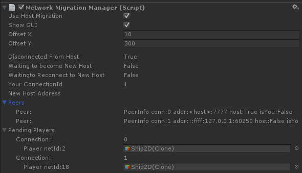
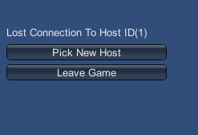

# Host Migration

In a multiplayer network game without a dedicated server, one of the game instances acts as the host - the center of authority for the game. This is a player whose game is acting as a server and a "local client", while the other players each run a “remote client”. See documentation on [network system concepts](UNetConcepts) for more information.

If the host disconnects from the game, gameplay cannot continue. Common reasons for a host to disconnect include the host player leaving, the host process crashing, the host’s machine shutting down, or the host losing network connection.

The **host migration** feature allows one of the remote clients to become the new host, so that the multiplayer game can continue.

## How it works

During a multiplayer game with host migration enabled,Unity distributes the addresses of all peers (players, including the host and all clients) to all other peers in the game. When the host disconnects, one peer becomes the new host. The other peers then connect to the new host, and the game continues.

The Network Migration Manager component uses the Unity Networking HLAPI. It allows the game to continue with a new host after the original host disconnects. The screenshot below shows the migration state displayed in the Network Migration Manager, in the Inspector window.



The Network Migration Manager provides a basic user interface, similar to the [Network Manager HUD](UNetManager.html). This user interface is for testing and prototyping during game development; before you release your game you should implement a custom user interface for host migration, and custom logic for actions like choosing the new host automatically without requiring input from the user.



Even though the migration may have occurred because the old host lost connection or quit the game, it is possible for the old host of the game to rejoin the game as a client on the new host.

During a host migration, Unity maintains the state of [SyncVars](ScriptRef:Networking.SyncVarAttribute.html) and [SyncLists](ScriptRef:Networking.SyncList_1.html) on all networked GameObjects in the Scene. This also applies to custom serialized data for GameObjects.

Unity disables all of the player GameObjects in the game when the host disconnects. Then, when the other clients rejoin the new game on the new host, the corresponding players Unit re-enables those clients on the new host, and respawns them on the other clients. This ensures that Unity does not lose player state data during a host migration.

NOTE: During a host migration, Unity only preserves data that is available to clients. If data is only on the server, then it is not available to the client that becomes the new host. Data on the host is only available after a host migration if it is in SyncVars or SyncLists.

When the client becomes a new host, Unity invokes the callback function [OnStartServer](ScriptRef:Networking.NetworkBehaviour.OnStartServer.html) for all networked GameObjects. On the new host, the Network Migration Manager uses the function [BecomeNewHost](ScriptRef:Networking.NetworkMigrationManager.BecomeNewHost.html) to construct a networked server Scene from the state in the current [ClientScene](ScriptRef:Networking.ClientScene.html).

In a game with host migration enabled, peers are identified by their [connectionId](ScriptRef:Networking.NetworkSystem.PeerInfoMessage-connectionId.html) on the server. When a client reconnects to the new host of a game, Unity passes this connectionId to the new host so that it can match this client with the client that was connected to the old host. This Id is on the `ClientScene` as the [reconnectId](ScriptRef:Networking.ClientScene-reconnectId.html).

## Non-Player GameObjects

Non-player GameObjects with client authority are also handled by host migration. Unity disables and re-enables client-owned non-player GameObjects in the same way it disables and re-enables player GameObjects.

## Identifying Peers

Before the host disconnects, all the peers are connected to the host. They each have a unique connectionId on the host - this is called the [oldConnectionId](ScriptRef:Networking.NetworkSystem.ReconnectMessage-oldConnectionId.html) in the context of host migration.

When the Network Migration Manager chooses a new host, and the peers reconnect to it, they supply their `oldConnectionId` to identify which peer they are. This allows the new host to match this reconnecting client to the corresponding player GameObject.

The old host uses a special `oldConnectionId` of zero to reconnect - because it did not have a connection to the old host, it WAS the old host. There is a constant [ClientScene.ReconnectIdHost](ScriptRef:Networking.ClientScene.ReconnectIdHost.html) for this.

When you use the Network Migration Manager’s built-in user interface, the Network Migration Manager sets the `oldConnectionId` automatically. To set it manually, use [NetworkMigrationManager.Reset](ScriptRef:Networking.NetworkMigrationManager.Reset.html) or [ClientScene.SetReconnectId](ScriptRef:Networking.ClientScene.SetReconnectId.html).

## Host Migration Flow

* MachineA hosts Game1, a game with host migration enabled

* MachineB starts a client and joins Game1

    * MachineB is told about peers (MachineA–0, and self (MachineB)–1)

* MachineC starts a client and joins Game1

    * MachineC is told about peers (MachineA–0, MachineB–1, and self (MachineC)–2)

* MachineA drops the connection on Game 1, so the host disconnects

* MachineB disconnects from host

    * MachineB callback function is invoked on MigrationManager on client

    * MachineB player GameObjects for all players are disabled

    * MachineB stays in online Scene

* MachineB uses utility function to pick the new host, picks self

    * MachineB calls BecomeNewHost()

    * MachineB start listening

    * MachineB player GameObject for self is reactivated

    * MachineB The player for MachineB is now back in the game with all its old state

* MachineC gets disconnect from host

    * MachineC callback function is invoked on MigrationManager on client

    * MachineC player GameObjects for all players are disabled

    * MachineC stay in online Scene

* MachineC uses utility function to pick new host, picks MachineB

    * MachineC reconnects to new host

* MachineB receives connection from MachineC

    * MachineC send reconnect message with oldConnectionId (instead of AddPlayer message)

    * callback function is invoked on MigrationManager on server

    * MachineB uses oldConnectionId to find the disabled player GameObject for that player and re-adds it with ReconnectPlayerForConnection()

    * player GameObject is re-spawned for MachineC

    * The player for MachineC is now back in the game with all its old state

* MachineA recovers (the old host)

    * MachineA uses utility function to pick the new host, picks MachineB

    * MachineA "reconnects" to MachineB

* MachineB receives connection from MachineA

* MachineA send reconnect message with oldConnectionId of zero

    * callback function is invoked on MigrationManager on server (MachineB)

    * MachineB uses oldConnectionId to find the disabled player GameObject for that player and re-adds it with ReconnectPlayerForConnection()

    * player GameObject is re-spawned for MachineA

    * The player for MachineA is now back in the game with all its old state

## Callback Functions

Callback functions on the NetworkHostMigrationManager:

```

// called on client after the connection to host is lost. controls whether to switch Scenes
protected virtual void OnClientDisconnectedFromHost(
    NetworkConnection conn, 
    out SceneChangeOption sceneChange)

// called on host after the host is lost. host MUST change Scenes
protected virtual void OnServerHostShutdown()

// called on new host (server) when a client from the old host re-connects a player
protected virtual void OnServerReconnectPlayer(
    NetworkConnection newConnection, 
    GameObject oldPlayer, 
    int oldConnectionId, 
    short playerControllerId)

// called on new host (server) when a client from the old host re-connects a player
protected virtual void OnServerReconnectPlayer(
    NetworkConnection newConnection, 
    GameObject oldPlayer, 
    int oldConnectionId, 
    short playerControllerId, 
    NetworkReader extraMessageReader)

// called on new host (server) when a client from the old host re-connects a non-player GameObject
protected virtual void OnServerReconnectObject(
    NetworkConnection newConnection, 
    GameObject oldObject, 
    int oldConnectionId)

// called on both host and client when the set of peers is updated
protected virtual void OnPeersUpdated(
    PeerListMessage peers)

// utility function called by the default UI on client after connection to host was lost, to pick a new host.
public virtual bool FindNewHost(
    out NetworkSystem.PeerInfoMessage newHostInfo, 
    out bool youAreNewHost)

// called when the authority of a non-player GameObject changes
protected virtual void OnAuthorityUpdated(
    GameObject go,
    int connectionId,
    bool authorityState)
```

## Constraints

For host migration to work properly, you need to go to the GameObject’s Network Manager component and enable **Auto Create Player**. Data that is only present on the server (the host) is lost when the host disconnects. For games to be able to perform host migration correctly, important data must be distributed to the clients, not held secretly on the server.

This works for direct connection games. Additional work is required for this to function with the matchmaker and relay server.

