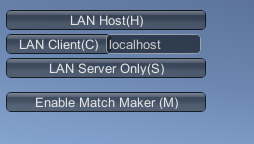
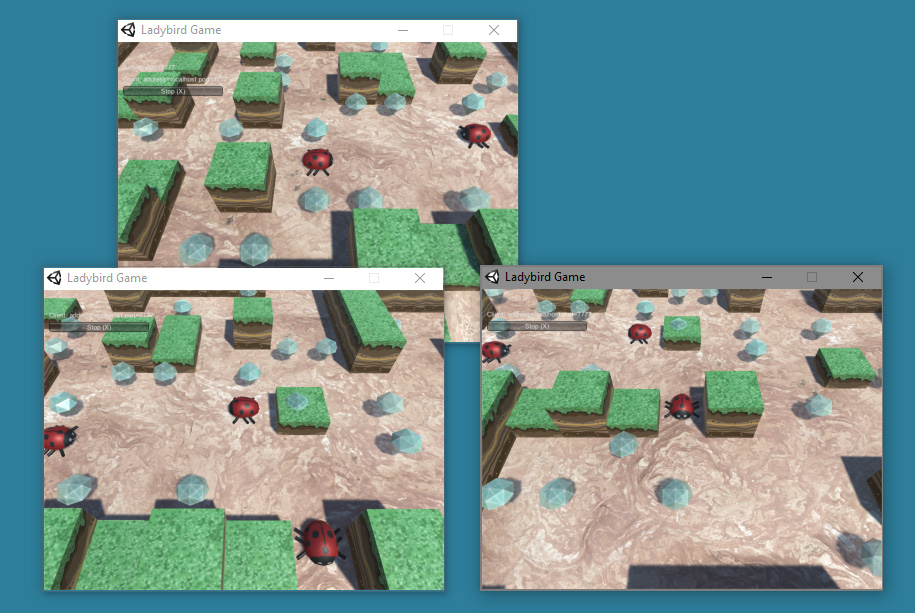

# The Network Manager HUD in LAN mode

###LAN Host

Click the **LAN Host** button to start a game as a host on the local network. This client is both the host *and *one of the players in the game. It uses the information from the **Network Info** section in the inspector to host the game. 

When you click this button, the HUD switches to a simple display of network details, and a **Stop (X)** button which allows you to stop hosting the game and return to the main LAN menu.

When you have started a game as a host, other players of the game can then connect to the host to join the game. 

Click the **Stop (X)** button to disconnect any players that are connected to the host player. Clicking **Stop (X)** also returns the HUD to the LAN menu.

### LAN Client

To connect to a host on the local network, use the text field to the right of the **LAN Client** button to specify the address of the host. The default host address is "localhost", which means the client looks on its own computer for the game host. Click **LAN Client ****(C)** to attempt to connect to the host address you have specified.

Use the default “localhost” in this field if you are running multiple instances of your game on one computer, to test multiplayer interactivity. To do this, you can create a standalone build of your game, and then launch it multiple times on your computer. This is a common way to quickly test that your networked game interactions are functioning as you expect, without you needing to deploy your game to multiple computers or devices.

When you want to test your game on multiple machines within the same network (that is, on a LAN), you need to put the address of the person acting as host into the "localhost**"** text field.

The person acting as the host needs to tell their IP address to everyone running LAN clients, so that you can type this into the box.

Enter the IP address (or leave it as "localhost" if you are testing it on your own machine), then click **LAN Client** to attempt to connect to the host.

When the client is attempting to connect, the HUD displays a **Cancel Connection Attempt** button. Click this if you want to stop trying to connect to the host.

If the connection is successful, the HUD displays the **Stop (X) button**. Click this if you want to stop the game on the client and disconnect from the host:

Unity has a built-in Network Discovery system, which allows clients to automatically find hosts on the same local network. However, this is not built into the Network Manager HUD, so you need to enter the address manually. You can integrate the Network Discovery system into your game when you replace the Network Manager HUD with your own UI. See documentation on [Network Discovery](UNetDiscovery) to learn more.

### LAN Server Only

Click **LAN Server Only** to start a game which acts as a server that other clients can connect to, but which does not act as a client to the game itself. This type of game is often called a "dedicated server". A user cannot play the game on this particular instance of your game. All players must connect as clients, and nobody plays on the instance that is running as the server.

A dedicated server on a LAN results in better performance for all connected players, because the server doesn’t need to process a local player’s gameplay in addition to acting as server.

You might also choose this option if you want to host a game that can be played over the internet (rather than just within a local network), but want to maintain control of the server yourself - for example, to prevent cheating by one of the clients, because only the server has authority over the game. To do this, you would need to run the game in **Server Only** mode on a computer with a public IP address.

### Enable Match Maker

Click **Enable Match Maker (M)** to change the HUD to Matchmaker mode. You need to use Matchmaker mode if you want to create or connect to games hosted on the internet using Unity’s Matchmaker multiplayer service. Click **Enable Match Maker (M)** to display the Matchmaker controls in the Network Manager HUD.

**Note**: Remember that the Network Manager HUD feature is a temporary aid to development. It allows you to get your multiplayer game running quickly, but you should replace it with your own UI controls when you are ready.

