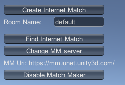
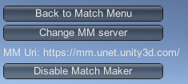

# The Network Manager HUD in Matchmaker mode

Matchmaker mode provides a simple interface that allows players to create, find and join matches hosted on Unity’s Multiplayer Service. 

A "match" (also sometimes referred to as a game session, or a game instance), is a unique instance of your game hosted by Unity’s Multiplayer Service. With Unity’s Multiplayer Service, a certain limited number of players can join and play together. If lots of people are playing your game, you may have multiple matches, each with multiple players playing together.

In order to use Matchmaker mode, you must first enable Unity Multiplayer Service for your project. Once you have enabled Unity Multiplayer Service for your project, you can use the HUD in Matchmaker mode to create or connect to instances of your game (also sometimes referred to as "matches" or "sessions") hosted on the internet.

### **Create Internet Match**

Click **Create Internet Match** to start a new match. Unity’s Multiplayer Service creates a new instance of the game (a "match"), which other players can then find and join.

### Find Internet Match

Click __Find Internet Match__ to send a request to the Unity Multiplayer Service. The Unity Multiplayer Service returns a list of all matches that currently exist for this game. 

For example, if two separate players connect, and create a match each named "Match A" and "Match B" respectively, when a third player connects and presses the __Find Internet Match__ button, __Match A__ and __Match B__ are listed as available matches to join.

In the Network manager HUD, the available matches appear as a series of buttons, with the text "Join Match: *match name*" (where *match name* is the name chosen by the player who created the match).

To join one of the available matches, click on the "Join Match: *match name*" button for that match. Alternatively, click **Back to Match Menu** to go back to the Matchmaker menu.

When you replace the HUD with your own UI, there are better ways to list the available matches. Many multiplayer games display available matches in a scrollable list. You might want to make each entry on the list show the match name, the current and maximum number of players, and other information such as the match mode type, if your decide to make your game have different match modes (such as "capture the flag", "1 vs 1", or "cooperative").

**Note**: There are some special characters which, if used in a match name, appear modified in the list of available matches in the Network manager HUD. These characters are:

* Open square brace: **[**

* percent symbol: **%**

* Underscore: **_**

If a match name contains these characters, they are surrounded by square braces in the list of available matches. So a match named "my_game" is listed as "my[_]game".

### Change MM Server

This button is designed for internal use by Unity engineers (for testing the Multiplayer service). It reveals buttons which assign one of three pre-defined URLs to the **MatchMaker Host URI** field in the Network Manager - "local", "staging" and "internet". However, the "local" and "staging"** **options are *only intended for internal use by Unity engineers, and not intended for general use*.

If you select the "local" or "staging" options, your game cannot connect to Unity’s Multiuser Service. Therefore you should always make sure this option is set to "internet" (which is the default).

### MM Uri Display

This displays the current Matchmaker URI (Uniform Resource Identifier, a string of characters used for identification). To view the URI in the Inspector, navigate to the Network Manager component and see the **MatchMaker Host URI** field**. **By default this points to the global Unity Multiplayer Service, and for normal multiplayer games using the Unity Multiplayer Service. You should not need to change this. The Unity Multiplayer Service automatically groups the players of your game into regional servers around the world. This grouping ensures fast multiplayer response times between players in the same region, and means that players from Europe, the US, and Asia generally end up playing with other players from their same global region.

If you want to explicitly control which regional server your game connects to, override this value via scripting. For more information and for regional server URIs, see API reference documentation on [NetworkMatch.baseUri](https://docs.unity3d.com/ScriptReference/Networking.Match.NetworkMatch-baseUri.html).

For example, you might want to override the URI if you want to give your players the option of joining a server outside of their global region. If "Player A" in the US wants to connect to a match created via Matchmaker by "Player B" in Europe, they would need to be able to set their desired global region in your game. Therefore you would need to write a UI feature which allows them to select this.

**Note**: Remember that the Network Manager HUD feature is a temporary aid to development. It allows you to get your multiplayer game running quickly, but you should replace it with your own UI controls when you are ready.

