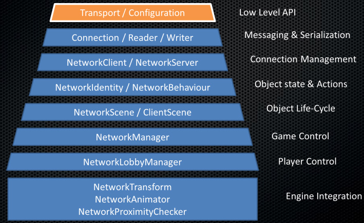

The Multiplayer High Level API
=============================

Unity's multiplayer High Level API (HLAPI) is a system for building multiplayer capabilities for Unity games. It is built on top of the lower level [transport](UNetUsingTransport) real-time communication layer, and handles many of the common tasks that are required for multiplayer games. While the transport layer supports any kind of network topology, the HLAPI is a server authoritative system; although it allows one of the participants to be a client and the server at the same time, so no dedicated server process is required. Working in conjunction with the [internet services](UnityMultiplayerSettingUp), this allows multiplayer games to be played over the internet with little work from developers.

The HLAPI is a new set of networking commands built into Unity, within a new namespace: **UnityEngine.Networking**. It is focused on ease of use and iterative development and provides services useful for multiplayer games, such as:

* Message handlers
* General purpose high performance serialization
* Distributed object management
* State synchronization
* Network classes: Server, Client, Connection, etc

The HLAPI is built from a series of layers that add functionality:

 

This section of the manual explains how to use the multiplayer HLAPI.