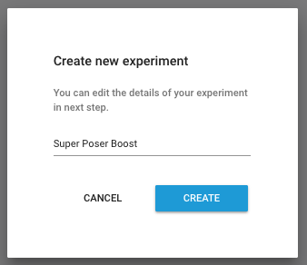
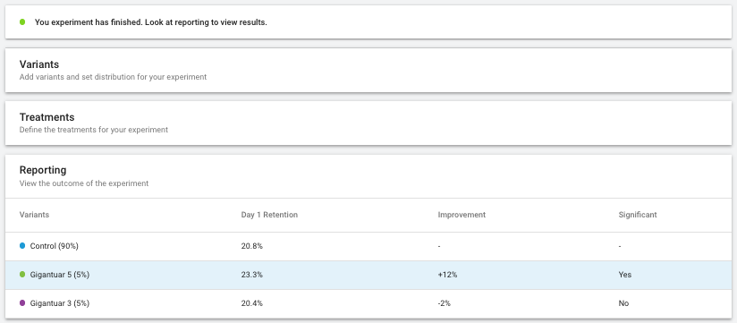

# Unity Analytics A/B Testing

An A/B test is a controlled experiment that exposes different groups of players to variations of some aspect of your game. The aspect of a game that you test can be fundamental, such as the input control scheme, or it can be cosmetic, like a different color treatment, or something else in between. An A/B test allows you to compare key metrics collected during the experiment to help you analyze which variation performs better.

__How does A/B testing work?__

Unity Analytics A/B testing groups players according to the variants you define in your experiment. Each group sees the treatment of your game that you specify for that variant group. A treatment is a set of one or more [Remote Settings](https://docs.unity3d.com/Manual/UnityAnalyticsRemoteSettings.html) to which you assign unique values for each variant group. At runtime, the A/B testing service randomly assigns a player to one of the groups based on your variant allocation percentages. The player receives the values of the Remote Settings for their assigned group. Your application then uses those Remote Settings so that the player experiences the aspect of your game you wish to test.

The key parts of an A/B test include:

* __Experiment__ — a test run by showing different treatments to different groups of players.

* __Variant__ — defines the number of groups and the distribution of players to those groups. One variant is always the control group.

* __Treatment__ — defines the Remote Settings to use for the experiment and the specific setting values for each variant.

* __Goal__ — The Analytics metric that you want to improve with the experiment. An experiment compares the goal metric across the variant groups so that you can see which treatment has the most desirable effect.

You can run more than one experiment at the same time, but you should be careful that the different experiments do not interact since some players will see the experimental treatments for both experiments. For example, if you run a test to compare the ordering of the steps in your onboarding tutorial in one experiment and run a different test to test tutorial pacing, you will have difficulty figuring out which experiment caused any changes in results. While that example might be pretty obvious, even tests of unrelated parts of your game could interact. The more fundamental the part of your game you are testing and the larger your experimental groups, the more chance there is for experimental interaction.

Create and run A/B tests from the Unity Analytics Dashboard. You must also implement the experiment treatment in your application using the [Remote Settings](UnityAnalyticsRemoteSettings) API.

# Creating an experiment

To create an experiment:

1. Go to the Analytics Dashboard for your project.

2. Click __A/B Testing__ to open the A/B Testing page.

3. Click the __Create Experiment__ button.

    The __Create new experiment__ dialog opens.

    

4. Enter a name for the experiment.

5. Click __Create__.

Once the experiment has been created, you must define the goals, variants and the treatments.

## Choose an experiment goal

The experiment goal defines the analytics metric that the experiment treatments are designed to influence. You can choose:

* __Day 1 Retention__ — the percentage of users who return to your game exactly one day after the first time they play.

* __Day 7 Retention__ — the percentage of users who return to your game exactly seven days after the first time they play.

The [report](#reports) generated for your experiment shows the difference in the metric across the experiment variants. The chosen goal also influences the amount of time an experiment must run to collect statistically significant data. For example, it takes longer to run an experiment measuring Day 7 retention than one measuring Day 1 retention. 

To choose the experiment goal:

1. Click the __Select Experiment Goal__ button.

    

2. Choose a goal from the drop-down list.

    

3. Click __Save__.

## Set up the experiment variants

Use the __Variants__ section of the experiment to define the player groups for the A/B test and the assign the percentage of players the testing service allocates to each group. 

A __Control__ group always exists. The control group should receive the current or default experience in your game. This group provides the basis to which the results of the other groups can be compared.

To add an additional variant, click the __ADD__ button at the top of the section. Assign a name and an allocation percentage for the group. The allocation percentages for all groups must add up to 100%. The __Estimate__ column displays the number of players expected to be allocated to each variant per day.

To delete a variant, click the trash can icon next to its name. 

The estimated time to complete the experiment is based on the on how long it should take to achieve a statistically valid number of samples. The more players (DAU) your application typically has and the larger the allocation of players to the experimental variants, the shorter the estimated time will be. 

Click __Save__ when your variants are set up as desired.

## Set up the experiment treatments

Use the __Treatments__ section to define the settings used in the experiment and assign the individual setting values for each group.

Click the __ADD__ button to add a setting to the experiment. 

You can use existing Remote Settings from the Release configuration as long as the settings are not used in any other active experiments. Note that the Remote Settings page only displays the default value used for the control group. The variant settings can only be viewed or changed on the A/B Testing page.

You can create new settings without going to the Remote Settings page. Settings created in A/B Testing are not shown on the Remote Settings page. If you want to continue using a setting after the experiment is finished, you can create a Remote Setting with the same name.

Click __Save__ when your treatments are defined.  

## Implementing your treatments

Use the [Remote Settings API](UnityAnalyticsRemoteSettingsUsing) to access the values defined in your experiment at runtime. Use the setting name shown in the Treatments section as the key when accessing the setting in your game. You can implement Remote Settings in [code](UnityAnalyticsRemoteSettingsScripting) or use the [Remote Settings component](UnityAnalyticsRemoteSettingsComponent) to access and apply the settings values in the Unity Inspector window. 

# Managing experiments

After you create at least one experiment, the A/B Testing page displays your experiments in a list.

__To start an experiment:__

1. Click the name of an experiment in the __Not Started__ status.

2. Click the __Start Experiment__ button.

__Note: __After an experiment has started, you can no longer make changes, since that would invalidate the test results.

__To stop an experiment:__

1. Click the name of an experiment in the __Running__ status.

2. Click the __Stop Experiment__ button.

__Note:__ You cannot restart an experiment.

__To view a report:__

1. Click the name of an experiment in the __Ended__ status.

2. The Reporting section displays the experiment results.

# Reports

Use the Reports section to review the results of an experiment once it has finished.

The report lists the variant groups, the metrics recorded for the experiment goal, and how each variant compared to the control group. (The significance rating uses the standard statistical significance level of 5%.)

* 2018-08-01 <!-- include IncludeTextNewPageNoEdit -->
     * 2018-08-01 - Service compatible with Unity 5.5 onwards at this date but version compatibility may be subject to change.
     * New feature in 2018.1

