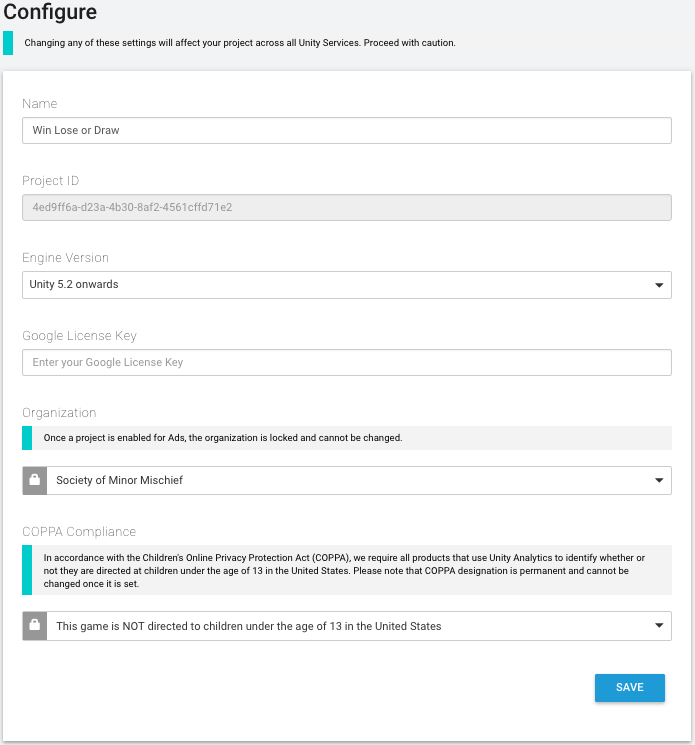
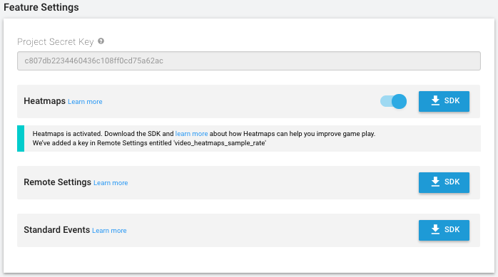
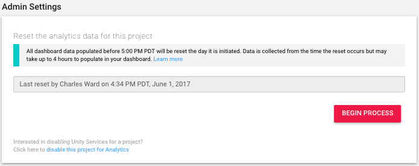

# Configure page 

View and edit settings for individual Unity Analytics projects on the Configure page. Find the Configure page under **Settings** > **Analytics Settings** on the dashboard.

The Configure page contains these sections:

* Project Service Settings
* Feature Settings
* Admin Settings

## Project Service Settings
The Project Service Settings control aspects of a project for the Analytics service. As noted in the table below, some settings also affect the Ads and IAP services.

|:---|:---|
|__Name__| The name of the project. Displayed in the Unity Services Dashboards and the Unity Editor Services windows. |
|__Project ID__ | A unique identifier for the project. Used to identify the project between Unity Services and the Editor. |
|__Engine Version__ | Specifies the Unity Editor and Engine version in use. The value set here changes the information shown on the Integration pages. |
|__Google License Key__| Enter your Google license key if you want to validate in-app purchases (IAP) made through the Google Play store. |
|__Organization__ | The name of your Unity Organization.|
|__COPPA Compliance__ | Specifies whether your project is directed at children and falls under the domain of the U.S. Children’s Online Privacy Protection Act (COPPA).  |

When you specify that your application is subject to COPPA, the Unity Ads service alters the way it serves advertisements to the user to conform with the rule. Data collected by the Analytics service remains the same. 

It is solely your responsibility to ensure that your application and your usage of Analytics data conforms to applicable laws (Unity cannot supply legal advice on this matter.) See [COPPA Compliance](UnityAnalyticsCOPPA) for more information.

## Feature Settings
The feature settings section provides information and settings for specific Analytics-related features.

|:---|:---|
|__Project Secret Key__| The project secret key authorizes access to your Analytics data. Use the project secret key with the Raw Data Export REST API, as well as for Remote Settings and Heatmaps support in the Unity Editor.  Note that you should keep the __Project Secret Key__ secret. Anyone possessing this value can potentially access your Analytics data.  Also note that the __Project Secret Key__ was formerly known as the __Raw Data Export API Key__. The key value is the same; use the __Project Secret Key__ in any place where you previously used the __Raw Data Export API Key__. |
|__Heatmaps __(Pro-only)| Heatmaps visualize your Analytics data in two and three dimensions by displaying graphical markers of events directly in your Editor scene.  To use Heatmaps, enable the feature on the Configure page, then click the __SDK__ button to download the Heatmaps asset package. |
|__Remote Settings__ | Click the **SDK** button to download the Remote Settings asset package. |
|__Standard Events__ | Click the **SDK** button to download the Standard Events asset package. |

## Admin Settings 
The Admin Settings section contains controls that let you delete existing Analytics data or disable Analytics altogether.

####Reset Analytics Data
Resetting your Analytics data permanently deletes all existing processed data so that it no longer appears in any Dashboard reports, segments or funnels. However, your raw data is not deleted and you can still be download it using [Raw Data Export](UnityAnalyticsRawDataExport). 

The processed data is deleted at the time stated on the Configure page, at which point Analytics data collection, processing, and aggregation begins anew.

Click the **Begin Process** button and follow the prompts to complete the data reset.

####Turn off Analytics

Click the **disable this project for Analytics** link to turn off Unity Analytics for the project. (You can re-enable Analytics for the project at any time from the Unity Editor or the Services Dashboard.)

---
* 2017-08-29  <!-- include IncludeTextNewPageYesEdit -->
* New feature in Unity 2017.1
