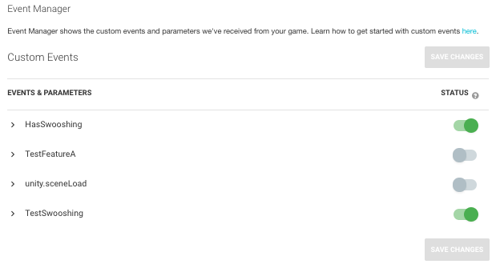
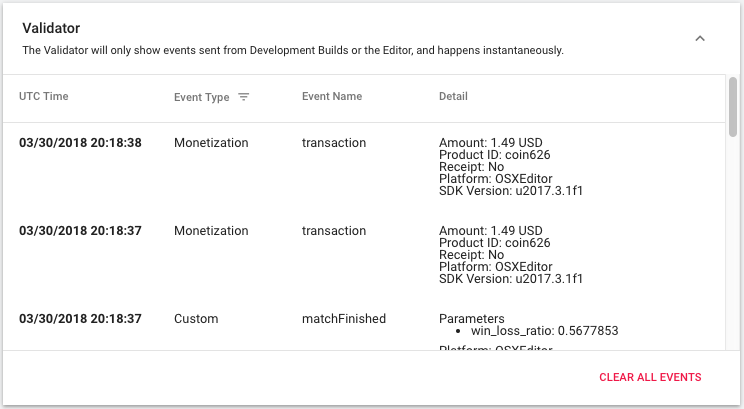
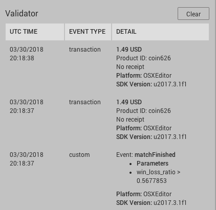

# Event Manager 
View a list of all the standard and custom events and parameters you have dispatched from your project. Turn off old, unused events to prevent them from appearing in new reports.

When you disable an event, the Unity Analytics system ignores that event when processing your data. Because disabled events are ignored during data processing, they do not count toward your account event limits. If you re-enable an event, Unity Analytics includes newly dispatched instances of that event in subsequent reports, but any event instances dispatched while the event was disabled remain unprocessed. 
Note that you can download disabled events through [Raw Data Export](UnityAnalyticsRawDataExport). The Event Manager only controls whether events are aggregated with the rest of your Analytics data. 

## Validator

The Validator displays events sent from development builds of your game (and from Play mode in the Unity Editor) as they are received by the Unity Analytics service.

Use the Validator window during development to verify that the Analytics events you send are received by the service. The events shown by the Validator on the Analytics Dashboard should match the events shown by the version of the Validator shown on the Analytics section of the Services window in the Unity Editor.

---
* 2018-03-30  <!-- include IncludeTextNewPageYesEdit -->
* New feature in Unity 2017.1
* Validator display moved to the event Manager page.