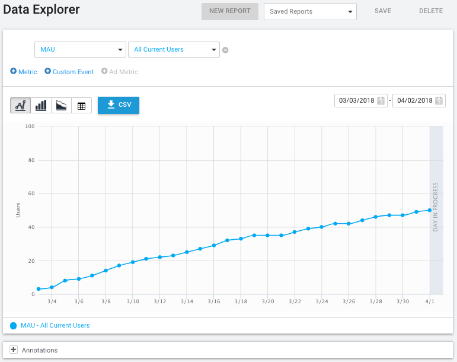
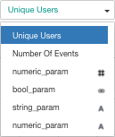
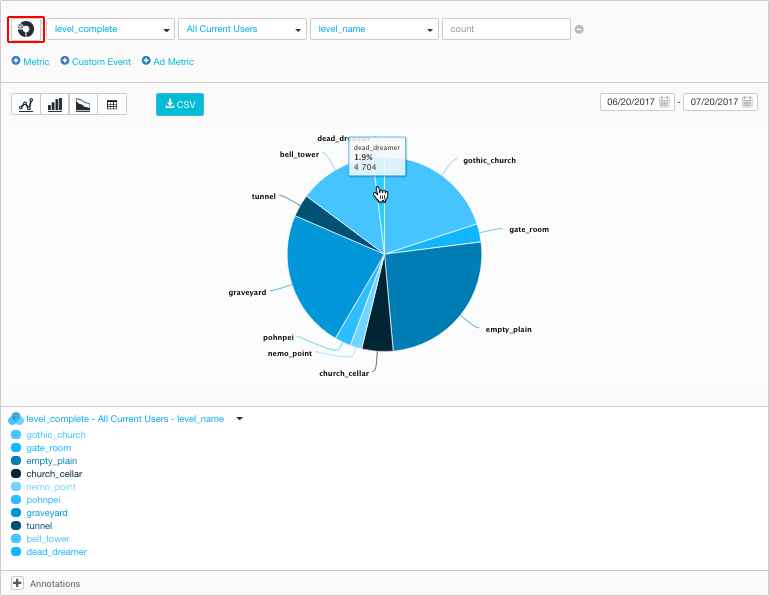
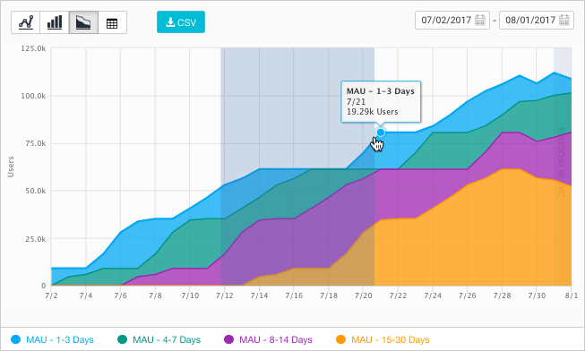
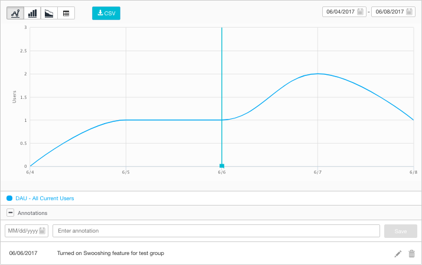

# Data Explorer

Build reports for your Unity Analytics metrics and events using the Data Explorer. The Data Explorer reports show how selected metrics and custom events change over time.

## Create a new report
To create a Data Explorer report:

1. Navigate to the Analytics dashboard for your project.
2. Click **Data Explorer**.
3. Add **Metrics**, **Custom Events**, and **Ad Metrics** to the report by clicking the + buttons next to the desired type of data. (The Ad Metrics option is disabled for projects not using Unity Ads.) 

4. Set the date range and chart type as desired. See [Report Options](#ReportOptions) for more information.

**Note**: The default report includes a single metric. You can change the metric type and segment for this item. (To delete this item, you must first add a second item -- you cannot delete the last data item on a report.)

To save a report for future viewing:

1. Click the **New Report** button.

2. On the dialog that opens, enter a name for the report and click **OK**.

To view a saved report in the future, click the **Saved Reports** dropdown and select the report name in the list. You can adjust the date range to view the same report with your latest data.

## Copy a report
To copy an existing Data Explorer report:

1. Navigate to your Analytics dashboard for your project.
2. Click **Data Explorer**.
3. Click the **Saved Reports** dropdown and select the report name in the list.

4. Adjust the date range, chart type or other options as desired. See [Report Options](#ReportOptions) for more information.
5. Click the **New Report** button.
6. On the dialog that opens, enter a name for the report copy and click **Ok**.

## Download report data
To download a comma-separated value file (CSV) containing the data in a report:

1. Navigate to your Analytics dashboard for your project.
2. Click **Data Explorer**.
3. Load a saved report or create a new one.
4. Adjust the date range or other options as desired. See [Report Options](#ReportOptions) for more information. 
Click the **CSV** button to download the data for the currently displayed report.

**Note:** CSV download exports precisely what you see in the chart/table. If you have a Unity Pro subscription, you can also download all of your Analytics data in raw form from the [Raw Data Export](UnityAnalyticsRawDataExport) page or through the Raw Data Export REST API.

## Report options

You can add the following types of data to a report:

* **Metric** -- Analytics metrics are computed from the Core Analytics events sent automatically whenever someone plays your game. These metrics include such things as how many people played your game, how long they played, and how much money they spent on in-app purchases.
* **Custom Event** -- Custom events are the events that you dispatch from your game to measure behavior or other factors unique to your game. See [Custom events](UnityAnalyticsCustomEvents) for more information about defining and using custom events.
* **Ad Metric** -- Ad metrics report data from the Unity Ads Service (only available if you are using Unity Ads.)

You can add up to twenty data items to a single report. The charts will display the appropriate units for the vertical scale as long as there are no more than two data items that use different units of measure.

You can set the date range for a report and select different chart types.

### Metric and Ad Metric options

When you add a __Metric__ or __Ad Metric__ to the chart, you must set the name and can choose a data __Segment__:

* A -- The metric name
* B -- The segment of the data to show
* C -- Delete the metric from the report

For each data item, you can specify a __Segment__ of the data to display. A __Segment__ is a subset of the data for that item, selected according to a set of rules. For example, the __Android Users__ segment includes data only for players on the Android platform, while the __iOS Users__ segment includes data only for players on the iOS platform. 

The Analytics Service includes a set of standard segments. You can also create your own custom __Segments__. Use the [Segment Builder](UnityAnalyticsSegmentBuilder) to view the definitions of the standard segments and to build your own custom __Segments__. Note that when you create a custom __Segment__, it only applies to newly collected metrics and events. Older data is not reprocessed for inclusion in a new __Segment__.

### Custom event options

When you add a __Custom Event__ to a report, you can set additional options based on the event parameters.

* A -- Show a pie chart (only for categorizable data items)
* B -- The name of the __Custom Event__
* C -- The __Segment__ of the data to show
* D -- The custom event __Parameter__ name and display options
* E -- How to aggregate parameter values
* F -- Delete the custom event from the report

When a __Custom Event__ has parameters, you can choose how the data for that event is displayed on the chart. You can show the count of each distinct value received or, for numeric properties, the sum or average of the values of all the events received:

The symbols displayed after the __Parameter__ name indicate how the __Parameter__ is displayed. The string (A) and boolean (Venn diagram) symbols indicate that the __Parameter__ values are categorizable into distinct groups. The numeric symbol (#) indicates that the __Parameter__ value is a number that can be averaged or summed in addition to being counted. Note that numeric __Parameters__ appear in the list twice, once with a string symbol and once with a numeric symbol, giving you the option of treating a numeric __Parameter__ as either a categorizable or a aggregatable value. 

When showing categorizable __Parameter__ values, only the ten most common values are broken out into individual groups. The rest of the values are lumped together in an __Other__ group. Thus, treating numeric __Parameters__ as categorizable strings is generally only useful for __Parameters__ with a limited set of distinct values.

You can view the set of distinct values at the bottom of the chart. You can also view a pie-chart of the values by clicking the pie-chart button in front of the data item. Only a single pie chart can be displayed at a time.

**Note:** To download the data in a categorizable-data pie chart, click the pie-chart button next to the Custom Event before clicking the **CSV** button.

### Chart types
You can choose the following chart types for a report:

* **Spline** -- A smoothed line chart
* **Column** -- A bar chart
* **Stacked** -- A stacked area chart
* **Table** -- A table of values
* **Pie** -- A pie chart (only available for individual, categorizable Custom Event parameters)

#### Chart Zoom
You can zoom in on the **Spline**, **Column** and **Stacked** charts by clicking on the chart and dragging across the section you want to view in more detail.

When you are zoomed in, the chart displays a __Reset Zoom__ button, which restores the chart to display the entire date range.

## Annotations
You can use annotations to mark the dates of important external factors that might affect your game’s analytics data, such as game updates, marketing campaigns, and promotions. Add date-based annotations to the Data Explorer reports using the Annotations section below the report chart. 

Annotations are project-wide, not specific to an individual report. Annotations display on all report charts whenever the Annotations section is open. 

**To add an annotation:**

1. On any Data Explorer report, click the **+ Annotations** button to open the __Annotations__ section (if not already open). 
2. Click in the date box and set the date for the annotation. You can only add one annotation record for a given day.
3. Enter a name or descriptive text for the annotation.
4. Click __Save__.

---
* 2017-08-29  <!-- include IncludeTextNewPageYesEdit -->
* New feature in Unity 2017.1

