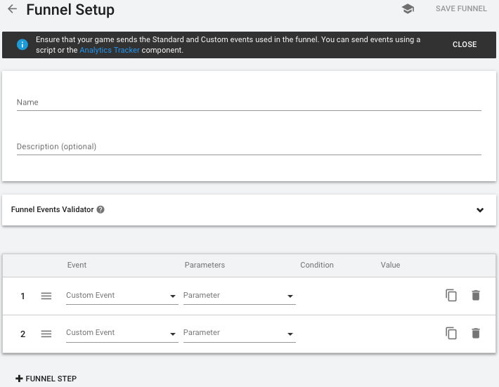
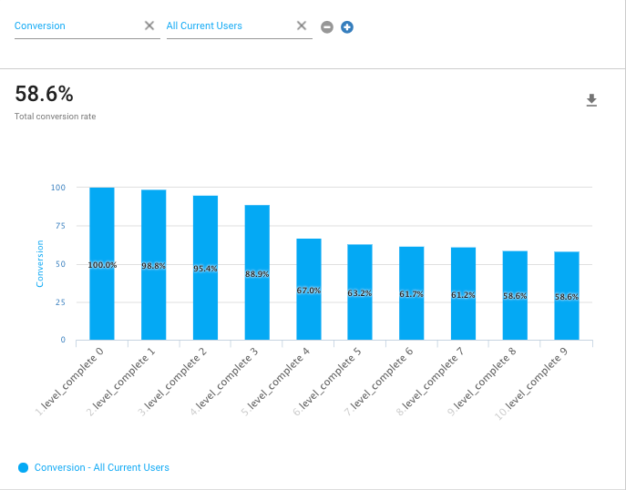
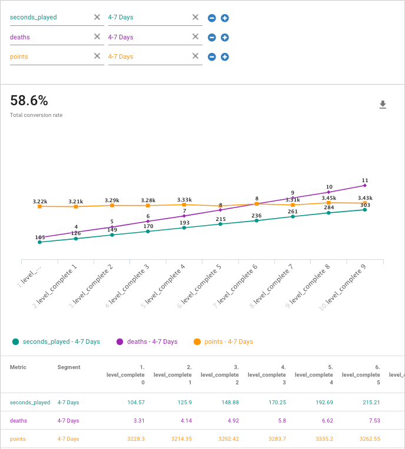
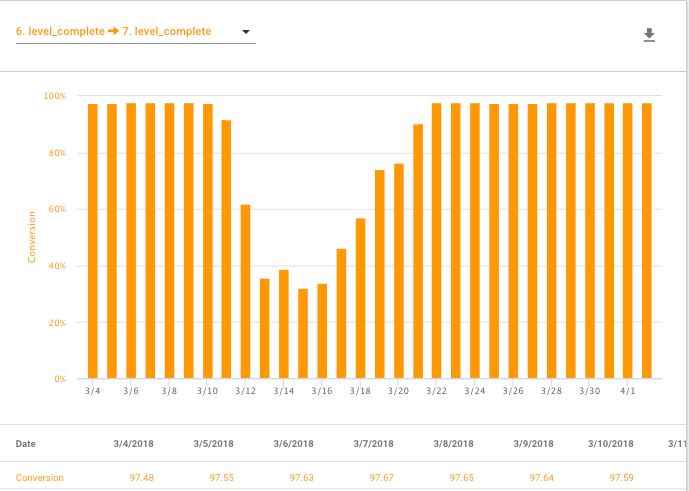

# Funnels

Funnels help you track whether players make it through linear sequences in your game. A funnel reveals what percentage of your players make it through each step of the sequence as well as the sequence as a whole. Common sequences to track with a funnel include:

* First-time user experience — track how new players make it through your on-boarding sequence
* Game Progression — track how players progress through the major milestones in your game, such as level completion
* Purchase UI — uncover impediments to making a purchase

Funnels are based on [Standard]() and [Custom]() events. Unity Analytics evaluates each step in a funnel according to whether the defined standard or custom event has been dispatched with the correct parameter values. In order for users to enter and progress through a funnel, they must complete the funnel steps in the precise order those steps appear in the funnel.

Create funnels on your Analytics Dashboard.

**Important*: Unity Analytics evaluates the rules defined in a funnel as it processes incoming data. Existing data is not re-evaluated when you create a new funnel. Only data received after you create a funnel appears in the Funnel Analyzer report.  

## Create a new funnel 
Before creating a funnel, you should first:

1. Add the necessary __Standard__ or __Custom Events__ to your game.
2. Run your game so that at least one instance of each event is dispatched to the Unity Analytics system. You can perform this step while running your game in the Unity editor.
3. Wait for Unity Analytics to process the events (about 8-16 hours).

After dispatching at least one instance of the Standard and Custom events that you want to include in the funnel, and waiting until those events are processed, follow these steps to create the funnel rules on the Analytics Dashboard:

1. On the Unity Analytics dashboard, click **Funnel Analyzer**.
2. Click **Create Funnel**.
   

3. Enter a __Name__ and, optionally, a __Description__ for your funnel.
4. For each step in the linear sequence of events you want to track and analyze:
    1. Click __+ Funnel Step__. (The first two steps are created automatically, since a funnel always  requires comparing at least two phases of progression.)
    2. Select the __Standard__ or __Custom Event__ name. Only events that have been dispatched by an instance of your game and processed are listed.
    3. Set rules for the **Parameters** (optional). The parameters dispatched with an event must satisfy the rules you define in order for that player to successfully complete that step in the funnel. If you do not define parameter rules, simply dispatching the event completes the step.
5. Click **Save**.   
 
 While you are creating the funnel steps, you can use the **Delete**, **Duplicate** and **Rearrange** icons at the top of each step to make changes.

**Note**: After you've clicked **Save**, funnel steps cannot be modified. However, you can create a copy of the funnel and modify the steps of the copy. The reason for this restriction is that changing the rules of an existing funnel would invalidate any existing data included in that funnel.

## Reading a Funnel Analyzer report
The __Funnel Analyzer__ page of your Analytics Dashboard lists the funnels that you have created. 

Check the **Members** column to see how many players have entered the funnel.
A __Funnel Analyzer__ report has two sections: the __Funnel__ chart and the __Drilldown__ section, which provides more detailed information about the funnel data.

### Funnel conversion chart
The __Funnel__ conversion chart provides an immediate overview of how players have progressed through the sequence of steps tracked by the funnel. Unexpected drop-offs between steps indicate good places to investigate game play, user interface, or other issues that block players from continuing to the next step.

The above example shows an example funnel based on the level_complete event. This example exhibits large drop offs in the early levels. The chart can’t tell you exactly what is wrong -- the levels could be too hard, or they could be too easy -- but it can reveal good places to look for game-play problems. 

### Funnel metrics

You can add metrics and segments to the chart to get more detail about what is going on in the funnel. The metrics available include parameters that you included with any of the Standard or Custom Events used by the funnel. 

### Funnel Steps By Date chart

The Funnel Steps By Date chart shows changes of the conversion rate over time. You can display either the overall conversion rate of players entering and completing the funnel, or the conversion rate between individual steps.

The above example shows a drop-off in conversion near the middle of the reporting period. The conversion rate recovers a few days later. Perhaps an update contained a bug that made it harder for players to complete the step and the bug was fixed in a subsequent update.

---
* 2017-08-29  <!-- include IncludeTextNewPageYesEdit -->
* New feature in Unity 2017.1
* Funnel Dashboard UI changed 2017-09-19

