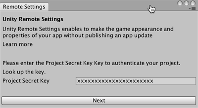

# Enabling Remote Settings 

To enable Remote Settings in a project:

1. If you haven’t already, [turn on Unity Analytics](UnityAnalyticsOverview) for the project.

2. If needed, import the Remote Settings package from the [Unity Asset Store](https://www.assetstore.unity3d.com/#!/content/89317).

3. Open the Remote Settings window with __Window__ > __Unity Analytics__ > __Remote Settings__:

    

4. Enter the __Project Secret Key__ for your Analytics project and click __Next__. 
    You can find your __Project Secret Key__ under the __Configure__ page on the Unity Analytics dashboard

5. On the Remote Settings window, click the __Refresh__ button. The window displays the key-value pairs for any settings you have already created.

If you haven’t created any Remote Settings yet, see [Creating and changing Remote Settings](UnityAnalyticsRemoteSettingsCreating) to get started.

**Note:** Keep your __Project Secret Key__ secret. Anyone possessing this value could access your Analytics data. The secret keys for your projects are stored in your Editor preferences file, not in project files. The __Project Secret Key__ was formerly known as the __Raw Data Export API Key__. The key value is the same; use the __Project Secret Key__ in any place where you previously used the __Raw Data Export API Key__. 

---

* 2017-06-30 <!-- include IncludeTextNewPageYesEdit -->

* 2017-05-30 - Service compatible with Unity 5.5 onwards at this date but version compatibility may be subject to change.
 
* New feature in 2017.1 
