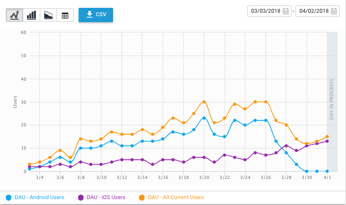
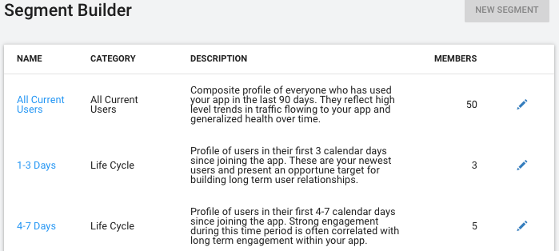
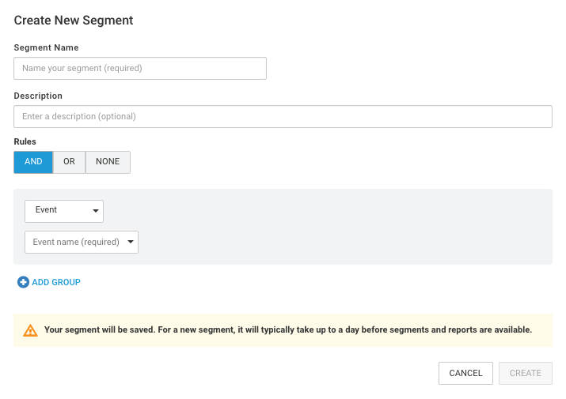

# Segment Builder 
Segments are subsets of your player base, split apart by key differentiators, such as country, platform, experience level, or spending patterns. View existing segments and create new ones on the __Segment Builder__ page.

Use segments in the __Data Explorer__ and __Funnel Analyzer__ to compare metrics across segments. For example, if you publish your game on both Android and iOS, you can use segments to compare player behavior by platform.

Unity Analytics defines the following categories of segments:

|:---|:---|
|__Life Cycle__| Segments based on the number of calendar days since a player first used your app. These segments are automatically populated based on core analytics events. |
|__Geography__ | Segments based on where the player is located in the world. These segments are automatically populated based on analysis of the player’s IP address and other geolocation techniques. |
|__Monetization__ | Segments based on a player’s verified in-app purchases (IAP). These segments are automatically populated if you use Unity’s IAP service. Otherwise, you can report verified IAP purchases using the [Analytics.Transaction function](ScriptRef:Analytics.Analytics.Transaction.html).    Note that IAP verification is only supported by the Apple App store and Google Play store.|
|__Platform__ | Segments based on the player’s platform. These segments are populated automatically based on the Unity build. |
|__Custom__ | Any segments you define. |

The __Segment Builder__ page lists all the existing segments and shows the current segment population.

You can change the name or delete existing segments, but you cannot change the rules that make up the segment definition. (To use different rules, create a new segment.)

## Create a new segment
Create your own segments on the __Segment Builder__ page of your Analytics dashboard.

**Important:** Unity Analytics evaluates the rules defined in a segment as it processes incoming data.
Existing data is not re-evaluated when you create a new segment. Only data received after you create it appears in that segment in __Data Explorer__ and __Funnel Analyzer__ reports.  

To create a segment:

1. On the Analytics dashboard, click the **Segment Builder** page.
2. Click the **+ New Segment** button.

3. Define one or more rules that incoming events must satisfy in order for a user to be included in the segment.
4. Click the **Save** button.

#### Segment Rules
For each custom segment, define one or more rules to determine whether a player is included in a segment. Once a player is included in a custom segment, they are considered part of that segment for up to 90 days even if no further qualifying events are received. When designing segments, take into consideration that there is no way for a player to leave a segment. For example, avoid creating a segment like “Players who have played fewer than 5 levels.” Because players do not leave the segment, they will still be included when they have played more than 5. A better approach might be a set of segments like “Players who have played 1, 2, …, n levels” (at whatever level of detail you find useful). 

You can define multiple rules for a segment. You can combine the rules such that **ALL** the rules must apply, **ANY** rule must apply, or **NONE** of the rules can apply for a player to join a segment. 

The rules themselves can be derived from core, session-based Analytics events (similar to the standard segments) or can be based on Standard and Custom Events.

####Core Analytics segment rules

The standard segments use rules based on the core Analytics events. You can create segment rules using these same criteria by setting the __Rule__ type to any option other than __Event__. For example, if you wanted platform-based segments beyond the standard Android and iOS segments, you could choose the rule type, __User platform is___ and then choose one of the available platforms: 

Each of the rule types has its own set of options.

####Standard and Custom Event segment rules

To create a segment based on __Standard__ and __Custom Events__, leave the __Rule__ type as __Event__ and choose the event name from the __Event name__ list. Only events that have already been received from your game appear in the list. Thus, before creating event-based segments, you should dispatch at least one instance of the event (which you can do while running your game in the Unity Editor). Remember that events dispatched by your game do not show up in the dashboard for several hours.

In addition to the event name, you can set one or more restrictions on the allowed parameter values. If you do not specify any parameter restrictions, then dispatching the event with any parameter values, or no parameters at all, is enough to satisfy the rule.

---
* 2017-08-29  <!-- include IncludeTextNewPageYesEdit -->

* 2018-06-04 - Removed Demographics Segments, which are no longer supported.

* New feature in Unity 2017.1

