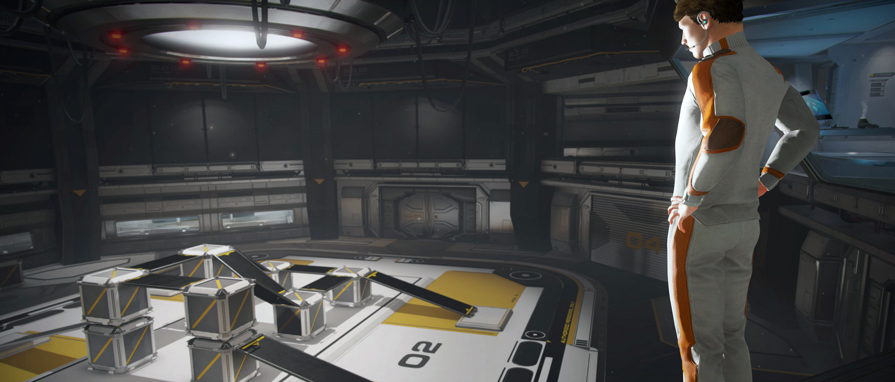

# Getting Started

This section is your key to getting started with Unity. It explains the Unity interface, menu items, using assets, creating scenes, and publishing builds.

When you are finished reading this section, you will understand how Unity works, how to use it effectively, and the steps to put a basic game together.

## Installation Options

You can install the Unity Editor in the following ways:

* The Hub provides a central location to manage your Editor installations, Accounts and Licenses, and Projects. For more information on installing the Editor using the Hub, see [Installing Unity using the Hub](GettingStartedInstallingHub).
* You can use the Download Assistant to install the Editor. If you subsequently choose to install the Hub, you can add it to the Hub at that time. For more information, see [Installing Unity using the download assistant](InstallingUnity).
* The Unity Download Assistant supports offline deployment. This allows you to download all the necessary files for installing Unity and generate a script to install the Editor on computers without internet access. For more information, see [Installing Unity offline using the Download Assistant](DeployingUnityOffline).

------------------------

2018-06-12 <!-- include IncludeTextAmendPageSomeEdit -->