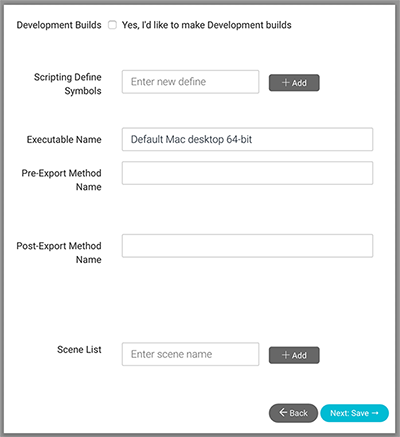

# Pre- and post-export methods

The pre- and post-export methods allow you to trigger actions before and after your Unity Project is built. These methods must exist as code within your Project in the Editor folder in your Asset folder. If this folder doesn't exist in your directory, right click within your Asset folder and go to __Create__>__Folder__ and name it "Editor". 

__Important__: The UnityEngine.CloudBuild.BuildManifestObject class is only available when running in Cloud Build (as in, not locally). To compile your code locally, wrap your pre- and post-export methods in an `#if UNITY_CLOUD_BUILD` block.

You set pre- and post-export methods in the Advanced Options of the build target. For more information, see [Advanced Options](UnityCloudBuildAdvancedOptions).

__Pre-export method name__

To use a pre-export method, create a public static method in your Unity Project that contains the code which you want executed before the Project is exported by the Unity Editor.

`public static void PreExport()`

You can enable Cloud Build to pass the build manifest of the current build to the pre-export method by specifying a BuildManifestObject object as a parameter in the method signature. You can then make changes to the Project or **Player** settings before the Project is exported.

`public static void PreExport(UnityEngine.CloudBuild.BuildManifestObject manifest)`

When Unity Cloud Build calls the method, it passes a BuildManifestObject object as an optional parameter, where BuildManifestObject is the build manifest of the current build.

For more information, see [Build manifest as ScriptableObject](UnityCloudBuildManifestAsScriptableObject).

## __Post-export method name__

To use the post-export method, create a public static method in your Unity Project that contains the code which you want executed after the Project is exported by the Unity Editor.

`public static void PostExport(string exportPath)`

When Unity Cloud Build calls the method, it passes a string:

* For non iOS build targets, the string contains the path to the exported Project.

* For iOS Projects, the string contains the path to the exported Xcode project. You can use the path to locate the exported Xcode project to perform additional preprocessing before Xcode is called to complete the build process.

__Note__: If you've tagged any methods in your code with the Unity [PostProcessBuildAttribute](ScriptRef:Callbacks.PostProcessBuildAttribute.html), those methods are executed before any methods configured as post-export methods in Unity Cloud Build.

