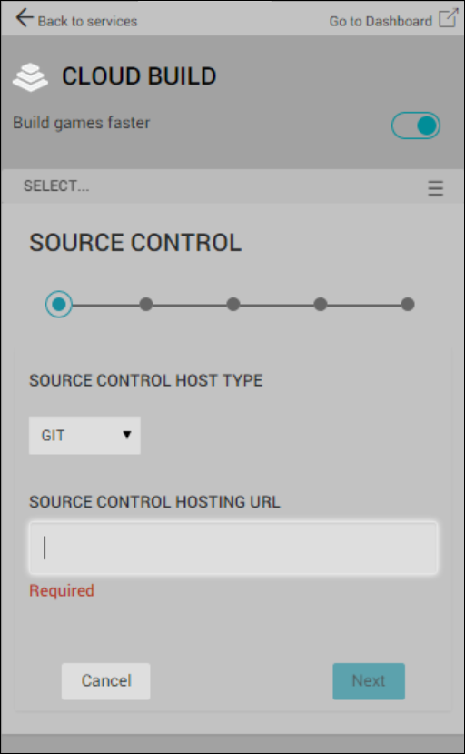
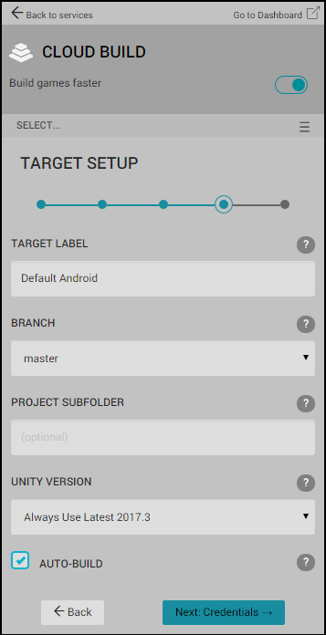

# Using the Unity Editor to configure Unity Cloud Build for Git

Unity Cloud Build supports projects stored in Git repositories. Your repository can be hosted on [GitHub](https://github.com/), [GitLab](https://about.gitlab.com/), [Bitbucket](https://bitbucket.org/), or private servers.

__Note__: This feature requires a subscription to Unity Teams Advanced. For more information,  see the [Unity Teams](https://unity3d.com/teams) page.

## Enabling Cloud Build

In the __Services__ window, next to __Cloud Build__, click the __OFF__ button to switch it __ON.__

In the __CLOUD BUILD__ window, click the __Cloud Build__ toggle to enable Cloud Build for your Project.

## Setting the source control hosting type

In the services __SOURCE CONTROL__ window:

1. From the __SOURCE CONTROL HOST TYPE__ drop-down menu, select __GIT__.

2. In the __SOURCE CONTROL HOSTING URL__ field, enter the URL of your Git repository. For information on the format of the URL, see the **URL syntax** section below.

3. Click __Next__.

## URL syntax

To connect to your repository, you must specify the URL to your Git server. You can specify the URL to use the following protocols:

* HTTPS

* GIT

* SSH

The following are examples of URLs for [GitHub](https://github.com/), [bitbucket](https://bitbucket.org/), and [GitLab](https://about.gitlab.com/):

* https://github.com/youraccount/yourrepo

* git://github.com/youraccount/yourrepo.git

* git@bitbucket.org:youraccount/yourrepo.git

* git@gitlab.com:youracccount/yourrepo.git

If you are hosting Git on a private server, you must use SSH to connect to your repository.

Use the format that is most convenient for you. Unity Cloud Build automatically re-writes the URL into the format it needs.

When Unity Cloud Build connects to the hosting site, it automatically detects whether your repository is public or private. If your repository is public, Unity Cloud Build automatically connects to it and you can skip to the [Target Setup](#heading=h.yazupq5xp3xo) section below.

### Using private repositories

If your repository is private, Cloud Build must use SSH to connect to it. When Cloud Build detects that the repository is private, it displays the __Grant us access to your source control__ window.

### Setting your SSH key on GitHub

To add your SSH key to your project in GitHub:

1. Sign in to [GitHub](https://github.com/).

2. In the upper-right corner of any GitHub page, click your profile photo, then click __Your profile__.

3. On your profile page, click __Repositories__, then click the name of your repository.

4. In your repository, click the __Settings__ tab.

5. In the sidebar, click __Deploy keys__, then click the __Add deploy key__ button.

6. In the __Title__ textbox, type name to identify this key. 

7. In the __Key__ field, paste in your public key from the __Grant us access to your source control__ screen, and then click the __Add key __button.

For more information on deploy keys, see [Managing Deploy Keys](https://developer.github.com/v3/guides/managing-deploy-keys/) in the GitHub documentation.

You can also add your SSH key to your GitHub account so that all repositories in your account are accessible to Cloud Build. For more information, see [Adding a new SSH key to your GitHub account](https://help.github.com/articles/adding-a-new-ssh-key-to-your-github-account/) in the GitHub documentation.

### Setting your SSH key on Bitbucket

To add your SSH key to your Bitbucket account:

1. Sign in to [Bitbucket](https://bitbucket.org/).

2. Click your avatar in the lower left of the page.

3. Click __Bitbucket Settings__.

4. On the __Settings__ page, in the __SECURITY__ section, click __SSH keys__.

5. In __SSH keys__, click the __Add key__ button.

6. In the __Label__ field, enter a recognizable name for the key (such as __Unity Cloud Build__.)

7. Paste the Unity Cloud Build SSH key from the __Grant us access to your source control__ screen into the __Key__ field.

8. Click __Add key__.

On the __Grant us access to your source control__ screen, click __Next: Target Setup__.

## Setting up your target platform

To configure the runtime platform for your app in the Unity Editor, go to the __Services__ window and make the following changes:

1. From the __TARGET LABEL__ drop-down menu, select a build platform.

2. From the __BRANCH__ drop-down menu, select the branch from which to build your project. The default branch in most Git repositories is "master". If you are building for multiple build targets, you can configure a different branch for each build target.

3. In the __PROJECT SUBFOLDER__ field, enter the the folder in your project that contains your Unity project; specifically the __Assets__ and __ProjectSettings__ folders. The path to the folder is typically similar to the following:

*NewGameProject/Src/UnityProject/*

If your Unity project is not at the root of your repository, you must complete the __PROJECT SUBFOLDER__ field.

4. Optionally, uncheck the AUTO-BUILD checkbox if you do not want Cloud Build to automatically build your Project when you make changes to your Project. For more information, see [Automated Build Generation](UnityCloudBuildContinuousIntegration).

## Git submodules

If your project is using private Git submodules, make sure that the URLs present in your *.gitmodules* file are using the `git@` syntax instead of `https://` or `git://`.

For example:

* git@github.com:youraccount/yourrepo.git (for GitHub)

* git@bitbucket.org:youraccount/yourrepo.git (for Bitbucket)

* git@gitlab.com:youracccount/yourrepo.git (for GitLab)

---
2018-04-10  <!-- include IncludeTextNewPageYesEdit -->