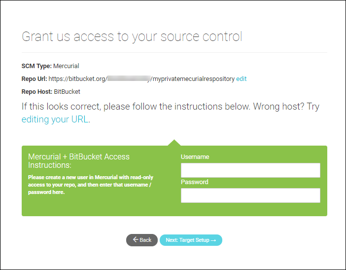

# Using the Unity Developer Dashboard to configure Unity Cloud Build for Mercurial

Unity Cloud Build supports projects stored in [Mercurial](https://www.mercurial-scm.org/) repositories. Your can host your repository on [Bitbucket](https://bitbucket.org/) or on a private server.

To connect to your repository, Unity Cloud Build requires that you supply appropriate access credentials. This applies to Mercurial repositories hosted on Bitbucket or elsewhere.

## Configuring Mercurial in the Dashboard

1. Sign in to the [Unity Developer Dashboard](https://developer.cloud.unity3d.com).
2. From the __Projects__ page, select your Project.
3. In the left-hand navigation pane, click __Cloud Build__ > __Config__.
4. If this is the first time you have configured Cloud Build, you see a Build History page informing you that __Cloud Build has not been set up for this project__. Click the __Set up Cloud Build__ link to continue.
5. In the __Source Control__ window, click the __Manual__ tab.
6. In the __SCM URL__ field, enter the URL of your Mercurial server. For information on the format of the URL, see the **URL syntax** section below.
7. From the __SCM Type__ drop-down menu, select __Mercurial__.
7. Click the __Next Access__ button.

### URL syntax

To connect to your repository, you must specify the URL to your Mercurial server. You can specify the URL to use the following protocols:

   * HTTPS

   * SSH

   The following are examples of URLs for [bitbucket](https://bitbucket.org/):

   * https://github.com/youraccount/yourrepo

   * git@bitbucket.org:youraccount/yourrepo.git

   Use the format that is most convenient for you. Unity Cloud Build automatically re-writes the URL into the format it needs.

### Setting your credentials

On your Mercurial server, create a user name for Unity Cloud Build and assign a secure password. If your Mercurial host supports it, make this a read-only user account. 

On the __Grant us access to your source control__ window, enter your user name and password, and then click __Next: Target Setup__.

## Setting up the target build platform

In the Target Setup window, select a build platform. 

On the Developer Dashboard, on the __NEW BUILD TARGET: BASIC INFO__ window:

1. In the __Target Label__ field, enter a name for the build. 

2. If the root folder of your repository doesn't contain your Assets and Project settings, in the __Project Subfolder__ field, enter the URL of the folder that contains  your Assets and Project Settings.

3. From the __Unity Version__ drop-down menu, select the version of Unity with which to build the Project.

4. If you do not want the Project to automatically build whenever your repository is updated, click the __Auto-build__ toggle to disable this feature.

If you are building for the iOS or Android platforms, your next step is to enter credentials for the build. Click __Next: Credentials__. For all other platforms, click __Next: Build__ to complete the configuration and start the initial build.

### Android credentials

On the IOS __SIGNING CREDS__ window supply the following information:

* A __Bundle ID__ to uniquely identify your app on the device and in Google Play Store. 

* Enter your Android keystore credentials or select __Auto Generated Debug Keystore__ to use a development keystore. For more information on Android keystores, see [Android Keystore System](https://developer.android.com/training/articles/keystore.html).

### iOS Credentials

On the IOS __SIGNING CREDS__ window supply the following information:

* A Bundle ID to uniquely identify your app on the device.

* The Xcode version with which to build the app.

* Enter your IOS credentials. For more information on iOS credentials, see [Building for iOS](UnityCloudBuildiOS).

---
2018-04-10  <!-- include IncludeTextNewPageYesEdit -->