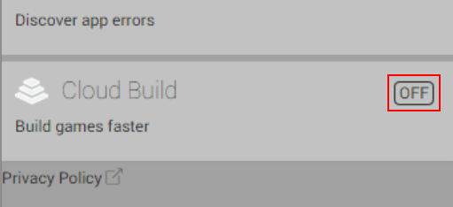
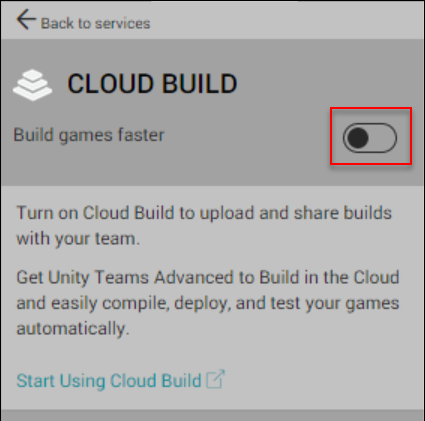
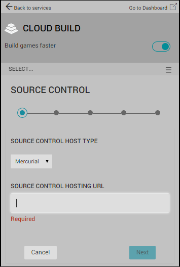
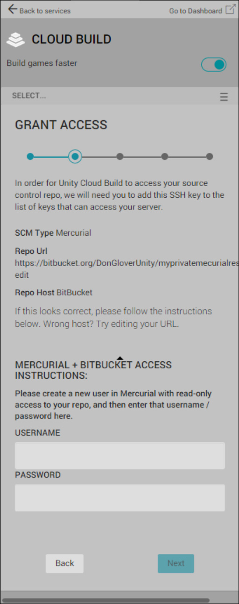

# Using the Unity Editor to configure Unity Cloud Build for Mercurial

Unity Cloud Build supports projects stored in [Mercurial](https://www.mercurial-scm.org/) repositories. Your can host your repository on [Bitbucket](https://bitbucket.org/) or on a private server.

To connect to your repository, Unity Cloud Build requires that you supply appropriate access credentials. This applies to Mercurial repositories hosted on Bitbucket or elsewhere.

## Enabling Cloud Build

In the Services window, next to __Cloud Build click the OFF__ button to switch it __ON__:

In the __CLOUD BUILD__ window, click the __Cloud Build__ toggle to enable Cloud Build for your Project.

## Setting the source control hosting type

In the services__ SOURCE CONTROL__ window:

1. From the __SOURCE CONTROL HOST TYPE__ drop-down menu, select Mercurial.

2. In the __SOURCE CONTROL HOSTING URL__ field, enter the URL of the Mercurial repository. For information on the format of the URL, see the **URL syntax** section below.

3. Click the __Next__ button.

### URL syntax

To connect to your repository, you must specify the URL to your Mercurial server. You can specify the URL to use the following protocols:

* HTTPS

* SSH

The following are examples of URLs for [bitbucket](https://bitbucket.org/):

* https://github.com/youraccount/yourrepo

* git@bitbucket.org:youraccount/yourrepo.git

Use the format that is most convenient for you. Unity Cloud Build automatically re-writes the URL into the format it needs.

## Setting your credentials

On your Mercurial server, create a user name for Unity Cloud Build and assign a secure password. If your Mercurial host supports it, make this a read-only user account. 

In the __GRANT ACCESS__ window, enter the user name and password.

## Setting up a runtime target platform

To configure the runtime platform for your app, in the Unity Editor, go to the __Services__ window and make the following changes:

1. From the __TARGET LABEL__ drop-down menu, select a build platform.

2. From the __BRANCH__ drop-down menu, select the branch from which to build your project. The default branch in most Git repositories is "master". If you are building for multiple build targets, you can configure a different branch for each build target.

3. In the __PROJECT SUBFOLDER__ field, enter the the folder in your project that contains your Unity project; specifically the __Assets__ and __ProjectSettings__ folders. The path to the folder is typically similar to *NewGameProject/Src/UnityProject/*

    **Note**: If your Unity project is not at the root of your repository, you must complete the __PROJECT SUBFOLDER__ field.

4.     Optionally, uncheck the __AUTO-BUILD__ checkbox if you do not want Cloud Build to automatically build your Project when you make changes to your Project. For more information, see [Automated Build Generation](UnityCloudBuildContinuousIntegration).

---
2018-04-10  <!-- include IncludeTextNewPageYesEdit -->