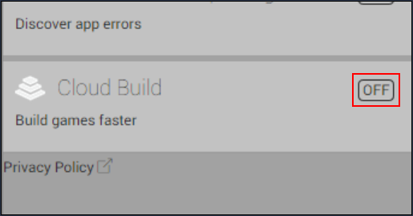
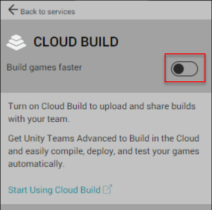
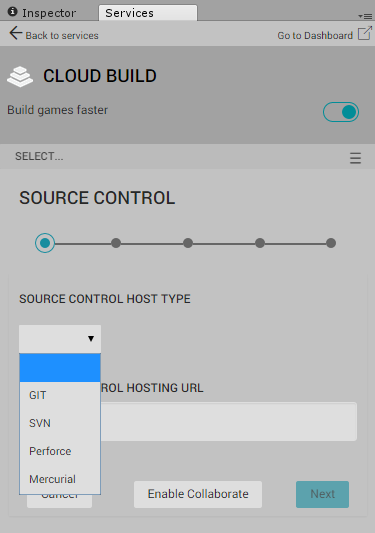
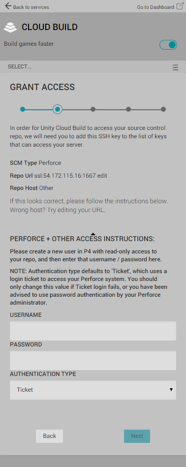

# Using the Unity Editor to configure Unity Cloud Build for Perforce

Unity Cloud Build supports Projects stored in [Perforce](https://www.perforce.com/) repositories.

## Enabling Cloud Build

1. In the Services window, next to __Cloud Build__ click the __OFF__ button to switch it __ON__:

2. In the __CLOUD BUILD__ window, click the __Cloud Build__ toggle to enable Cloud Build for your Project.

3. In the __Build History__ window, click __Set up Cloud Build__.

## Setting the source control hosting type

In the services __SOURCE CONTROL__ window:

1. From the __SOURCE CONTROL HOST TYPE__ drop-down menu, select __Perforce__.
2. In the __SOURCE CONTROL HOSTING URL__ field, enter the URL of the Perforce repository. For information on the format of the URL, see the __URL syntax__ section below.
3. Click the __Next__ button.

**URL syntax**

To connect to your repository, you must specify the URL to your Perforce server. You can specify the URL to use the following protocols:

* HTTPS
* SSL

The following are examples of valid URLs:

* https://127.0.0.1:1667
* ssl:127.0.0.1:167

## Grant access

In the __GRANT ACCESS__ window, enter the username and password, then click __Next__.

## Setting up a runtime target platform

To configure the runtime platform for your app:

1. In the __CHOOSE PLATFORM__ window, select the build platform from the __PLATFORM__ drop-down menu and then click __Next__.
2. In the __TARGET SETUP__ window, from the __CLIENT WORKSPACE__ drop-down menu, select the Perforce workspace from which to build your Project.
3. In the __PROJECT SUBFOLDER__ field, enter the folder that contains your Unity Project; specifically the __Assets__ and __ProjectSettings__ folders. The path to the folder is typically similar to *NewGameProject/Src/UnityProject/.*

**Note**: If your Unity Project is not at the root of your repository, you must complete the __PROJECT SUBFOLDER__ field.

1. From the __UNITY VERSION__ drop-down menu, select the version of Unity to use to build the Project.
2. Optionally, uncheck the __AUTO-BUILD__ checkbox if you do not want Cloud Build to automatically build your Project when you make changes to your Project. For more information, see [Automated Build Generation](UnityCloudBuildContinuousIntegration).