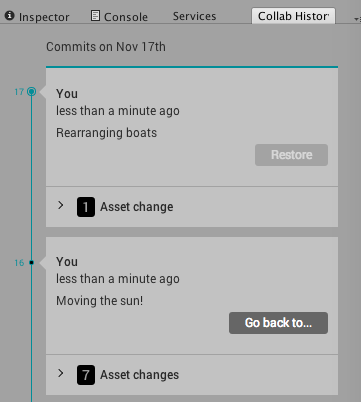
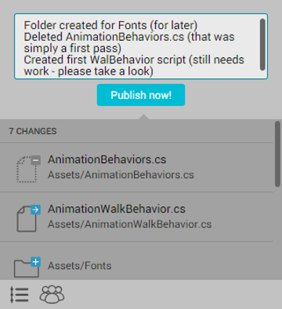

# Restoring previous versions of a project

There are times when you need to revert your entire Project to a previous version. When this occurs, you can use the **Restore** and **Go Back** functionality to retrieve a previous version of your Project. You can then publish the retrieved Project as the current version in the cloud. Collaborate ensures that all versions of your Project are intact, even after a restore, and that you can access them at any time in the development cycle.

To open the **Collab History** window, on the Unity Editor menu bar, select __Window__ &gt; __Asset Management__ &gt; __Collab History__.

To remove all local changes and restore the latest version from the cloud, on the head node of the change history, click the **Restore** button.

To restore a version published earlier than the current version in the cloud, click the **Go back to** button. 

Restoring replaces all local Project files with the files from the older version. The files are now listed as modified in the Collaborate toolbar. A blue **plus sign (+)** on a file or folder indicates that it is modified. A blue **arrow (->)** on a file or folder means it is new (see image below).

To publish the restored version as the current revision in the cloud, click the **Publish now!** button. 

## See also

[Reverting files](UnityCollaborateRevertingFiles)