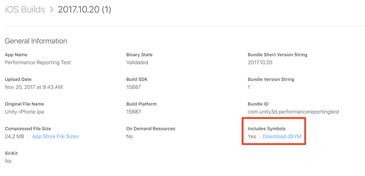
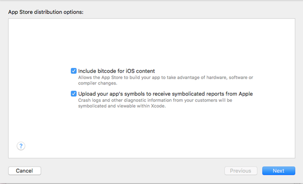

# Finding and uploading missing iOS/OSX application symbols

When you build your application using Xcode, iOS/OSX places the symbols  in a dSYM folder with a name similar to the following:

_~/Library/Developer/Xcode/DerivedData/&lt;build id&gt;/Build/Products/&lt;build type&gt;/appname.dSYM_

A dSYM file is an ELF file that contains DWARF (debugging with attributed record formats) debug information for your application. DWARF is a debugging file format that supports source-level debugging.

To verify that the dSYM contains the correct UUID, run the `dwarfdump` command, and replace `appname` with the name of your application’s dSYM:

`dwarfdump -u appname.dSYM/Contents/Resources/DWARF/appname`

Dwarfdump is an application that prints DWARF information in a human-readable format.

The following shows sample output from dwarfdump:

```
    UUID: 5EEDCCD2-38E7-3E52-81EC-B90C7BCD6D91 (armv7) appname.dSYM/Contents/Resources/DWARF/appname
    UUID: 583173FD-6697-3E3C-90DC-EA9147563A5B (arm64) appname.dSYM/Contents/Resources/DWARF/appname
```

**Note**: The output of dwarfdump reports the UUID in upper-case and with dashes. UUIDs are often displayed as all lower-case with no dashes. Either format can represent a UUID. For example, `5EEDCCD2-38E7-3E52-81EC-B90C7BCD6D91` and `5eedccd238e73e5281ecb90c7bcd6d91` represent the same UUID.

When you have located the correct dSYM folder, zip the entire folder and upload it to the Performance Reporting service using the **Manage Symbols** tab on the Services Dashboard.

## iOS, Bitcode, and the App Store

When you build your iOS app with Bitcode enabled and submit it to the App Store, Apple post-processes your build and creates a new binary. The new binary has a new UUID and a new corresponding dSYM. In this case, you must download the dSYM from iTunes Connect. It’s available in iTunes Connect at __My Apps__ >  __Activity__ >  __All Builds__ >  __(choose your build)__:



When you upload your app to the App Store, check __Include bitcode for iOS content__ and __Upload your app’s symbols to receive symbolicated reports from Apple__ to enable the App Store to generate a new dSYM with the correct symbols:



When you have downloaded the new dSYM, verify that the UUID is correct using dwarfdump. Zip the file and upload it to the Performance Reporting service through the __Manage Symbols__ tab.

### Troubleshooting: I uploaded the symbols for the right UUID, but my reports are still not symbolicated correctly

When you upload new symbols through the __Manage Symbols__ tab, there is a short period between the upload and when they are available for use. Please wait at least five minutes before submitting a new crash. When they have been processed, any new reports are generated with the proper symbolication.

For more information on symbolication, see the [Symbolicating Crash Reports](https://developer.apple.com/library/content/technotes/tn2151/_index.html#//apple_ref/doc/uid/DTS40008184-CH1-SYMBOLICATION) section of Understanding and Analyzing Application Crash Reports on the Apple Developer website.

**Note**: When you upload a new dSYM lD, reports are not re-symbolicated. You must submit a new crash to generate a report that uses the new symbols.