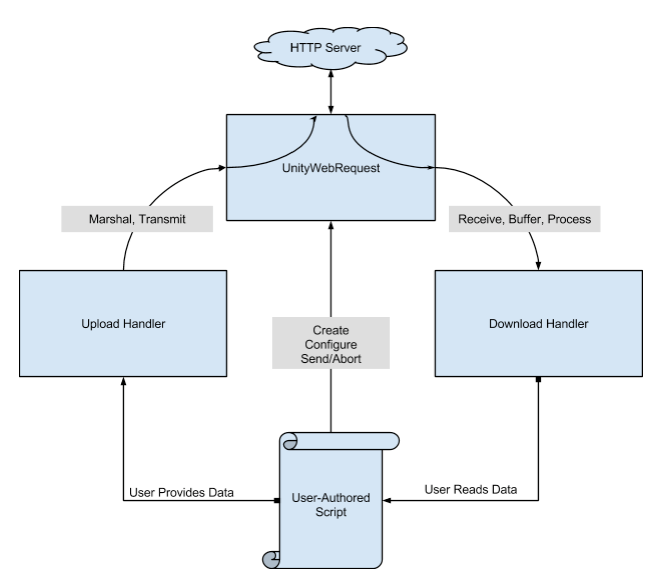

#UnityWebRequest

UnityWebRequest provides a modular system for composing HTTP requests and handling HTTP responses. The primary goal of the UnityWebRequest system is to allow Unity games to interact with web browser back-ends. It also supports high-demand features such as chunked HTTP requests, streaming POST/PUT operations, and full control over HTTP headers and verbs.

The system consists of two layers: 

* A [High-Level API](UnityWebRequest-HLAPI) (HLAPI) wraps the Low-Level API and provides a convenient interface for performing common operations
* A [Low-Level API](UnityWebRequest-LLAPI) (LLAPI) provides maximum flexibility for more advanced users

##Supported platforms

The UnityWebRequest system supports most Unity platforms:

* All versions of the Editor and Standalone players
* WebGL
* Mobile platforms: iOS, Android
* Universal Windows Platform
* PS4 and PSVita
* XboxOne
* Nintendo Switch

##Architecture

The UnityWebRequest ecosystem breaks down an HTTP transaction into three distinct operations:

* Supplying data to the server
* Receiving data from the server
* HTTP flow control (for example, redirects and error handling)

To provide a better interface for advanced users, these operations are each governed by their own objects:

* An `UploadHandler` object handles transmission of data to the server
* A `DownloadHandler` object handles receipt, buffering and postprocessing of data received from the server
* A `UnityWebRequest` object manages the other two objects, and also handles HTTP flow control. This object is where custom headers and URLs are defined, and where error and redirect information is stored.

For any HTTP transaction, the normal code flow is:

* Create a Web Request object
* Configure the Web Request object
    * Set custom headers
    * Set HTTP verb (such as GET, POST, HEAD - custom verbs are permitted on all platforms except for Android)
    * Set URL
* (Optional) Create an Upload Handler and attach it to the Web Request
    * Provide data to be uploaded
    * Provide HTTP form to be uploaded
* (Optional) Create a Download Handler and attach it to the Web Request
* Send the Web Request
    * If inside a coroutine, you may Yield the result of the ``Send()`` call to wait for the request to complete
* (Optional) Read received data from the Download Handler
* (Optional) Read error information, HTTP status code and response headers from the UnityWebRequest object

---

• 2017-05-16  <!-- include IncludeTextAmendPageNoEdit --> 